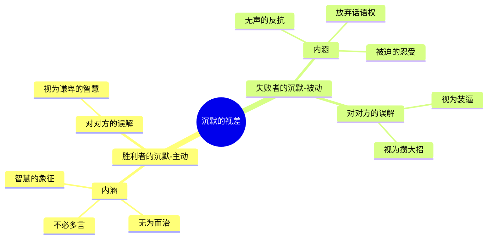
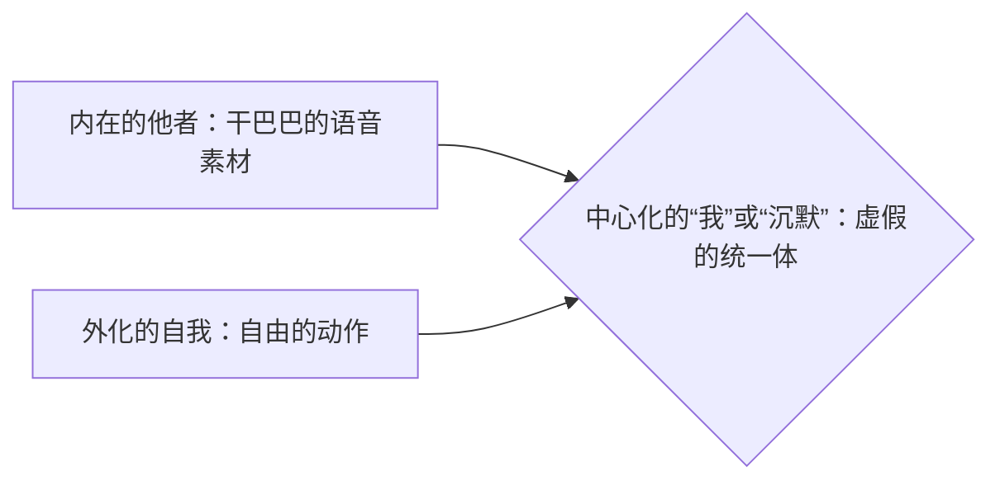
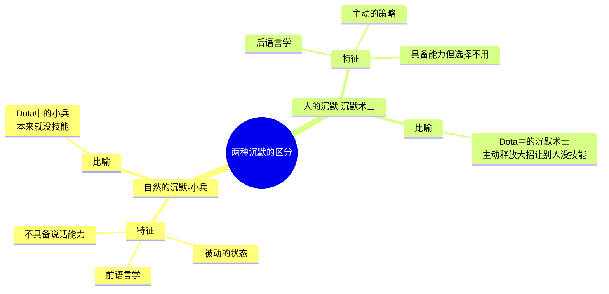

---
{"dg-publish":true,"permalink":"/1-4 平庸主义/1-4-1 当代自然主义/1-4-1-3 沉默主义/","created":"2025-09-19T20:52:29.547+08:00","updated":"2025-09-23T01:36:57.961+08:00"}
---

### **一、本章概览**
- **主义主义编码**: 1-4-1-3
- **意识形态命名**: [[沉默主义\|沉默主义]] / [[静默主义\|静默主义]] (Quietism)
- **核心论断**: “沉默”并非一种统一的状态，而是一个充满[[视差\|视差]]的场域。它作为一种虚假的[[中心化\|中心化]]，掩盖了胜利者“不必多言”的主动沉默与失败者“无话可说”的被动沉默之间的深刻对立，形成一种相互误解的、看似和平的共存状态。
- **你能获得**:
    - **诊断工具**: 掌握分析1-4-1-3编码意识形态的“四格”框架，理解其如何通过“沉默”这一中介来调和内在矛盾。
    - **核心概念**: 深入理解“[[沉默的视差\|沉默的视差]]”、“[[中心化的虚假调和\|中心化的虚假调和]]”以及“两种沉默”（人的沉默 vs. 自然的沉默）等关键概念。
    - **现实洞察**: 辨识现实中将“沉默是金”或“无为而治”等观念意识形态化的倾向，看穿其背后可能隐藏的权力关系与压制。

---
### **二、核心内容解析**

#### **“主义主义”四格分析**

1.  **场域之“1” (Ontology)**：该意识形态预设了一个统一、整全的[[世界\|世界]]框架。所有的存在物，无论是胜利者还是失败者，无论是喧嚣还是沉默，都发生在这个唯一的、无所不包的舞台之上。这个“1”的[[存在论\|存在论]]设定是后续一切分裂与调和的基础，它确保了没有任何一方可以逃逸到体系之外，所有矛盾都必须在内部“解决”。这种统一性使得“沉默”可以被视为一个普遍现象，而非两个完全不同世界的产物，从而为虚假的[[中心化\|中心化]]调和铺平了道路。

2.  **本体之“4” (Body)**：在统一的[[世界\|世界]]之内，真正的[[本体\|本体]]（即世界的实在内容）却是不可言说的，是一个空洞或内在分裂。这个“4”意味着该意识形态对于“世界究竟是什么”这一根本问题保持沉默，或者说它认为[[9 未命名/本体论\|本体论]]本身是无法被语言所把握的。这恰恰是“沉默”成为核心策略的原因：既然实在不可说，那么争论谁的[[语言\|语言]]更符合实在就变得毫无意义。这为失败者放弃话语权（因为语言扭曲实在）和胜利者超越话语权（因为行动已证明一切）提供了共同的、尽管是消极的本体论基础。

3.  **现象之“1” (Phenomenon)**：在[[现象\|现象]]层面，所有经验都被均质化、自然化为“自然现象”。这是一种认识论上的“休战协议”。无论是胜利者的沾沾自喜，还是失败者的忍受，在现象上都被看作是“理所当然”的。[[主体性\|主体性]]的尖锐体验被抹平，一切都“夫复何言”。这种对[[现象\|现象]]的统一化处理，压制了两种沉默背后截然不同的主观感受与伦理立场，使得它们在表面上看起来都是“静谧”这一种状态，从而维持了体系的稳定。

4.  **目的之“3” (Purpose)**：该意识形态的最终[[9 未命名/目的论\|目的论]]是“沉默”本身。沉默成为了那个居于中心的调和者，一个使得胜利者和失败者得以“共存”的虚假中介。对于胜利者，目的是维持一种“无为而治”的、彰显智慧的静谧；对于失败者，目的是通过放弃话语斗争来“堪忍”生存。沉默这个点，就像一个[[视差\|视差]]的焦点，双方都朝向它，但从各自位置看到的内涵完全不同。这个“3”的[[中心化\|中心化]]功能，就是让这个不可调和的对立，通过一个共同指向的“沉默”行为，被伪装成了一种和谐与目的。

#### **其他核心知识点**

##### 沉默的视差之见
“沉默”在这一意识形态中并非单一实体，而是一个典型的[[视差\|视差]]结构。它是一个在本体论上自我分裂的东西，观察者的立场（胜利者 vs. 失败者）决定了其显现的形态。对于胜利者（Winner），沉默是主动选择，是力量与智慧的象征，是“不必多言”的沾沾自喜。对于失败者（Loser），沉默是被动承受，是反抗无效后的“无声反抗”，是彻底放弃话语权的标志。这两种沉默不仅彼此不同，更处于一种相互误解的扭结关系中：胜利者会将失败者的沉默美化为“谦卑的智慧”，而失败者则将胜利者的沉默解读为“装逼”或“攒大招”的阴谋。

**举例阐释**：一个大公司的老板在会议上对争议问题一言不发，这可能被他自己和拥护者视为“运筹帷幄”的智慧沉默。而基层员工可能会认为这是“被迫”的沉默，因为他们的反对意见在权力结构下根本没有表达的空间。同时，基层员工会把老板的沉默解读为一种傲慢或在酝酿更严厉的措施，而老板则可能将员工的沉默误读为“默认”或“顺从”。

##### 中心化的虚假调和
所有[[中心化\|中心化]]（编码中的“3”）都是一种虚假的调和，它并非真正解决了矛盾，而是用一个中介物掩盖了不可调和的裂痕。讲稿以“我”这个词为例，揭示了这种机制。“我”既可以被体验为一个内在的、干巴巴的、无灵魂的声音素材（内在的他者，奴隶姿态），也可以被体验为一个发动思想的、拥有纯粹自由的动作（外化的自我，主人姿态）。“我”这个词本身，作为中心化的中介，强行将这两个相互排斥的维度捏合在一起，造成了自我意识统一的假象。[[沉默主义\|沉默主义]]中的“沉默”扮演了同样的角色，它将胜利者与失败者这两种无法共存的生存姿态，强行统一在了“不说话”这同一个行为之下。

**举例阐释**：在家庭冷战中，“全家都不说话”这一“沉默”状态就是一种[[中心化\|中心化]]的虚假调和。在父母看来，这可能是“让大家都冷静一下”的主动策略；而在孩子看来，这可能是“说什么都没用”的被动绝望。尽管行为统一，但内在的立场和体验是完全对立的，矛盾并未解决，只是被“沉默”这个行为暂时遮蔽了。

##### 两种沉默：人的沉默 vs. 自然的沉默
讲稿通过一个精妙的类比，区分了两种本质不同的沉默，这两种沉默在[[沉默主义\|沉默主义]]中被有意无意地混淆了。一种是“自然的沉默”，指前语言的、不具备符号能力的存在（如动物、自然界）的沉默，它们是“不会说”。另一种是“人的沉默”，指后语言的、有意识地选择不使用语言的沉默，这是一种“可以不说”的权力或策略。胜利者倾向于将自己的主动沉默比附于自然的“智慧”沉默（如“天地不言而四时行”），从而将其正当化、自然化。

**举例阐释**：讲稿中的Dota 2类比最为经典。自然的沉默就像游戏里的小兵，它们本来就没有技能，所以它们的“沉默”是被动的、天生的。而人的沉默（尤其是胜利者的沉默）就像英雄“[[沉默术士\|沉默术士]]”释放的全领域静默大招，它不是没能力，而是通过主动施展“沉默”这一技能，剥夺了其他所有英雄施放技能（说话）的能力，这是一种绝对的权力行为。

---
### **三、关键观点提取**
- “所有的[[中心化\|中心化]]实际上都是一个[[视差\|视差]]的形成，这两方面看的不一样的。”
- “[[自然的沉默\|自然的沉默]]是小兵的沉默，[[人的沉默\|人的沉默]]是[[沉默术士\|沉默术士]]的沉默，这样你就懂了。”
- “在loser的眼中，他当然他知道心知肚明自己沉默是被逼的...他会反过来认为人类的沉默，这种故意不说话...会被识别为...装逼...就是他认为他们在攒大招...准备一鸣惊人。”
- “学哲学不要变成这个收集癖（恋词癖），要学会沉默，要学会就是不不用不调用这个词，你也在思考，就是一个姿态给他。”

---
### **四、知识点问答**
#### Q: 在1-4-1-3的[[沉默主义\|沉默主义]]中，“沉默”为何能同时被胜利者和失败者接纳为最终目的（3）？
A: 因为“沉默”本身是一个具有[[视差\|视差]]的符号。对于胜利者，沉默是其权力的最高体现和维持现有秩序的最佳方式（[[无为而治\|无为而治]]），是主动达成的目的。对于失败者，沉默是在话语体系内斗争彻底失败后的唯一生存策略，是无可奈何下接受的目的。这个“沉默”作为中心调和者，其高明之处在于它并不提供统一的内涵，而是提供了一个统一的*行为*。双方都可以将自己的动机投射到这个行为上，从而在不解决根本对立的情况下，达成一种表面的、目的论上的“休战”。

#### Q: 为什么说[[沉默主义\|沉默主义]]的[[9 未命名/本体论\|本体论]]是“4”（内在分裂/空无），而非“2”（二元对立）？
A: 因为[[沉默主义\|沉默主义]]并不认为[[世界\|世界]]由两个相互斗争的实体（如善与恶）构成。它的基础场域是“1”（统一整体），但这个整体的核心是空的、不可言说的。它不是“和平 vs. 暴力”两个东西在斗，而是“暴力”本身就是一种围绕着那个不可言说的“空”而产生的关系模式。胜利者和失败者都是在这个统一场域内，因如何对待那个“不可言说的[[本体\|本体]]”而分裂出的不同姿态。所以，矛盾并非源于外部对抗，而是源于系统自身无法言说其核心，这种内在的不可能性（4）导致了后续的姿态分裂。

#### Q: 讲稿中提到的“学哲学要学会沉默”与[[沉默主义\|沉默主义]]中的“沉默”有何本质区别？
A: 两者截然相反。[[沉默主义\|沉默主义]]中的沉默，无论是主动还是被动，都是一种逃避或终结思考的策略。胜利者的沉默是“我已经赢了，不必再思考”，失败者的沉默是“我思考也没用，所以放弃思考”。而讲稿提倡的“哲学的沉默”，是一种积极的、超越“恋词癖”的思考姿态。它意味着不依赖现成的词语或概念，在沉默中保持思维的运动和张力，是思考的开始而非终结。前者是用沉默来掩盖问题，后者是用沉默来逼近问题本身。

---
### **五、知识延伸**
- **[[维特根斯坦\|维特根斯坦]]《[[逻辑哲学论\|逻辑哲学论]]》**: 这本书的结尾名言“凡是不可说者，皆应保持沉默”，可以被视为1-4-1-3编码中[[9 未命名/本体论\|本体论]]之“4”的某种哲学表达。它划定了语言的界限，承认了某个不可言说的领域，这与[[沉默主义\|沉默主义]]将[[本体\|本体]]悬置起来的做法有深刻的类比关系，尽管维特根斯坦的动机与[[沉默主义\|沉默主义]]完全不同。
- **[[道德经\|道德经]] / [[老子\|老子]]**: 讲稿明确指出，对《道德经》的庸俗化解读是[[沉默主义\|沉默主义]]的典型体现。诸如“无为而治”、“大音希声”等概念，很容易被当权者挪用为一种“胜利者的沉默”哲学，即用一种看似超然、符合自然大道的姿态，来合理化其统治地位和压制性的秩序。这提供了一个批判性参照的绝佳文本。
- **[[主奴辩证法\|主奴辩证法]]**: 黑格尔的这一理论深刻揭示了两个意识（主人与奴隶）之间相互依赖、相互塑造的复杂关系。这与[[沉默主义\|沉默主义]]中胜利者与失败者之间相互误解、相互定义的扭结关系高度相关。两者都揭示了权力关系并非单向的压迫，而是一种复杂的、动态的相互“承认”（或误认）的结构。

---
## 双链关联总结
- **一级关联 (核心意识形态与概念)**: [[沉默主义\|沉默主义]]、[[静默主义\|静默主义]]、[[主页\|主页]]、[[视差\|视差]]、[[中心化\|中心化]]、[[胜利者\|胜利者]]、[[失败者\|失败者]]、[[暴力\|暴力]]、[[沉默的视差\|沉默的视差]]、[[中心化的虚假调和\|中心化的虚假调和]]、[[人的沉默\|人的沉默]]、[[自然的沉默\|自然的沉默]]
- **推测相关人物 (Speculated Figures)**:
    - **[[沉默术士\|沉默术士]] (Data 2英雄)**: 作为“人的沉默”或“胜利者沉默”的完美虚构化身，其实施的沉默是一种主动的、剥夺他者能力的权力行为。
    - **被庸俗化解读的[[老子\|老子]]**: 其“无为”思想被抽空了革命性内涵，扭曲为维护现状、标榜统治智慧的“胜利者”意识形态。
- **二级关联 (上下文与背景)**: [[存在论\|存在论]]、[[9 未命名/本体论\|本体论]]、[[现象\|现象]]、[[9 未命名/目的论\|目的论]]、[[主体性\|主体性]]、[[9 未命名/符号学\|符号学]]、[[语言哲学\|语言哲学]]
- **三级关联 (推测与延展)**: [[维特根斯坦\|维特根斯坦]]、[[逻辑哲学论\|逻辑哲学论]]、[[道德经\|道德经]]、[[无为而治\|无为而治]]、[[主奴辩证法\|主奴辩证法]]