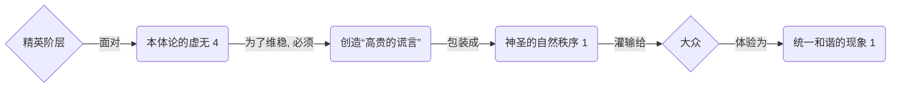
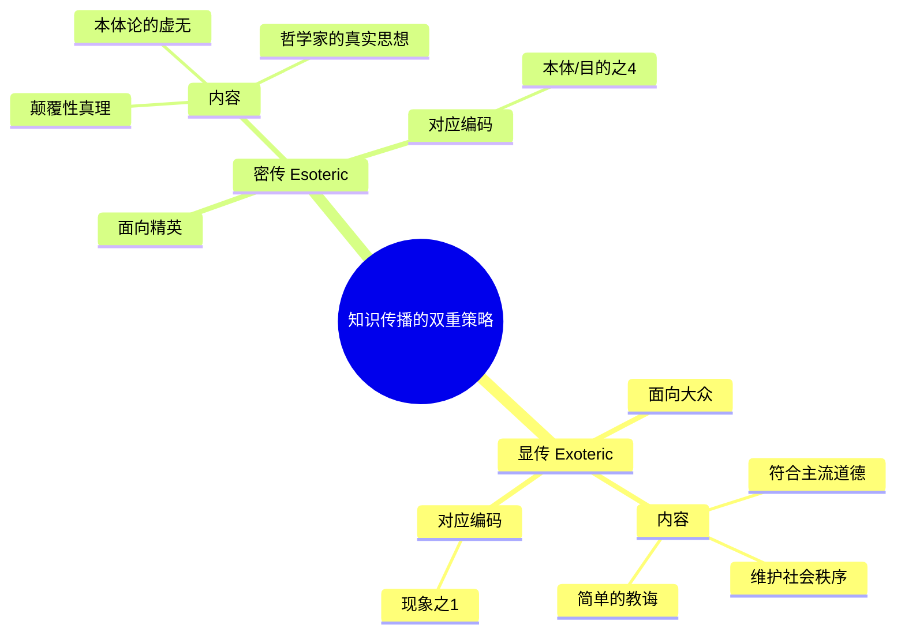
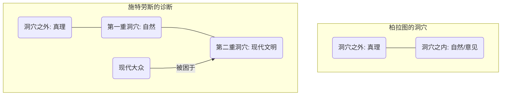

---
{"dg-publish":true,"permalink":"/1-4 平庸主义/1-4-1 当代自然主义/1-4-1-4 蒙昧主义/","created":"2025-09-19T20:52:29.550+08:00","updated":"2025-09-23T19:11:54.131+08:00"}
---

### **一、本章概览**
- **主义主义编码**: 1-4-1-4
- **意识形态命名**: [[蒙昧主义\|蒙昧主义]] (Obscurantism)
- **核心论断**: [[蒙昧主义\|蒙昧主义]]是一种由知识精英阶层刻意构建的意识形态，它对外宣称一个统一、和谐的自然秩序（场域之1，现象之1），但其内在的[[9 未命名/本体论\|本体论]]基础却是空洞的（本体之4），最终导向一种只有少数人才能知晓的、创伤性的[[虚无主义\|虚无主义]]结局（目的之4）。其核心操作是通过“[[高贵的谎言\|高贵的谎言]]”来愚化大众，以维系自身的特权地位。
- **你能获得**: 通过本笔记，你将掌握[[蒙昧主义\|蒙昧主义]]（1-4-1-4）的内在运作逻辑，理解其如何通过“[[显传与密传\|显传与密传]]”的二元话语策略来制造知识壁垒。你还能学会运用“[[主页\|主页]]”框架诊断以[[列奥·施特劳斯\|列奥·施特劳斯]]为代表的特定类型知识分子的思想姿态，并识别他们在现实中散播的、看似深刻实则虚无的“智慧”。

---
### **二、核心内容解析**
#### **“主义主义”四格分析**

1.  **场域之“1” (Ontology)**：[[蒙昧主义\|蒙昧主义]]预设的世界舞台是一个统一、封闭且等级森严的[[自然秩序\|自然秩序]]。这个[[世界\|世界]]框架被描绘成永恒不变、超历史的整全存在。所有事物，包括社会关系和个体命运，都在这个宏大的、唯一的自然法则中有其“恰当”的位置。这种[[存在论\|存在论]]上的“一”拒绝任何内在矛盾或历史变动性，它为后续的等级制和“各安其分”的思想提供了不容置疑的、绝对化的背景。它将一个僵死的、人为建构的秩序伪装成神圣的、唯一的[[自然\|自然]]。

2.  **本体之“4” (Body)**：在该意识形态中，构成这个[[世界\|世界]]的真实[[本体\|本体]]是一个被刻意掩盖的“空洞”或“不可能性”。讲稿中明确指出，其[[9 未命名/本体论\|本体论]]是“不反思的”，实际上是“没有[[9 未命名/本体论\|本体论]]”。这个“4”代表着支撑整个“[[自然秩序\|自然秩序]]”的终极基石的缺席。为了填补这个虚无，[[蒙昧主义\|蒙昧主义]]的操纵者必须发明一个“[[高贵的谎言\|高贵的谎言]]”（a noble lie），一个虚构的创世神话或本体论叙事（如柏拉图的“金银铜铁人”），并将其作为[[实在\|实在]]本身呈现给大众。这个[[本体\|本体]]之“4”是精英秘而不宣的真相：世界的基础是虚构。

3.  **现象之“1” (Phenomenon)**：在[[主体性\|主体性]]的感知层面，[[蒙昧主义\|蒙昧主义]]要求大众将一切社会现象都理解为一个统一、无差别的[[自然现象\|自然现象]]。个体的感知和经验被严格规训，社会关系（如阶级、种姓）被去政治化，被解释为如同物理规律一般天经地义。这种[[现象\|现象]]之“1”压制了任何反思和批判的可能，因为它将一个复杂的、充满权力关系的社会现实简化为单一、和谐的自然图景。主体的任务不是去质疑，而是去接受并融入这个被给予的、看似无矛盾的整体。

4.  **目的之“4” (Purpose)**：该意识形态最终导向的[[9 未命名/目的论\|目的论]]是虚无和毁灭。这个最终的“4”是创伤性真理的揭露：整个体系没有任何内在意义或神圣目标。对于大众而言，他们永远在“1”的循环中，而对于掌握了“秘密”的精英而言，历史的终点是意义的彻底崩塌。这是一种只有少数人才能“承受”的[[虚无主义\|虚无主义]]。因此，[[蒙昧主义\|蒙昧主义]]的最终[[目的\|目的]]不是为了达成某个积极的社会愿景，而是为了无限期地推迟大众发现这个虚无真相的时刻，从而维持现有的权力结构，直至最终不可避免的毁灭。

#### **其他核心知识点**

##### 高贵的谎言 (The Noble Lie)
这个概念源自[[6 哲学家/柏拉图\|柏拉图]]的《[[理想国\|理想国]]》，是[[蒙昧主义\|蒙昧主义]]（1-4-1-4）意识形态的核心操作工具。它指由统治阶层或哲人王精心编造的一个虚构故事，旨在向民众解释社会等级和分工的天然合理性，从而维护城邦的稳定。在1-4-1-4的结构中，“[[高贵的谎言\|高贵的谎言]]”正是为了填补[[本体\|本体]]之“4”的虚无而存在的具体内容。精英自身并不相信这个谎言，但他们认为这个谎言对于“愚化”大众、防止社会因发现真相（即世界毫无根基）而陷入混乱是“高尚”且必要的。它将一个政治建构伪装成一个自然事实，是[[蒙昧主义\|蒙昧主义]]将“1”的现象强加于人的关键手段。

**举例阐释**：[[6 哲学家/柏拉图\|柏拉图]]在《[[理想国\|理想国]]》中提出的“金属神话”——神在创造人的时候，分别在统治者、军人和劳动者的灵魂里掺了金、银和铜铁，因此他们的社会地位是天生注定的。[[9 未命名/苏格拉底\|苏格拉底]]本人也承认这是个谎言，但认为它对城邦的和谐至关重要。

##### 显传与密传 (Exoteric and Esoteric Writing)
这是[[列奥·施特劳斯\|列奥·施特劳斯]]提出的解读古代哲学文本的方法论，同时也被讲稿指认为[[蒙昧主义\|蒙昧主义]]者进行思想传播的典型策略。**显传** (Exoteric) 指的是文本公开、表层的教义，是写给广大、缺乏哲学训练的民众看的，内容通常是符合社会主流道德、简单易懂的劝诫。而**密传** (Esoteric) 则是隐藏在字里行间的“微言大义”，是作者真实的、可能具有颠覆性的思想，只有少数具备足够智慧的“哲人”才能通过细致的解读来领会。这种二元写作方式完美服务于1-4-1-4：用“显传”来构建和维护那个统一、和谐的现象之“1”，而将那个虚无主义的、颠覆性的本体/目的之“4”作为“密传”知识，保留在精英小圈子内。

**举例阐释**：[[列奥·施特劳斯\|列奥·施特劳斯]]解读[[马基雅维利\|马基雅维利]]时，认为其表面上在教导君主如何行恶，这只是显传；而密传的教诲是关于现代性的根本问题。讲稿则反过来批判施特劳斯本人就采用这种手法，公开宣扬回归古典，私下里却拥抱一种精英式的[[虚无主义\|虚无主义]]。

##### 两重洞穴 (The Double Cave)
这是讲稿中用来描述[[列奥·施特劳斯\|列奥·施特劳斯]]对现代社会困境诊断的一个比喻，它扩展了[[6 哲学家/柏拉图\|柏拉图]]的“洞穴比喻”。施特劳斯认为，古代人只被困在**第一重洞穴**，即自然的、朴素的意见（Doxa）构成的洞穴，走出这层洞穴相对容易。而现代人则被困在**第二重洞穴**之中，这一层是由现代文明、消费主义、人本主义等高度人为化的符号系统所构成的。现代大众不仅远离真理，甚至远离了那层更“真实”的自然洞穴。讲稿借此指出，施特劳斯所谓的“启蒙”或“返璞归真”，其第一步是要求人们先走出“现代文明”这个第二重洞穴，退回到第一重洞穴（所谓古代自然生活），但这本身就是一种导向愚昧和非理性的倒退。

**举例阐释**：一个古代农夫相信神明掌管天气，他处于第一重洞穴。一个现代白领相信只要努力消费就能获得幸福，他处于第二重洞穴。施特劳斯认为，后者比前者更难被拯救，因为他离“自然的真理”更远。

---
### **三、关键观点提取**
- “背后就是[[9 未命名/本体论\|本体论]]，实际上是没有[[9 未命名/本体论\|本体论]]的，这个世界是没有[[9 未命名/本体论\|本体论]]的，你必须去讲一个 a [[noble lie\|noble lie]]（高贵的谎言）。”
- “他所谓的走出洞穴，实际上不是变聪明，是变蠢。他首先要求现代人需要走出第一层洞穴，就是现代文明的洞穴。”
- “表面上看，[[列奥·施特劳斯\|列奥·施特劳斯]]批判现代[[虚无主义\|虚无主义]]最厉害...实际上他自己就是一个古典[[虚无主义\|虚无主义]]者。”
- “这些大知识分子是会骗人的，他们的屁股，他们会对于社会管理权力有一种幻想。”
- “他通通是一种故弄玄虚的[[蒙昧主义\|蒙昧主义]]，他不会把他重要的机制告诉你们，他不会把他的位置让给你。”

---
### **四、知识点问答**
#### Q: 为什么说 蒙昧主义(1-4-1-4) 的本质是一种“精英特供”的虚无主义？
A: 因为其结构本身就是分裂的。对于大众，它呈现的是一个有意义、有秩序的[[世界\|世界]]（现象之1），要求人们安于现状。而对于掌握了“密传”的精英来说，他们深知这个秩序的[[本体\|本体]]是虚无（本体之4），其最终[[目的\|目的]]也是意义的消解（目的之4）。因此，[[虚无主义\|虚无主义]]这一“真相”本身成了一种特权知识，被精英阶层所垄断和守护，作为他们操控大众、维系自身优越感的工具。它不是一种普遍的哲学立场，而是一种区隔统治者与被统治者的知识权力。

#### Q: 蒙昧主义者提出的“返璞归真”与真正意义上的回归自然有何根本区别？
A: [[蒙昧主义\|蒙昧主义]]者口中的“返璞归真”，其目标并非让人获得本真的生存状态，而是为了瓦解现代社会的批判性思维。他们所谓的“[[自然\|自然]]”是一个被其美化、僵化了的等级制秩序（场域之1），是一种超历史的、反动的幻想。它要求人们放弃现代文明带来的反思能力，退回到一个被他们定义好的“淳朴”状态。而真正意义上的回归自然，应是承认[[自然\|自然]]本身的运动、变化与内在矛盾，从中汲取生成性的力量，而不是将其当作一个僵死的偶像去崇拜。

#### Q: 讲稿中为何将列奥·施特劳斯视为现代蒙昧主义的代表？
A: 因为施特劳斯的哲学实践完美契合了1-4-1-4的模式。他公开倡导回归古典、批判现代性的堕落（构建了一个理想化的“1”的[[世界\|世界]]图景）；同时，他通过“[[显传与密传\|显传与密传]]”的解读方法，暗示存在着一种只有少数哲人才能掌握的、不可言说的深层真理。批评者认为，这个所谓的“密传真理”正是其[[虚无主义\|虚无主义]]的内核（对应“4”）。他将知识分子定位为洞悉天机但对大众秘而不宣的特殊群体，这种姿态被讲稿解读为一种典型的、旨在维护精英地位的[[蒙昧主义\|蒙昧主义]]操作。

---
### **五、知识延伸**
- **[[6 哲学家/柏拉图\|柏拉图]]的《[[理想国\|理想国]]》**: 这是理解[[蒙昧主义\|蒙昧主义]]思想源头的必读文本，尤其是其中关于“洞穴比喻”和“[[高贵的谎言\|高贵的谎言]]”的章节。它直接提供了1-4-1-4意识形态中用于愚民的核心工具和理论基础，是施特劳斯思想的重要参照系。
- **[[列奥·施特劳斯\|列奥·施特劳斯]]的著作 (如《论僭政》)**: 直接阅读被批判的对象是理解其复杂性的最佳途径。虽然讲稿对其持完全批判态度，但通过阅读其原著，可以更深入地理解他为何提出“[[显传与密传\|显传与密传]]”的解读法，以及他对现代性危机的诊断，从而形成自己对其是否属于[[蒙昧主义\|蒙昧主义]]的判断。
- **[[卡尔·波普尔\|卡尔·波普尔]]的《[[开放社会及其敌人\|开放社会及其敌人]]》**: 这本书提供了与施特劳斯截然相反的视角。波普尔猛烈批判[[6 哲学家/柏拉图\|柏拉图]]等哲学家，认为他们的思想是封闭社会和极权主义的源头。将波普尔对[[6 哲学家/柏拉图\|柏拉图]]的批判与讲稿对[[蒙昧主义\|蒙昧主义]]的批判进行参照阅读，可以构建一个“开放 vs 封闭”、“启蒙 vs 蒙昧”的思想对立框架。

---
### **六、双链关联总结**
- **一级关联 (核心意识形态与概念)**: [[蒙昧主义\|蒙昧主义]]、[[1-4-1-4\|1-4-1-4]]、[[高贵的谎言\|高贵的谎言]]、[[显传与密传\|显传与密传]]、[[两重洞穴\|两重洞穴]]、[[自然秩序\|自然秩序]]
- **推测相关人物 (Speculated Figures)**: [[列奥·施特劳斯\|列奥·施特劳斯]]、[[6 哲学家/柏拉图\|柏拉图]]、[[老子\|老子]]（作为中国古代思想的类比）、刘小枫（讲稿中提及的国内推崇者）、以及所有故弄玄虚、将知识神秘化以维护自身权威的“大师”或“国师”型知识分子。
- **二级关联 (上下文与背景)**: [[主页\|主页]]、[[当代自然主义\|当代自然主义]]、[[虚无主义\|虚无主义]]、[[政治哲学\|政治哲学]]、[[古典学\|古典学]]、[[理想国\|理想国]]
- **三级关联 (推测与延展)**: [[精英主义\|精英主义]]、[[犬儒主义\|犬儒主义]]、[[反启蒙\|反启蒙]]、[[5 主义/后现代主义\|后现代主义]]（作为对宏大叙事崩溃的另一种回应）、[[普遍同质化国家\|普遍同质化国家]]、[[知识就是力量\|知识就是力量]]