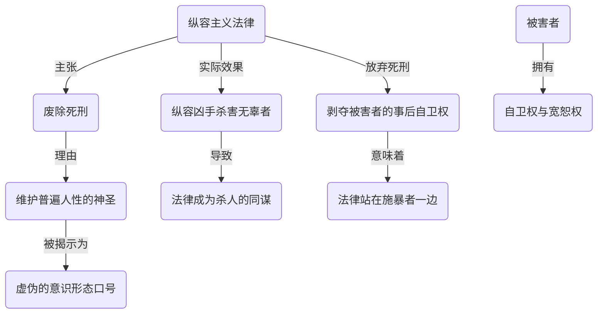
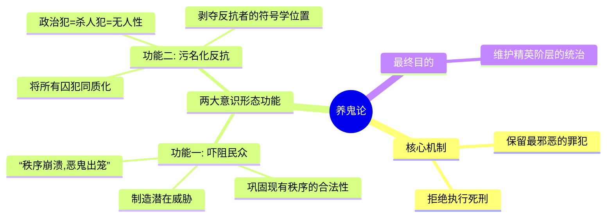
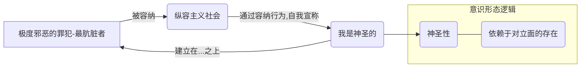

---
{"dg-publish":true,"permalink":"/1-4 平庸主义/1-4-2 世俗人道主义/1-4-2-1 纵容主义/","created":"2025-09-19T20:52:29.557+08:00","updated":"2025-09-23T01:37:02.593+08:00"}
---

### **一、本章概览**
- **主义主义编码**: 1-4-2-1
- **意识形态命名**: [[纵容主义\|纵容主义]] (Permissiveness) / [[世俗人道主义\|世俗人道主义]]的伦理实践
- **核心论断**: “纵容主义”通过倡导“[[废除死刑\|废除死刑]]”等绝对宽容的姿态，看似捍卫了普遍的[[人性\|人性]]神圣，实则是一种虚伪的意识形态操作。它通过在监狱中“养鬼”，将最邪恶的罪犯作为一种潜在威胁来规训社会大众，并以容纳“最肮脏者”的方式倒错地建构自身的“[[神圣性\|神圣性]]”，最终服务于巩固现有[[权力\|权力]]秩序。
- **你能获得**: 你将掌握“[[纵容主义\|纵容主义]]”这一西欧主流意识形态的内在结构（1-4-2-1），理解其在“[[废除死刑\|废除死刑]]”议题上看似人道、实则充满悖论的逻辑，并学会运用“[[养鬼论\|养鬼论]]”这一批判性概念，来剖析其背后深层的社会控制机制。

---
### **二、核心内容解析**

#### **“主义主义”四格分析**

1.  **场域之“1” (Ontology)**：该意识形态预设的世界舞台是一个统一、封闭且自我循环的“[[人类社会\|人类社会]]”或“文明社会”。这个“1”意味着世界被理解为一个整体性的、无外部的[[存在论\|存在论]]框架。所有的事件和冲突都发生在这个名为“文明”的唯一舞台上，其运作规则是内在的、不容置疑的。这个场域的终极目标就是维持自身的循环与稳定，将一切异质性力量都收编进这个统一的叙事中，使其成为内部可管理的一部分，而不是一个真正的外部威胁。

2.  **本体之“4” (Body)**：在该意识形态中，关于世界究竟由什么“真实”构成的[[9 未命名/本体论\|本体论]]问题被悬置或回避了。这个“4”代表了一种对根本实在的“不反思”或“不可知”态度。它不去追问“[[人性\|人性]]的本质是什么？”或“[[实在\|实在]]的基底是什么？”，而是直接跳到现象层面进行操作。这种本体论上的虚空，使得意识形态可以轻易地将任何内容（如抽象的、普遍的“人性”）填入其中，而无需为其提供哲学上的坚实基础。这个“空位”是其意识形态能够灵活运作的关键。

3.  **现象之“2” (Phenomenon)**：主体对世界的体验被建构在一个核心的二元对立之上。这个“2”分裂出两个现象学的位置：一方是“可宽容者”（正常的、体面的、有序的），即主流社会中的“我们”；另一方是“被宽容者”（不正常的、混乱的、污秽的、脆弱的），即罪犯、越轨者等“他们”。整个社会生活就是一场“我们”如何去“宽容”或“管理”“他们”的持续戏剧。这种[[现象\|现象]]学的对立，将复杂的社会矛盾简化为一种道德上的强者对弱者、正常对异常的姿态，从而掩盖了背后真正的权力关系。

4.  **目的之“1” (Purpose)**：该意识形态的[[9 未命名/目的论\|目的论]]是导向一个永恒的、自我重复的“文明”状态。这个结尾的“1”意味着它的最终目标就是无限期地维持这个“宽容”的社会秩序本身。通过不断上演宽容与被宽容的戏码，系统得以确认自身的优越性和文明性，并无限循环下去。它不导向任何超越性的目标或历史的终结，唯一的目的就是让这个“越包容越文明”的逻辑永远运转，确保现有社会结构的永续存在。

#### **其他核心知识点**

##### 废除死刑的内在悖论
[[废除死刑\|废除死刑]]在“纵容主义”框架下，被宣传为[[世俗人道主义\|世俗人道主义]]的最高成就，但其内在逻辑充满悖论。它声称为了维护“人性的神圣”而不能杀人，却无视了法律在纵容凶手杀害无辜者时，本身已成为杀人的同谋。该理论认为，宽恕的权力在于被害者，而法律作为公共意志的体现，本应延伸被害者在受害瞬间无法实现的[[自卫权\|自卫权]]，将其转化为一种具有威慑力的事后[[报复权\|报复权]]。当法律放弃死刑，它便不再代表受害者，而是站在了有能力施暴的一方，保护了施暴者的生命，却剥夺了潜在受害者的终极安全保障。

**举例阐释**：当一个凶手残忍地杀害了一个无辜者，[[纵容主义\|纵容主义]]者会说：“我们不能杀他，否则我们和凶手有什么区别？”。讲稿对此反驳道，法律若要保护生命，就必须能够以“对死亡的恐惧”作为终极威慑工具。若放弃这一工具，法律实际上是在向所有潜在的施暴者传递一个信息：你可以剥夺他人的生命，而你自己的生命安全却能得到国家的绝对保障。

##### 养鬼论：作为意识形态工具的监狱
“[[养鬼论\|养鬼论]]”是讲稿提出的核心批判概念，它揭示了[[废除死刑\|废除死刑]]背后一种更深层的[[权力\|权力]]策略。该理论认为，西欧发达国家并非出于真正的仁慈而不判处恶性罪犯死刑，而是有意地将这些“最肮脏、最邪恶”的人“养”在监狱里。这些活着的“恶鬼”成为了一种意识形态工具，其功能有二：首先，他们作为一种潜在的恐怖象征，用来吓阻民众，暗示“如果现行秩序崩溃，这些魔鬼就会被放出来”，从而让人们不敢挑战现有体制；其次，它将所有被关进监狱的人——无论是真正的恶棍还是政治异议者——都同质化为“无人性”的囚犯，从而污名化一切反抗行为。

**举例阐释**：挪威的布雷维克案，一名大规模屠杀的凶手被判长期监禁，但在狱中享有优越的生活条件。根据“[[养鬼论\|养鬼论]]”，这种处理方式并非文明的体现，而是一种政治表演。这个活着的“鬼”时刻提醒着挪威社会：我们有能力控制这种极致的邪恶，而你们必须依赖我们这个秩序才能免受其害。任何试图颠覆这个秩序的人，最终都会落得和这个“鬼”一样的下场——被排除在“文明社会”之外。

##### 神圣性的倒错建构
[[纵容主义\|纵容主义]]所标榜的“人性的[[神圣性\|神圣性]]”并非一个先验的、积极的价值，而是通过一种倒错的、否定的方式被建构起来的。它的逻辑是：“我的社会之所以是神圣的，不是因为我们有多么高尚，而是因为我们能容纳下最肮脏、最污浊的罪犯，并让他们活下去。”这种[[神圣性\|神圣性]]的合法性完全依赖于那个被它所容纳的“极度邪恶”的对立面。通过展示对“鬼”的宽容，这个体系为自身加冕。这是一种脆弱的、寄生性的[[神圣性\|神圣性]]，因为它需要不断地有“鬼”来作为其存在的反面证明。

**举例阐释**：讲稿中的一句话精辟地总结了这点：“什么是神圣呢？就是我能容得下最肮脏的，我就是神圣的。” 这意味着，一个社会的道德优越感，并非来自其内部公民的积极德行，而是来自其对外部“贱民”的消极姿态。这套逻辑最终遮蔽了其在世界其他地区（如通过代理人战争）制造的真正“肮脏”的现实。

---
### **三、关键观点提取**
- “宽恕这个行为，宽恕者应该是[[被害者\|被害者]]，了解吗？”
- “如果法律说站在凶手的背后说杀人是不需要付出那个生命代价的...法律是站在有能力施暴的那一边。”
- “我认为他们不是[[废除死刑\|废除死刑]]，他们是在养鬼...与其说是废死，不如说是[[养鬼论\|养鬼论]]。”
- “他的[[神圣性\|神圣性]]其实根本不存在...它是通过设立一个极极度邪恶的一个对立面来支撑起它。”
- “什么是[[神圣性\|神圣性]]呢？就是我能容得下最肮脏的，我就是神圣的。简单来说，我能容纳一下...所以我是神圣的。”

---
### **四、知识点问答**
#### Q: 为什么讲稿认为废除死刑的法律反而是“站在施暴者一边”？
A: 因为法律的根本目的之一是保护公民的生命权。通过设立死刑，法律以终极的威慑来吓阻最恶性的暴力犯罪，这可以被看作是公民[[自卫权\|自卫权]]的社会化延伸。当法律取消死刑，它实质上是向施暴者保证，无论你犯下多么残忍的罪行，你的生命权都将得到国家机器的绝对保护。与此同时，被害者及其所代表的社会公众，则失去了最强有力的正义实现和安全保障手段。在这种权衡中，法律的天平明显偏向了拥有施暴能力的一方。

#### Q: “[[养鬼论\|养鬼论]]”如何揭示了“纵容主义”在政治上的虚伪性？
A: “[[养鬼论\|养鬼论]]”揭示了“[[纵容主义\|纵容主义]]”的政治目的并非其宣称的人道主义关怀，而是一种精密的社会[[规训权力\|规训权力]]策略。它通过保留和展示“人间恶鬼”，一方面制造了对社会失序的恐惧，迫使民众更加依赖现有[[权力\|权力]]秩序；另一方面，它创造了一个“非人”的范畴，将所有被政权视为威胁的个体（无论是杀人犯还是政治犯）都归入其中，从而剥夺了后者反抗的合法性。这种操作将伦理议题（是否废死）转化为维护统治的政治工具，暴露了其深刻的虚伪性。

#### Q: [[纵容主义\|纵容主义]]构建的“神圣性”为何是脆弱且具有欺骗性的？
A: 它的脆弱性在于，这种[[神圣性\|神圣性]]并非源于自身积极的价值创造，而是寄生于它所否定的“邪恶”之上。一旦没有了可供“宽容”的“恶鬼”作为参照物，其自我标榜的“神圣”就失去了存在的依据。它的欺骗性在于，通过在本土展示对个体罪犯的极致宽容，它成功地构建了一个文明、人道的形象，从而巧妙地遮蔽了它在国际上（如通过代理人战争、金融霸权）造成的大规模死亡和非人道灾难。这是一种典型的[[9 未命名/意识形态\|意识形态]]操作：用微观的、可见的“善行”来掩盖宏观的、不可见的“恶行”。

---
### **五、知识延伸**
- **[[6 哲学家/米歇尔·福柯\|米歇尔·福柯]]的《[[规训与惩罚\|规训与惩罚]]》**: 福柯对现代监狱制度的分析是理解“[[养鬼论\|养鬼论]]”的最佳理论参照。他揭示了惩罚方式从公开处决到监禁的转变，并非出于人道主义的进步，而是一种更高效的[[权力\|权力]]技术。监狱成为制造“罪犯”这一特殊社会类别，并以此来规训整个社会的工厂，这与讲稿中“养鬼”以吓阻民众的逻辑高度一致。
- **[[卡尔·施密特\|卡尔·施密特]]的《[[政治的神学\|政治的神学]]》**: 施密特认为“[[主权者\|主权者]]就是决断[[例外状态\|例外状态]]的人”。废除死刑可以被视为[[主权者\|主权者]]放弃了对最极端情况（即是否剥夺一个人的生命）做出决断的权力。这反映了现代自由主义国家试图用普遍的、无例外的规范来取代主权决断的倾向。然而，讲稿的分析暗示，这种放弃本身就是一种新的、更隐蔽的决断——决断了要“养鬼”来服务于统治。
- **电影《[[黑暗骑士\|黑暗骑士]]》中的[[蝙蝠侠\|蝙蝠侠]]与[[小丑\|小丑]]**: 这个例子形象地展示了[[纵容主义\|纵容主义]]的困境。[[蝙蝠侠\|蝙蝠侠]]坚守“不杀”原则（类似[[废除死刑\|废除死刑]]），但这却使得[[小丑\|小丑]]这样的“恶鬼”能够一次次地逃脱并制造更大的混乱。[[蝙蝠侠\|蝙蝠侠]]的道德洁癖，客观上纵容了邪恶的存续，并使整个哥谭市的市民生活在恐惧之中，这与[[养鬼论\|养鬼论]]中精英通过“养鬼”来控制民众的逻辑形成了有趣的参照。

---
### **六、双链关联总结**
- **一级关联 (核心意识形态与概念)**: [[纵容主义\|纵容主义]]、[[世俗人道主义\|世俗人道主义]]、[[废除死刑\|废除死刑]]、[[养鬼论\|养鬼论]]、[[神圣性\|神圣性]]、[[自卫权\|自卫权]]、[[报复权\|报复权]]、[[人性\|人性]]
- **推测相关人物 (Speculated Figures)**: 坚守“不杀原则”的[[蝙蝠侠\|蝙蝠侠]]（作为该意识形态困境的寓言化身）、部分西欧国家的白左政治家与社会活动家（作为该意识形态的现实载体）、主张绝对宽容的道德理论家
- **二级关联 (上下文与背景)**: [[9 未命名/意识形态\|意识形态]]、[[主页\|主页]]、[[权力\|权力]]、[[规训与惩罚\|规训与惩罚]]、[[存在论\|存在论]]、[[9 未命名/本体论\|本体论]]、[[现象\|现象]]、[[9 未命名/目的论\|目的论]]、[[规训权力\|规训权力]]
- **三级关联 (推测与延展)**: [[6 哲学家/米歇尔·福柯\|米歇尔·福柯]]、[[卡尔·施密特\|卡尔·施密特]]、[[主权者\|主权者]]、[[例外状态\|例外状态]]、[[小丑\|小丑]]、[[代理人战争\|代理人战争]]、[[5 主义/资本主义\|资本主义]]