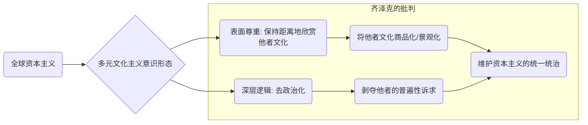
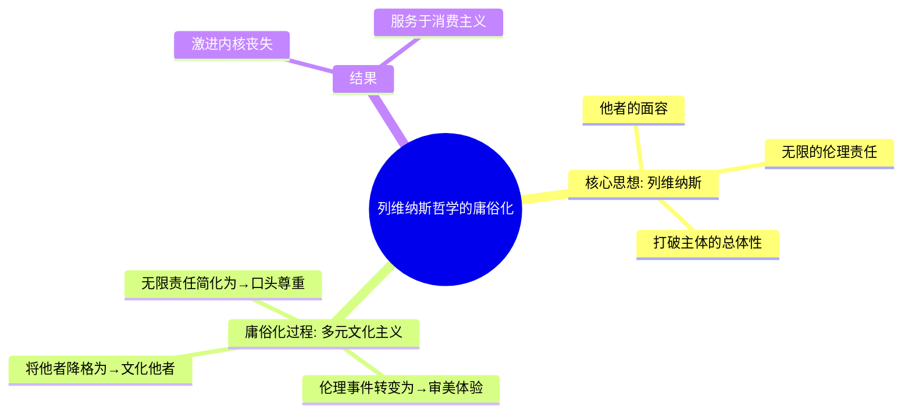
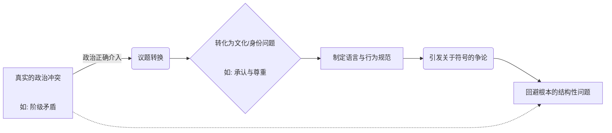

---
{"dg-publish":true,"permalink":"/1-4 平庸主义/1-4-2 世俗人道主义/1-4-2-2 多元文化主义/","created":"2025-09-19T20:52:29.559+08:00","updated":"2025-09-23T18:45:15.198+08:00"}
---

### **一、本章概览**
- **主义主义编码**: 1-4-2-2
- **意识形态命名**: [[多元文化主义\|多元文化主义]]
- **核心论断**: [[多元文化主义\|多元文化主义]]是一种虚伪的意识形态，它在[[全球资本主义\|全球资本主义]]这一统一场域下，通过颂扬表面的文化[[多样性\|多样性]]（4），制造出一种“宽容/开放”对抗“封闭/原教旨”（2）的虚假冲突，其最终目的（2）是不断维系这种“[[多样性\|多样性]] vs [[总体性\|总体性]]”的斗争，从而掩盖真正的政治矛盾，巩固[[全球资本主义\|全球资本主义]]的统治。
- **你能获得**: 你将理解[[多元文化主义\|多元文化主义]]作为一种“政治正确”的内在运作逻辑，掌握其在“主义主义”框架下的1-4-2-2结构，并能运用[[齐泽克\|齐泽克]]的批判视角，看穿其如何成为[[全球资本主义\|全球资本主义]]最理想的文化配套方案。

---
### **二、核心内容解析**

#### **“主义主义”四格分析**

1.  **场域之“1” (Ontology)**：该意识形态的世界观框架是一个统一、无所不包的[[全球资本主义\|全球资本主义]]系统。这个“1”是整个结构的隐性前提，它不被言说，却规定了一切。它意味着，无论文化、习俗、生活方式如何“多元”，它们都必须在这个统一的全球市场逻辑内运作和交换。所有的文化差异都被商品化、符号化，成为可以被消费的奇观，但绝不允许挑战这个统一的资本主义[[场域\|场域]]本身。因此，这个“1”代表了一个封闭的、同质化的经济-政治[[实在\|实在]]，是所有“多元”表演的唯一舞台。

2.  **本体之“4” (Body)**：该意识形态认为，世界在本体上是无根基、无中心的，不存在一个统一的、具有实体性的“文化本体”。这个“4”体现了一种庸俗化的[[5 主义/结构主义\|结构主义]]或后现代思想，即世界是由不断变动、差异化的“幻影”（文化符号、生活方式、族群认同）构成的。它强调“只有[[多样性\|多样性]]，没有本体”。这种对“空无”的强调，使得任何试图建立普遍性真理的努力都被视为压迫性的[[总体性\|总体性]]。然而，这个“4”的激进性是虚假的，因为它恰恰掩盖了场域之“1”（[[全球资本主义\|全球资本主义]]）作为真正不变的本体。

3.  **现象之“2” (Phenomenon)**：在主体的感知层面，世界被简化为一场永恒的二元对立：一方是“我们”——宽容、开放、拥抱多元的现代主体；另一方是“他们”——原始、封闭、愚蠢的[[5 主义/原教旨主义\|原教旨主义]]者或任何拒绝融入这个多元图景的“他者”。这种现象学上的“2”构建了一种道德优越感，主体通过将自身定位在“开放”的一极来获得认同。一切复杂的社会、政治问题都被转化为这种简单的文化价值对抗，使主体沉浸在一种廉价的自我肯定中，而忽略了更深层次的结构性矛盾。

4.  **目的之“2” (Purpose)**：该意识形态的[[9 未命名/目的论\|目的论]]是维持一种永恒的斗争状态，即“[[多样性\|多样性]]”对“[[总体性\|总体性]]”的斗争。这个“2”意味着它的最终目的不是达成任何实质性的和解或建立新的普遍性，而是要让“追求多样、反对统一”这个行为本身永久持续下去。通过不断地制造和识别出新的“[[总体性\|总体性]]”威胁（如欧洲中心主义、父权制等），来为[[多样性\|多样性]]的斗争赋予合法性。这使得社会永远处于一种低烈度的、可控的文化冲突之中，从而完美地避免了触及那个作为根基的[[全球资本主义\|全球资本主义]]的统一性。

#### **其他核心知识点**

##### 齐泽克对多元文化主义的批判
[[6 哲学家/斯拉沃热·齐泽克\|斯拉沃热·齐泽克]]深刻地揭示了[[多元文化主义\|多元文化主义]]的虚伪性，他认为这恰恰是晚期[[全球资本主义\|全球资本主义]]的完美意识形态。它以一种居高临下的姿态“尊重”他者文化，但这种尊重是保持安全距离的、非介入式的欣赏。它将他者视为一个有趣的、有待研究和消费的“文化样本”，而不是一个拥有普遍性诉求的真正主体。这种“尊重”的代价是剥夺了他者的政治锋芒，将其去政治化。只要他者安于扮演其“文化角色”，他就会受到欢迎；一旦他试图提出具有普遍性的政治纲领，他就会被视为威胁[[多样性\|多样性]]的[[5 主义/原教旨主义\|原教旨主义]]者。因此，[[多元文化主义\|多元文化主义]]是全球资本进行文化统治的工具，它通过允许表面的文化差异来确保深层经济逻辑的绝对统一。

**举例阐释**：一家跨国公司在内部大肆宣传“文化多样性周”，鼓励员工穿着民族服装、分享各自国家的美食。但这并不会改变公司对所有员工施加的统一的、高强度的工作绩效考核标准和利润至上的逻辑。文化差异在这里成了点缀，用以缓和和掩盖残酷的经济剥削这一普遍现实。

##### 列维纳斯的他者性哲学 (庸俗化)
讲稿提及[[多元文化主义\|多元文化主义]]挪用了[[伊曼纽尔·列维纳斯\|伊曼纽尔·列维纳斯]]的[[他者性\|他者性]]哲学。在列维纳斯那里，“他者”的出现是绝对的、创伤性的伦理事件。他者的“面容”直接向我发出“不可杀戮”的伦理诫命，它打破了我自我中心的[[总体性\|总体性]]，让我承担起无限的责任。这是一种颠覆性的、非对称的关系。然而，[[多元文化主义\|多元文化主义]]将这种激进的[[他者性\|他者性]]哲学庸俗化了。它把“他者”从一个对我具有绝对伦理要求的存在，降格为一个拥有异域风情、独特习俗的“文化他者”。与他者的相遇不再是伦理上的震撼，而是一种文化上的消费和审美体验。对“他者”的责任也被简化为一种廉价的、口头上的“尊重”，完全丧失了[[列维纳斯\|列维纳斯]]思想中的革命性内核。

**举例阐释**：一个游客去异国旅行，对当地人的生活方式、宗教仪式感到“新奇”和“有趣”，并表示“尊重他们的文化选择”。这种“尊重”是建立在游客的消费和审美立场上的，他并未真正被他者的生存处境所“质询”，也没有因此承担起任何实质性的伦理责任。这便是对[[他者性\|他者性]]的庸俗化。

##### 作为“非政治”的政治正确
讲稿指出，[[多元文化主义\|多元文化主义]]这类意识形态是“[[政治正确\|政治正确]]”，而[[政治正确\|政治正确]]的本质是“没有政治”。这里的“政治”指的是真实的、涉及根本性社会结构对抗的领域。[[政治正确\|政治正确]]通过建立一套关于语言、态度和文化承认的规范，将真正的政治冲突（如阶级斗争）替换为文化层面的承认和身份认同问题。它关注“我们该如何谈论少数群体”远胜于“我们该如何改变导致少数群体被压迫的经济结构”。通过这种议题转换，它成功地将人们的注意力从根本性的社会矛盾上移开，让大家陷入到关于符号、话语和姿态的无休止争论中，而现实的权力结构则安然无恙。

**举例阐释**：当讨论贫困问题时，一场真正的政治辩论可能会聚焦于税收政策、财富再分配和社会福利制度。而在一场被[[政治正确\|政治正确]]主导的讨论中，话题很可能会转向如何使用“正确的词汇”来称呼贫困人群，或者批评某部电影对贫困群体的“刻板印象”，从而回避了对经济制度本身的诘问。

---
### **三、关键观点提取**
- “一个社会的文明就取决于它多能够包容不同的这种不同的[[他者\|他者]]，[[他者\|他者]]越多越明，说明他越文明。”
- “差异高于[[同一性\|同一性]]。这个[[总体性\|总体性]]这个玩意儿他认为一般认为这个东西是现代性的危机。”
- “所有这一切都是在这个[[场域\|场域]]一致性的[[全球资本主义\|全球资本主义]]的这个束缚之下的。[[齐泽克\|齐泽克]]对他批判是非常非常的深刻的。”
- “[[政治正确\|政治正确]]就是没有政治，[[政治正确\|政治正确]]就是一切都只是只是调和，只是调和妥协性的。”

---
### **四、知识点问答**
#### Q: 为何说1-4-2-2中的“多样性”（4）与“统一性”（1）是共谋关系，而非对立关系？
A: 因为在[[多元文化主义\|多元文化主义]]的框架下，[[多样性\|多样性]]（本体之4）的存在完全依赖于[[全球资本主义\|全球资本主义]]这个统一[[场域\|场域]]（场域之1）。资本主义需要不断制造新的文化符号和生活方式作为商品来售卖，这种表面的[[多样性\|多样性]]恰恰是其市场活力的来源。反过来，对[[多样性\|多样性]]的颂扬又使得任何试图建立一种能挑战资本主义的新的普遍性方案（即一种新的“1”）都变得不可能，因为它会被立即打成压迫性的“[[总体性\|总体性]]”。因此，这个“4”通过反对一切其他的“1”，最终巩固了那个它从不言说的、作为其存在基础的资本主义之“1”。

#### Q: 多元文化主义在现象学上构建的“宽容 vs 封闭”的二元对立（2）有何欺骗性？
A: 这种对立的欺骗性在于，它将一个结构性的政治经济问题伪装成了一个个人性的文化姿态问题。它让主体相信，只要自己保持“宽容”和“开放”的态度，就站在了正义的一方，从而忽略了自己作为[[全球资本主义\|全球资本主义]]体系的参与者，可能正在以更隐蔽的方式参与对他者的剥削。这种二元对立制造了一个廉价的道德高地，使得主体可以心安理得地处在不平等的结构之中，因为它成功地将矛盾从“剥削者 vs 被剥削者”转移到了“宽容者 vs 不宽容者”。

#### Q: 在1-4-2-2的框架下，真正的“他者”在哪里？
A: 在这个框架下，真正的[[他者\|他者]]——即那个无法被纳入文化消费体系、其存在本身就对[[全球资本主义\|全球资本主义]]秩序构成挑战的主体——是被排斥和消声的。[[多元文化主义\|多元文化主义]]所欢迎的“他者”是已经被符号化、景观化、去政治化的“文化他者”。而一个拒绝被商品化、试图提出自己普遍性政治诉求的[[他者\|他者]]（例如，一个要求改变国际贸易规则而非仅仅要求文化尊重的第三世界运动），则会被视为“[[5 主义/原教旨主义\|原教旨主义]]”或“[[总体性\|总体性]]”的威胁，从而被驱逐出这个“宽容”的体系。

---
### **五、知识延伸**
- **[[6 哲学家/斯拉沃热·齐泽克\|斯拉沃热·齐泽克]]《[[意识形态的崇高客体\|意识形态的崇高客体]]》**: 要深入理解[[多元文化主义\|多元文化主义]]如何作为一种意识形态运作，这本书是必读之选。它系统阐述了意识形态如何在后现代社会中“起作用”，即使人们宣称自己不再相信任何宏大叙事。它为批判[[政治正确\|政治正确]]和[[多元文化主义\|多元文化主义]]的虚伪性提供了最锐利的理论武器。
- **[[伊曼纽尔·列维纳斯\|伊曼纽尔·列维纳斯]]《[[总体与无限\|总体与无限]]》**: 这是讲稿中直接提到的文本，也是[[多元文化主义\|多元文化主义]]所庸俗化的思想源头。阅读此书可以理解原初的[[他者性\|他者性]]哲学是何等激进和具有颠覆性，从而可以更清晰地看到[[多元文化主义\|多元文化主义]]对其的阉割和滥用，构成了一种强烈的批判性参照。
- **[[霍米·巴巴\|霍米·巴巴]]的[[文化杂糅\|文化杂糅]] (Hybridity) 理论**: 巴巴的后殖民理论提供了一个比[[多元文化主义\|多元文化主义]]更复杂的看待文化互动的方式。他认为文化不是孤立的、纯粹的实体，而是在殖民等权力关系中不断相互渗透、产生“杂糅”的。这个概念批判了[[多元文化主义\|多元文化主义]]那种将各种文化视为独立样本并置的“文化动物园”模式，强调了文化身份的流动性和不纯粹性。

---
### **六、双链关联总结**
- **一级关联 (核心意识形态与概念)**: [[多元文化主义\|多元文化主义]]、[[全球资本主义\|全球资本主义]]、[[多样性\|多样性]]、[[总体性\|总体性]]、[[他者性\|他者性]]、[[同一性\|同一性]]、[[政治正确\|政治正确]]
- **推测相关人物 (Speculated Figures)**: **致力于推动企业DEI（Diversity, Equity, and Inclusion）文化的大公司高管**。他们颂扬和管理文化差异，其目的不是为了颠覆权力结构，而是为了提高企业声誉、规避法律风险、吸引多元化人才，最终服务于公司在全球市场中的平稳运作和利润最大化，是1-4-2-2意识形态的完美实践者。
- **二级关联 (上下文与背景)**: [[5 主义/后现代主义\|后现代主义]]、[[后殖民主义\|后殖民主义]]、[[5 主义/结构主义\|结构主义]]、[[9 未命名/精神分析\|精神分析]]、[[欧陆哲学\|欧陆哲学]]、[[6 哲学家/斯拉沃热·齐泽克\|斯拉沃热·齐泽克]]、[[伊曼纽尔·列维纳斯\|伊曼纽尔·列维纳斯]]
- **三级关联 (推测与延展)**: [[9 未命名/身份政治\|身份政治]]、[[文化战争\|文化战争]]、[[文化挪用\|文化挪用]]、[[5 主义/普遍主义\|普遍主义]]、[[世界主义\|世界主义]]、[[文化杂糅\|文化杂糅]]