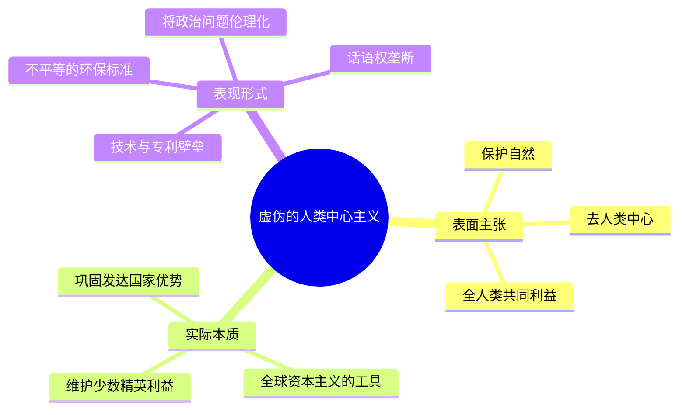
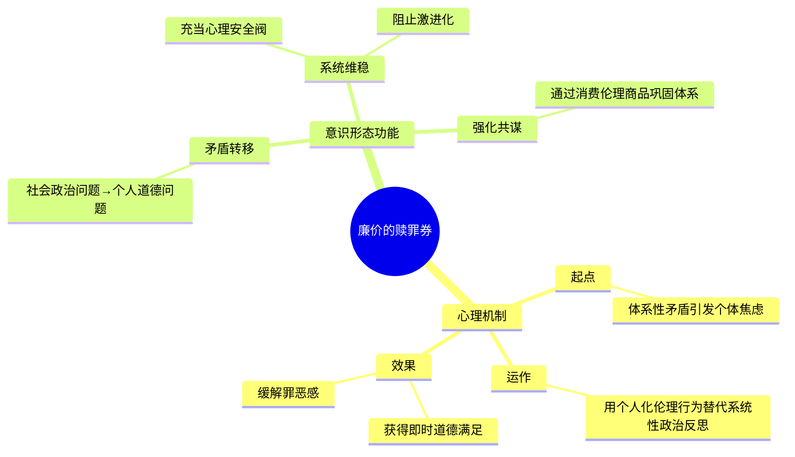
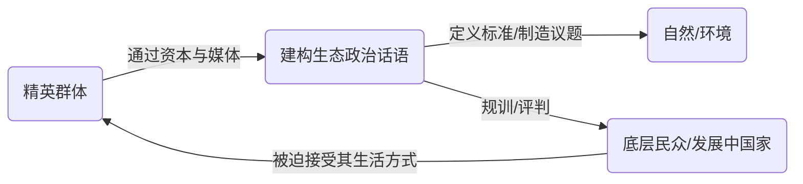

---
{"dg-publish":true,"permalink":"/1-4 平庸主义/1-4-2 世俗人道主义/1-4-2-3 环保主义/","created":"2025-09-19T20:52:29.562+08:00","updated":"2025-09-23T01:37:05.313+08:00"}
---

### **一、本章概览**
- **主义主义编码**: 1-4-2-3
- **意识形态命名**: [[环保主义\|环保主义]] / [[环境中心主义\|环境中心主义]] (其本质被揭示为一种隐蔽的[[5 主义/人类中心主义\|人类中心主义]])
- **核心论断**: [[环保主义\|环保主义]]并非真正关于自然的意识形态，而是一种高级的[[5 主义/人类中心主义\|人类中心主义]]。它通过建构一个中立、客观的“环境”概念作为中介（3），来调和[[全球资本主义\|全球资本主义]]（1）内部的多元文化（现象上的2）与总体性之间的矛盾，最终服务于少数发达国家精英群体的利益。
- **你能获得**: 你将掌握使用“主义主义”框架拆解[[环保主义\|环保主义]]的方法，看穿其如何将一个政治经济问题伪装成一个普遍伦理问题，理解其作为“廉价[[9 未命名/赎罪券\|赎罪券]]”的社会心理功能，并洞察其在[[生态政治学\|生态政治学]]中作为话语权工具的运作逻辑。

---
### **二、核心内容解析**

#### **“主义主义”四格分析**

1.  **场域之“1” (Ontology)**：该意识形态的[[存在论\|存在论]]舞台是一个不被质疑的、统一且封闭的[[全球资本主义\|全球资本主义]]体系。这个“1”意味着[[环保主义\|环保主义]]的一切讨论都发生在这个体系内部，它从不根本性质疑资本主义的生产方式、消费逻辑和全球资源分配模式。相反，它提出的所有解决方案，如“绿色资本”、“碳排放交易”，都旨在修补和延续这个系统，使其循环往复。这个场域是其所有思考的绝对背景和前提，是一个整全性的、无法被超越的经济秩序。

2.  **本体之“4” (Body)**：在[[全球资本主义\|全球资本主义]]的舞台上，不存在坚实的、原初的[[实在\|实在]]，只有后现代意义上的幻影（[[拟像\|拟像]] / Simulacrum）。这个“4”代表了本体论层面的虚无与内在不可能性。所谓的“自然”、“环境”或“地球母亲”，并非一个客观自在的实体，而是被媒体、科学话语和文化工业生产出来的、充满了人类中心主义投射的[[拟像\|拟像]]。现实本身是分裂且不自洽的，充满了各种被模拟和建构出来的符号，其背后没有稳固的根基。

3.  **现象之“2” (Phenomenon)**：[[主体性\|主体性]]体验被分裂为二元对立的结构。一方面是“反思性的”主体，即那些有理性的、聪明的、审慎的、有“人性光辉”的精英（环保主义者自己）；另一方面是“未反思的”或“前反思的”主体，即那些粗鲁的、愚蠢的、只顾眼前利益的普通大众或发展中国家的民众。这种现象学的“2”构建了一种道德和智识上的等级制，环保主义者将自己置于优越的审判者位置，而将他人视为需要被规训和教化的对象，这是一种虚假的、不彻底的反思。

4.  **目的之“3” (Purpose)**：该意识形态的[[9 未命名/目的论\|目的论]]在于寻求一个中心化的中介（3）来调和内在矛盾。具体而言，它旨在调和[[多元文化主义\|多元文化主义]]所倡导的“多样性”（multiplicity）与资本主义“总体性”（totality）之间的对抗。这个中介就是被客观化、普遍化的“人类生存环境”。这个“环境”概念作为一个看似中立的第三方，为政治裁决提供了标准：只要不破坏这个公共环境，多样性就可以被容忍，总体性的权力也找到了干预的合法性。最终，所有矛盾都汇集到“保护环境”这一中心目标上，从而掩盖了真正的社会对抗。

#### **其他核心知识点**

##### 虚伪的人类中心主义
[[环保主义\|环保主义]]最核心的特征是其深刻的虚伪性，它声称去人类中心，实际上是最极端、最隐蔽的[[5 主义/人类中心主义\|人类中心主义]]。这种意识形态所言的“人类”，并非抽象的、普遍的全人类，而是特指在[[全球资本主义\|全球资本主义]]体系下占据优势地位的少数发达国家人口。它通过垄断“环保”的话语权，将自身的生活方式和价值偏好普遍化为全人类的共同利益，从而将发展中国家维持在产业链的低端。这种中心主义通过设置技术壁垒（如绿色专利）、制定不平等的减排标准等方式，将一个阶级与地缘政治问题，巧妙地转化为一个关于自然与伦理的普遍性问题，从而巩固自身的霸权地位。

**举例阐释**：讲稿中提到，如果西方国家真心想解决发展中国家的碳排放问题，最有效的方式是无偿转让其先进的节能减排技术和专利。但他们绝不会这么做，因为这些专利是其维持全球经济优势地位的核心。相反，他们选择召开气候大会，分配碳排放额度，把“环境问题”变成一种可以交易的商品和地缘政治博弈的筹码，这彻底暴露了其[[5 主义/人类中心主义\|人类中心主义]]的自利本质。

##### 廉价的赎罪券
[[环保主义\|环保主义]]在个体层面常常扮演着一种“廉价[[9 未命名/赎罪券\|赎罪券]]”或“零售安慰剂”的角色。它允许身处不义体系中的个体，通过执行一些微小、程式化、几乎不触及根本的“环保行为”（如垃圾分类、断舍离、参与网络种树活动），来获得巨大的道德满足感和心理安慰。这种机制巧妙地转移了焦点，让人们觉得自己正在“改变世界”，从而无需反思自己作为体系一部分所参与的系统性剥削。它用一种廉价的、个人化的伦理实践，替代了对社会结构性问题的真正政治反思与行动，成为维持现状的强大心理稳定器。

**举例阐释**：讲稿中提及的黑心HR，他在工作中可能压榨员工、作恶多端，但在下班后，他通过坚持节约用电、将洗衣服的水冲马桶等行为，便心安理得地认为自己是一个“在对抗消费主义的英雄”。这种行为让他无需面对自己在微观权力关系中的作恶，环保成了他洗刷日常罪恶感的廉价工具。

##### 生态政治学的话语权垄断
[[环保主义\|环保主义]]催生了[[生态政治学\|生态政治学]]（Eco-politics），但这门学问并非中立的科学，而是一种新的权力话语。它通过一系列看似科学、客观的术语（如“承载力”、“碳足迹”、“可持续性”），垄断了定义“什么是自然”、“谁在破坏自然”以及“如何保护自然”的权力。这种话语权被少数精英和发达国家所掌握，他们可以根据自身利益，选择性地将某些行为定义为“不环保”并加以惩罚，同时将另一些破坏性更大的行为（如自身的高科技工业）合法化。最终，自然和环境成为了一种实现统治和区隔的政治工具。

**举例阐释**：电影《[[饥饿游戏\|饥饿游戏]]》是这种[[生态政治学\|生态政治学]]逻辑的终极寓言。国会区（Capitol）拥有极度发达、可以任意塑造环境的技术文明，他们享受着奢华的生活，同时却将其他行政区强制维持在一种前工业化的“原始”状态。这种强制的“原始”被包装成一种秩序，而各区之间残酷的生存搏斗则成为供国会区消费的景观。这完美展示了精英如何利用对“生态”的绝对控制权，来奴役和娱乐自身。

---
### **三、关键观点提取**
- “[[环保主义\|环保主义]]不是一种自然主义。环保主义是最极端的人类中心主义。”
- “这个隐藏[[5 主义/人类中心主义\|人类中心主义]]的人类也不是一个真正意义上的人类。这个人类是能够被[[全球资本主义\|全球资本主义]]所征用的自己人。”
- “这种很很廉价的环保主义实践，它变成一种[[9 未命名/赎罪券\|赎罪券]]了，精神赎罪券了。它就不需要反思，因为这个体系环保主义已经兜售给他一个廉价的反思。”
- “[[环保主义\|环保主义]]最终就会演变成这样一种东西...只有精英有资格讲环保，为什么？他有资格讲环保？他的工业效能高，对不对？他的工业屌。”
- “它（环保主义）虚构了一个虚假的人类共同体...在掩盖和压抑人和人的本质性的差异。”

---
### **四、知识点问答**
#### Q: 为什么说1-4-2-3[[环保主义\|环保主义]]是[[多元文化主义\|多元文化主义]]（1-4-2-2）矛盾的“调和者”？
A: [[多元文化主义\|多元文化主义]]（1-4-2-2）的内在矛盾在于，它在现象上提倡多样性（2），但其自身立场却是一种隐藏的、排他的普遍主义（基要主义），这导致其与资本主义的总体性逻辑持续冲突。[[环保主义\|环保主义]]（1-4-2-3）通过引入“人类生存环境”这个看似客观中立的第三方（3）作为[[9 未命名/目的论\|目的论]]，为这个矛盾提供了一个解决方案。它设定了一个所有人都必须遵守的底线，从而既能容纳不威胁这一底线的“多样性”，又能为总体性权力（如国家或国际组织）的干预提供合法性，从而将二元对抗的紧张关系，转化并汇集到一个中心化的、非政治化的“环保”目标之上。

#### Q: “廉价的[[9 未命名/赎罪券\|赎罪券]]”机制如何阻止个体进行真正的哲学反思？
A: 真正的哲学反思要求个体直面自身所处的社会结构的根本性矛盾，以及自身在其中的共谋关系。而“廉价的[[9 未命名/赎罪券\|赎罪券]]”机制通过提供一套简单、易行的个人化道德实践（如节约用水、垃圾分类），让个体能够迅速获得“我是个好人”、“我在做正确的事”的心理慰藉。这种即时的道德满足感，会短路（short-circuit）掉更深层次的、令人痛苦的自我诘问和系统批判，用一种虚假的、廉价的反思替代了真正的、困难的反思，从而成为意识形态的有力维稳工具。

#### Q: 讲稿中认为环保主义的“人类”是少数人，其判断标准是什么？
A: 判断标准在于，个体或群体是否能在“生态危机的发生学尺度下”（即一个长达数十年、充满不确定性的时间框架内）依然保有安全、富足、体面的生活状态。讲稿认为，在全球七十多亿人口中，能满足此条件的仅有生活在[[全球资本主义\|全球资本主义]]体系上游、能够通过专利、金融和技术优势攫取巨额利润的少数发达国家人口（约占10%）。对于绝大多数人而言，他们面临的是10小时后就可能没饭吃的生存危机，而非10年后的生态危机。因此，环保主义所保护的“人类未来”，实际上是这少数人现有生活方式的未来。

---
### **五、知识延伸**
- [[丁仲礼\|丁仲礼]]与柴静的对话: 这是现实中对[[环保主义\|环保主义]]话语权垄断的经典反击。丁仲礼院士以“中国人是不是人？”这一质问，直接击穿了西方环保话语中隐藏的[[5 主义/人类中心主义\|人类中心主义]]和发展权不平等问题，是理解[[生态政治学\|生态政治学]]背后地缘斗争的绝佳案例。
- **电影《[[饥饿游戏\|饥饿游戏]]》**: 如讲稿所述，这部电影是1-4-2-3意识形态发展到极致的艺术寓言。它展示了一个技术高度集中的核心区域如何通过垄断对“生态”的塑造权，将边缘区域强制维持在一种“原始”的、供其观赏和消费的野蛮状态，深刻揭示了环保主义潜在的反乌托邦结局。
- **斯拉沃热·[[齐泽克\|齐泽克]]的意识形态批判**: 齐泽克对于“星巴克式伦理”的批判与本讲稿中“廉价[[9 未命名/赎罪券\|赎罪券]]”的概念高度契合。他指出，当代资本主义善于将对其自身的批判也商品化（例如，购买一杯“公平贸易”咖啡让你感觉良好），这种行为非但没有颠覆体系，反而成了体系正常运转的一部分。这为理解环保主义的心理维稳功能提供了深刻的理论参照。

---
### **六、双链关联总结**
- **一级关联 (核心意识形态与概念)**: [[环保主义\|环保主义]]、[[5 主义/人类中心主义\|人类中心主义]]、[[全球资本主义\|全球资本主义]]、[[生态政治学\|生态政治学]]、[[9 未命名/赎罪券\|赎罪券]]、[[拟像\|拟像]]
- **推测相关人物 (Speculated Figures)**: [[Greta Thunberg\|Greta Thunberg]] (作为环保运动的符号，其行动本身依赖并促进了高科技工业复合体的运作)、《[[饥饿游戏\|饥饿游戏]]》中的国会区精英 (将对环境的绝对控制作为统治和娱乐的手段)
- **二级关联 (上下文与背景)**: [[主页\|主页]]、[[5 主义/后现代主义\|后现代主义]]、[[多元文化主义\|多元文化主义]]、[[哈贝马斯主义\|哈贝马斯主义]]、[[人道主义\|人道主义]]
- **三级关联 (推测与延展)**: [[生命政治\|生命政治]] (通过环境标准管理和规训人口的技术)、[[景观社会\|景观社会]] (环保本身成为一种被消费的奇观)、[[内爆\|内爆]] (环保主义试图调和矛盾，但最终可能加剧社会两极分化，导致系统崩溃)