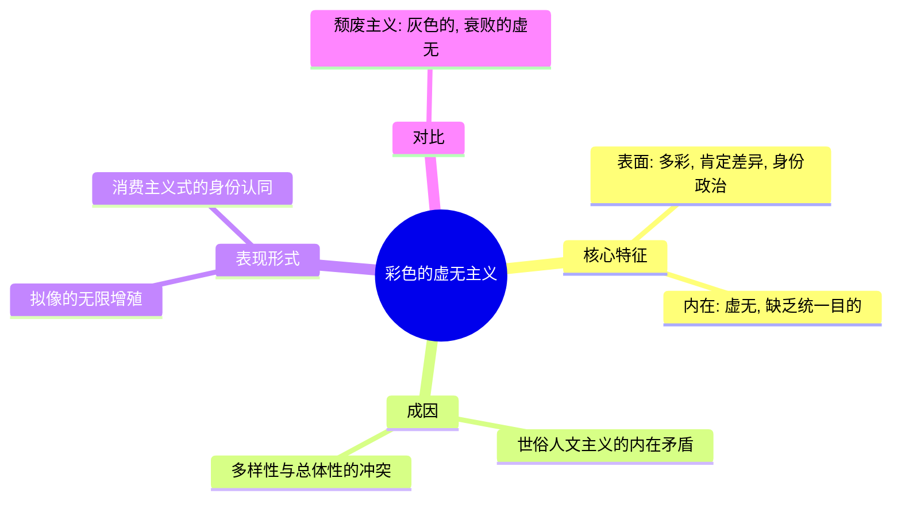
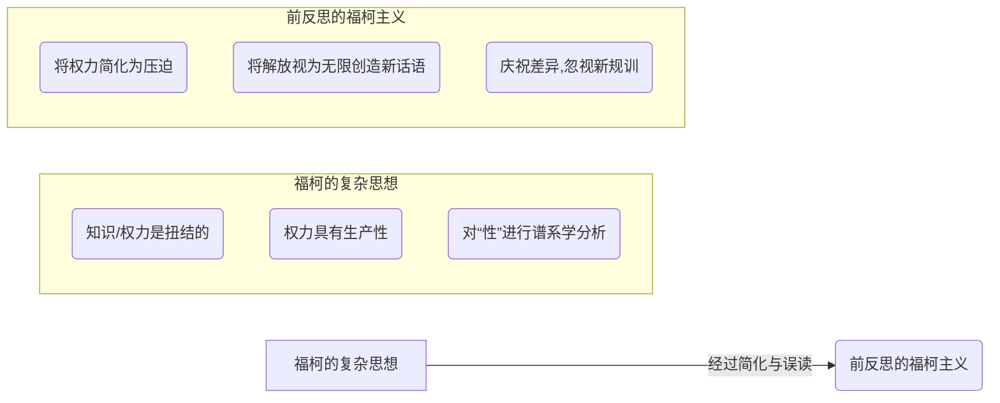
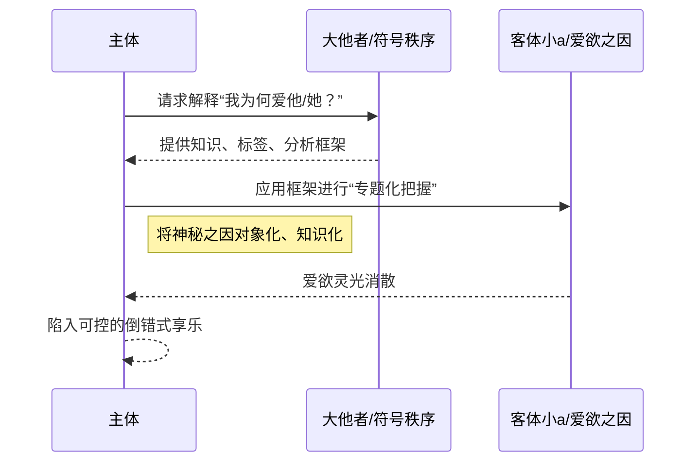

---
{"dg-publish":true,"permalink":"/1-4 平庸主义/1-4-2 世俗人道主义/1-4-2-4 性解放主义/","created":"2025-09-19T20:52:29.564+08:00","updated":"2025-09-23T18:44:54.498+08:00"}
---

### **一、本章概览**
- **主义主义编码**: 1-4-2-4
- **意识形态命名**: [[性解放主义\|性解放主义]] (Sexual Liberalism)
- **核心论断**: [[性解放主义\|性解放主义]]是[[世俗人文主义\|世俗人文主义]]发展到末路的必然产物，它将后者的内在矛盾外化为一种“[[彩色的虚无主义\|彩色的虚无主义]]”。在这种意识形态下，任何统一的[[性\|性]]本体都被解构为无穷的[[拟像\|拟像]]（Simulacrum），最终通过对[[爱欲\|爱欲]]的专题化、知识化把握，导致[[主体性\|主体性]]的瓦解和[[性倒错\|性倒错]]的产生。
- **你能获得**: 你将掌握 1-4-2-4 编码的完整[[主页\|主页]]四格剖析，理解为何[[人道主义\|人道主义]]会走向虚无，并洞悉当代身份政治背后“多彩”表象下的虚空内核。同时，你将学会从[[9 未命名/精神分析\|精神分析]]角度诊断，将[[爱欲\|爱欲]]对象（[[客体小a\|客体小a]]）知识化的行为如何引发[[性倒错\|性倒错]]。

---
### **二、核心内容解析**
#### **“主义主义”四格分析**

1.  **场域之“1” (Ontology)**：1-4-2-4 的[[存在论\|存在论]]舞台是一个由[[全球资本主义\|全球资本主义]]所规定的、整全且封闭的“1”的场域。这个场域是统一的、无所不包的，它为所有后续的“分裂”和“多样性”提供了唯一且不被质疑的背景。它就像一个巨大的、同质化的容器，内部可以上演五彩斑斓的差异游戏，但容器本身的逻辑——即商品交换、消费和全球化流动的逻辑——却是单一和绝对的。这个“1”的场域确保了无论内部的身份和欲望如何增殖，都不会触及最底层的经济和权力结构，一切“解放”都被限制在这个预设的舞台之上，成为系统自我调节的一部分。

2.  **本体之“4” (Body)**：在这个统一的场域内，世界的[[本体\|本体]]却是一个“4”，即一个内在分裂的虚空。该意识形态否认存在任何坚实、统一的[[实在\|实在]]，尤其是统一的“[[性\|性]]”本体。它宣称“不存在性本身，只存在各种各样的性（sexualities）”。世界的本质被替换为无穷无尽的差异之流和[[拟像\|拟像]]（simulacrum）。这些[[拟像\|拟像]]没有背后对应的真实，它们是自我指涉的符号游戏。因此，[[本体\|本体]]不再是某种坚实的物质或精神，而是一个由符号差异不断制造出来的、永远无法被填满的空洞，这为后续现象层面的分裂和目的层面的虚无奠定了基础。

3.  **现象之“2” (Phenomenon)**：主体的[[现象\|现象]]经验被一个尖锐的“2”所定义，即二元对立。这个对立发生在两极之间：一极是普通的、可被符号秩序完全捕获的日常事物（general objects）；另一极则是那个神秘的、引发无穷欲望的特殊对象——[[拉康\|拉康]]意义上的[[客体小a\|客体小a]]（object petit a）。[[性解放主义\|性解放主义]]的问题在于，它试图用处理普通事物的知识化、专题化方式去把握和分析[[客体小a\|客体小a]]。这种将[[爱欲\|爱欲]]的神秘诱因强行纳入[[9 未命名/大他者\|大他者]]的符号秩序进行分析的行为，构成了一种根本性的认识论分裂，主体就在这种分裂的体验中被撕扯。

4.  **目的之“4” (Purpose)**：该意识形态的[[9 未命名/目的论\|目的论]]最终走向一个“4”的结局，即虚无。由于[[本体\|本体]]是空洞的，[[现象\|现象]]体验是分裂的，其最终[[目的\|目的]]只能是目的本身的消解。这种虚无主义并非[[5 主义/颓废主义\|颓废主义]]那种灰暗、衰败的虚无，而是一种“[[彩色的虚无主义\|彩色的虚无主义]]”。它通过不断制造和消费新的身份、新的欲望、新的“性（sexualities）”来掩盖那个核心的空洞。其终极“目的”就是维持这种无穷的符号增殖过程，让主体沉浸在五彩斑斓的[[拟像\|拟像]]海洋中，从而忘记去追问任何终极意义，最终导向一种享乐至死但毫无建树的耗散状态。

#### **其他核心知识点**

##### 彩色的虚无主义
这是一种区别于传统[[5 主义/颓废主义\|颓废主义]]（1-3-4-4）的灰色虚无的特殊[[虚无主义\|虚无主义]]形态。它的核心特征在于，它并不直接呈现为绝望或衰败，而是以一种极度肯定“多样性”和“差异性”的正面、多彩的面貌出现。这种[[虚无主义\|虚无主义]]源于[[世俗人文主义\|世俗人文主义]]无法调和“多样性”与“总体性”的内在矛盾，最终选择放弃总体性，让多样性无限增殖。这种增殖表现为对各种[[性\|性]]身份、文化标签的不断创造和庆祝，形成一幅缤纷多彩的后现代画卷。然而，这幅画卷的绚烂色彩恰恰是为了掩盖其背后统一性[[9 未命名/目的论\|目的论]]的彻底缺失。它用表面的狂欢和身份的盛宴，来填充[[主体性\|主体性]]因丧失终极意义而产生的巨大空虚。

**举例阐释**：在某些极端的身份政治话语中，政治目标不再是争取普遍性的解放，而是无休止地细分和创造新的性别认同、性取向标签。每一种新标签都伴随着新的旗帜和符号，形成一场视觉上的“解放”盛宴，但这种符号的狂欢往往与现实的结构性问题脱节，最终使参与者陷入一种除了不断确认和展示自身差异外再无更高追求的虚无状态。

##### 前反思的福柯主义
这是对[[6 哲学家/米歇尔·福柯\|米歇尔·福柯]]思想的一种庸俗化和简单化的挪用。[[福柯\|福柯]]在其《[[性史\|性史]]》等著作中，以一种冷静、中立的谱系学方式，揭示了“性”是如何被话语、权力和知识体系所建构的，指出不存在所谓天然的、前话语的“性”。然而，[[前反思的福柯主义\|前反思的福柯主义]]却抽离了其复杂的分析框架，将其简化为一个单向度的“解放”叙事：即认为既然“性”是建构的，那么我们就可以通过不断创造新的话语来“解放”它，反抗一切压迫。这种观点忽视了[[福柯\|福柯]]思想的核心——[[权力\|权力]]的生产性，即“解放”话语本身也会迅速形成新的规训和[[权力\|权力]]网络。它是一种未经自我批判的、天真的应用，把复杂的哲学诊断当作了简单的政治口号。

**举例阐释**：将[[福柯\|福柯]]的理论简单理解为“打破一切关于性的规范都是好的”，并以此为依据，认为任何形式的性实践或身份认同都天然具有“颠覆性”和“政治正确性”，而完全不去分析这些新的实践和认同背后可能形成的新的商业逻辑、社群内部的排斥机制或更精密的控制形式。

##### 专题化把握与性倒错
这是讲稿中揭示的核心[[9 未命名/精神分析\|精神分析]]机制，解释了[[性解放主义\|性解放主义]]在个体层面导致精神困境的原理。[[性倒错\|性倒错]]（Perversion）产生的关键在于，主体试图用[[9 未命名/大他者\|大他者]]的知识体系和符号秩序，去“专题化地把握”那个本应保持神秘和不可言说的[[爱欲\|爱欲]]诱因——[[客体小a\|客体小a]]。当一个人开始像研究科学课题一样，去分析、解构、量化自己为何会爱上某人，试图将那份独一无二的迷恋还原为一系列可被定义的属性（如外貌、性格、共同点）时，[[爱欲\|爱欲]]的灵光就熄灭了。这种行为本质上是用一种认识论的、普遍化的姿态，去侵犯那个[[存在论\|存在论]]层面的、独一无二的欲望之因。其结果是，原初的爱欲消失了，取而代之的是一种可控的、可重复的、程序化的享乐模式，这就是[[性倒错\|性倒错]]的结构。

**举例阐释**：一个恋爱中的人，不去沉浸于爱的体验，反而沉迷于用各种心理学量表、星座配对、恋爱理论去“客观”分析自己的情感，试图为自己的每一次心动找到“科学依据”。这种行为最终会掏空情感本身，使其关系变成一场冰冷的认知实验，从而无法真正地去爱，只能在各种理论指导下“扮演”爱。

---
### **三、关键观点提取**
- “这个玩意儿 [[sexual liberalism\|sexual liberalism]] 它是一种[[虚无主义\|虚无主义]]，它是[[人道主义\|人道主义]]的[[虚无主义\|虚无主义]]。[[人道主义\|人道主义]]的[[虚无主义\|虚无主义]]必然走向 sexual liberalism，它是必然的。”
- “没有 sex 本身这个东西不存在，只存在 different kinds of sexualities，被这些东西拼成了一个彩色的画卷……它就是变成一种 [[拟像\|拟像]]。”
- “你如果把你的所爱的那个维度就进行专题性的研究和考察，那你就会很快陷入[[性倒错\|性倒错]]。”
- “这个东西不能够用一种认识论的，不能用[[9 未命名/大他者\|大他者]]的那个秩序……去专题性的把握这个小他者的[[爱欲\|爱欲]]这个维度。”

---
### **四、知识点问答**
#### Q: 为什么说 世俗人文主义 (1-2-1-4) 必然会走向 性解放主义 (1-4-2-4)？
A: 因为[[世俗人文主义\|世俗人文主义]]内部存在一个无法调和的矛盾：它既要肯定普遍的、统一的人类文明（总体性），又要尊重各种文化的特殊性（多样性）。它最初试图用一个普遍的“客观自然”来做中介，但最终会发现，最切身的“自然”是个体的身体和欲望。当[[5 主义/自由主义\|自由主义]]的原则被贯彻到底，推向这个最内在的身体领域时，任何统一的伦理规范都会被视为对个体自由的压迫。为了维护“多样性”，它只能放弃“总体性”，最终导致[[本体\|本体]]的消解（从“2”到“4”）和[[目的\|目的]]的虚无（从“4”到“4”），演变成只剩下多彩符号空壳的[[性解放主义\|性解放主义]]。

#### Q2: “彩色的虚无主义”与颓废主义的“灰色虚无”有何本质区别？
A: 两者的核心区别在于其能量状态和表象。[[5 主义/颓废主义\|颓废主义]]（1-3-4-4）的虚无是“灰色”的，它源于一个强大的中心（“3”）衰败后所带来的失落感和无力感，表现为消极、倦怠和衰败。而[[性解放主义\|性解放主义]]（1-4-2-4）的[[虚无主义\|虚无主义]]是“彩色”的，它不是源于中心的崩溃，而是源于[[本体\|本体]]的根本缺席（“4”）。它不表现为消极，反而以一种极度积极、活跃的姿态，通过不断制造和消费新的身份、欲望和[[拟像\|拟像]]来掩盖和填充那个中心的空洞，是一种能量过剩、向外耗散的虚无。

#### Q3: 为什么用知识去分析爱欲会导致性倒错，而不是更深刻的理解？
A: 因为[[爱欲\|爱欲]]的核心驱动力——[[客体小a\|客体小a]]，其本质是[[实在界\|实在界]]的一个碎片，它之所以能引发欲望，恰恰因为它溢出了[[9 未命名/大他者\|大他者]]的符号秩序和知识体系。它是一个神秘的“剩余物”。试图用知识去完全捕获它、解释它，就是一种符号系统对[[实在界\|实在界]]的暴力殖民。这种行为会摧毁[[客体小a\|客体小a]]的神秘性，使其从一个独一无二的欲望之因，降格为一个可以被替换、被归类的普通对象。主体与对象的关系因此从充满张力的[[爱欲\|爱欲]]关系，转变为一种主体完全掌控对象的、可预测的享乐关系，这正是[[性倒错\|性倒错]]的结构。

---
### **五、知识延伸**
- **[[让·鲍德里亚\|让·鲍德里亚]] (Jean Baudrillard) - 《[[拟像与仿真\|拟像与仿真]]》**: 鲍德里亚是理解1-4-2-4中“本体之4”的关键思想家。他的[[拟像\|拟像]]理论深刻揭示了一个没有本源、没有[[实在\|实在]]、只有符号自我循环的后现代状况，这与[[性解放主义\|性解放主义]]中“性”本体消解为无穷“sexualities”符号的逻辑完全契合，构成了对其最强有力的理论支持和批判。
- **[[6 哲学家/米歇尔·福柯\|米歇尔·福柯]] (Michel Foucault) - 《[[性史\|性史]]》**: 本讲稿分析的意识形态是对[[福柯\|福柯]]思想的“[[9 未命名/前反思\|前反思]]”应用。因此，回溯阅读《[[性史\|性史]]》原著，是理解这种挪用如何发生、以及它扭曲了什么的必要工作。福柯的原意并非简单的“解放”，而是揭示[[权力\|权力]]-知识如何生产出“性”这一概念，这为我们批判[[性解放主义\|性解放主义]]的天真叙事提供了坚实的参照。
- **[[6 哲学家/斯拉沃热·齐泽克\|斯拉沃热·齐泽克]] (Slavoj Žižek) - 关于[[9 未命名/意识形态\|意识形态]]与享乐的论述**: 齐泽克深刻地指出，当代[[9 未命名/意识形态\|意识形态]]的运作方式不再是要求我们“相信”，而是组织我们的“享乐”（Jouissance）。[[彩色的虚无主义\|彩色的虚无主义]]正是通过提供无穷无尽的、可供消费的身份认同和欲望模式来组织享乐，从而让人们安于现状。阅读齐泽克有助于我们从享乐经济学的角度，理解这种意识形态的强大黏性。

---
### **六、双链关联总结**
- **一级关联 (核心意识形态与概念)**: [[性解放主义\|性解放主义]]、[[1-4-2-4\|1-4-2-4]]、[[世俗人文主义\|世俗人文主义]]、[[彩色的虚无主义\|彩色的虚无主义]]、[[性倒错\|性倒错]]、[[前反思的福柯主义\|前反思的福柯主义]]、[[专题化把握\|专题化把握]]、[[拟像\|拟像]]、[[客体小a\|客体小a]]
- **推测相关人物 (Speculated Figures)**: 某些将身份的无限细分和展示作为政治终点，而非达成更广泛社会变革手段的活动家或理论家。他们沉浸在符号的创造与区隔中，将话语的颠覆等同于现实的颠覆。
- **二级关联 (上下文与背景)**: [[5 主义/后现代主义\|后现代主义]]、[[9 未命名/精神分析\|精神分析]]、[[拉康\|拉康]]、[[福柯\|福柯]]、[[鲍德里亚\|鲍德里亚]]、[[5 主义/解构主义\|解构主义]]、[[全球资本主义\|全球资本主义]]、[[5 主义/自由主义\|自由主义]]、[[人道主义\|人道主义]]
- **三级关联 (推测与延展)**: [[5 主义/颓废主义\|颓废主义]]、[[1-3 唯我论/1-3-4 直觉主义/1-3-4-4 颓废主义\|1-3-4-4 颓废主义]]、[[主体性\|主体性]]、[[9 未命名/大他者\|大他者]]、[[爱欲\|爱欲]]、[[9 未命名/目的论\|目的论]]、[[实在界\|实在界]]、[[权力\|权力]]、[[知识\|知识]]、[[享乐\|享乐]]