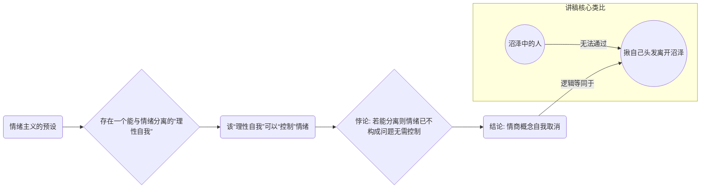
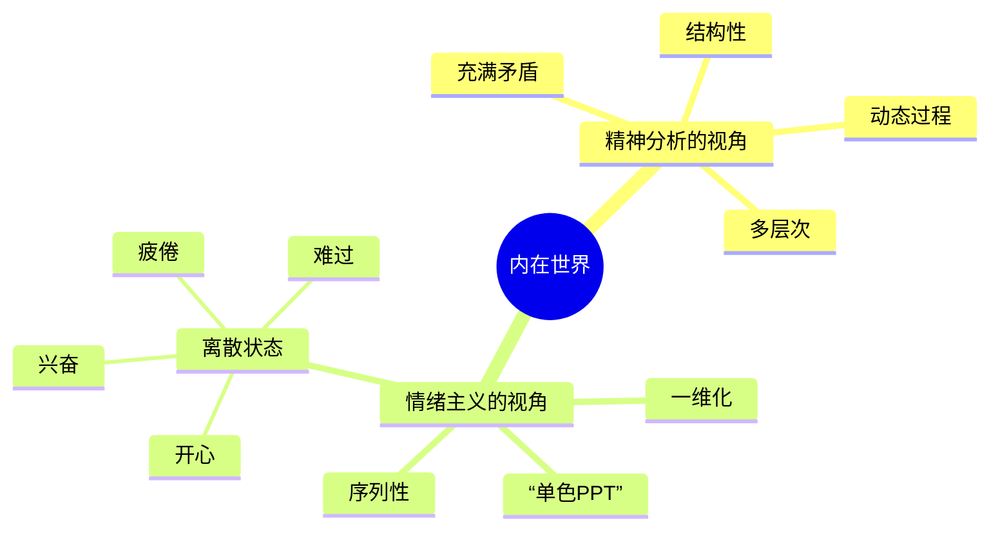
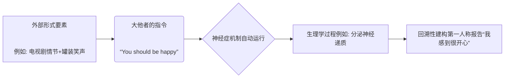

---
{"dg-publish":true,"permalink":"/1-4 平庸主义/1-4-3 心理主义/1-4-3-1 情绪主义/","created":"2025-09-19T20:52:29.571+08:00","updated":"2025-09-23T18:25:51.247+08:00"}
---

### **一、本章概览**
- **主义主义编码**: 1-4-3-1
- **意识形态命名**: [[情绪主义\|情绪主义]] (Emotionalism)
- **核心论断**: [[情绪主义\|情绪主义]]是一种庸俗化的[[心理主义\|心理主义]]，它将复杂多维的内在心灵状态简化为一维的、可管理的“情绪”，并以维持情绪稳定为终极目的。这套意识形态通过兜售“[[情商\|情商]]”等伪概念，成为[[消费主义\|消费主义]]社会中一种前病理学的、自我压抑的神经症机制。
- **你能获得**:
    1.  理解 1-4-3-1 编码如何精准描绘“做人嘛，开心最重要”这类流行心态的内在骨架。
    2.  掌握从[[9 未命名/精神分析\|精神分析]]视角批判“情绪”、“[[情商\|情商]]”等日常概念的方法。
    3.  辨识[[情绪主义\|情绪主义]]在流行文化、职场话语和消费行为中的具体表现，如“[[罐装笑声\|罐装笑声]]”现象。

---
### **二、核心内容解析**

#### **“主义主义”四格分析**

1.  **场域之“1” (Ontology)**：该意识形态预设的世界是一个统一、有序且可被清晰言说的[[世界\|世界]]。这个“1”代表了一种由“正常人”或“学术共同体”所担保的、客观中立的普遍话语秩序。在这个[[存在论\|存在论]]框架下，世界被视为一个稳定、宁静的背景舞台，其中的一切事物都可以被一个类似[[9 未命名/大他者\|大他者]]的视角所观察、描述和分类。它排除了根本性的混乱与矛盾，认为存在一个普适的、主导性的秩序，所有现象都应在这个统一的秩序内找到自己的位置，从而为后续的情绪管理和价值评判提供了稳定的参照系。

2.  **本体之“4” (Body)**：在那个统一的世界舞台上，真正构成[[实在\|实在]]的创伤性、矛盾性内核（即[[实在界\|实在界]]）被彻底悬置或否认。这里的“4”体现为一种“none of my business”（与我无关）的态度。[[情绪主义\|情绪主义]]者主动回避世界的荒谬、虚无和深层矛盾，将这些无法被日常语言整合的维度排除在自己的认知范围之外。这种对本体论层面“虚空”的回避，使得他们能够心安理得地生活在表象世界中，不必面对生存的根本性难题，为将一切问题还原为心理或情绪问题铺平了道路。

3.  **现象之“3” (Phenomenon)**：主体通过一个绝对中心化的中介来感知和体验世界，这个中介就是“[[情绪\|情绪]]”(Emotion)。在1-4-3-1的结构中，[[主体性\|主体性]]的体验被简化为一种可被横向切片、可被命名的情绪状态。这个“3”如同一个有色滤镜，所有外部世界的输入和对内部状态的感知，都必须经过这个“情绪”中心进行染色和调和。它将[[世界\|世界]]的统一秩序（1）与被否认的内在虚空（4）之间的矛盾，转化为不同“心情”下的不同[[世界\|世界]]样貌，从而实现了一种虚假的内在整合。

4.  **目的之“1” (Purpose)**：该意识形态的[[9 未命名/目的论\|目的论]]是导向一种永恒的循环，即维持“情绪的稳定与安宁”。这个最终的“1”意味着终极目标不是发展、超越或达成任何外部成就，而是回到一种积极、乐观、可控的情绪状态，并无限地维持下去。所有的行为，无论是消费、社交还是工作，最终都被同一个目标所驱动：确保情绪系统的封闭循环，避免痛苦、焦虑等“不稳定”状态的干扰。这是一种绝对的内循环，生命的意义被等同于良好情绪的不断重复。

#### **其他核心知识点**

##### 情商：一种自我取消的意识形态工具
情商（EQ）是[[情绪主义\|情绪主义]]意识形态下的核心术语，它被宣传为一种高级的、理性的、可以“控制”情绪的能力。然而，这一概念在逻辑上是自我取消的。它预设了一个能够与自身情绪拉开距离、并以上帝视角进行评判和管理的“理性自我”。但问题在于，如果你已经有能力与某种负面情绪拉开距离，那么该情绪本身就已经不再构成问题，你也就不再需要“控制”它了。因此，“情绪控制”这个概念本身就是一个骗人的幌子，它只对那些尚未陷入情绪或已经摆脱情绪的人“有效”，而对于真正深陷其中的人则毫无用处。它是一种意识形态工具，用以制造一种虚假的自我掌控感。

**举例阐释**：讲稿中提到，你不可能掉到沼泽里，然后通过拎着自己的头发把自己拎出来。“情绪控制”就如同这个荒谬的比喻，它假设了一个不受沼泽影响的支点，但这个支点在现实中根本不存在。

##### 情绪的一维化：内在世界的“单色PPT”模式
[[情绪主义\|情绪主义]]最根本的操作，是将人类复杂、多层、充满矛盾的内在心灵活动，压平成一个一维的序列。这种模式将内心世界想象成一个不断切换的“单色PPT”，每一页都代表一种简单、明确的情绪，如“开心”、“难过”、“烦躁”等。这种简化操作，使得原本流动的、结构性的心理过程，被固化为一个个离散的、可被日常语词轻易捕捉的状态。这种思维方式不仅是[[9 未命名/前反思\|前反思]]的，更是低智商的，因为它完全忽略了心灵的纵深结构，将人变成只能在一个向度上体验世界的“[[单向度的人\|单向度的人]]”。

**举例阐释**：流行文化中的“可甜可咸”、“可御可萝”等标签，就是这种一维化思维的体现。它试图用一组简单的、二元对立的形容词来穷尽一个人的性格与状态，仿佛一个人只能在几个预设好的“PPT模板”之间切换。

##### [[罐装笑声\|罐装笑声]]：情绪作为一种现代神经症
从[[9 未命名/精神分析\|精神分析]]的视角看，现代社会中的“情绪”并非一种自发的内在体验，而更像是一种被外部符号系统所规训的、自动运行的神经症。[[罐装笑声\|罐装笑声]]是这个机制的绝佳隐喻。在观看情景喜剧时，即使观众本人觉得不好笑，但只要剧情满足了某些形式要素（如包袱、转折），并且背景音播放了笑声，一种“开心”的指令就会被[[9 未命名/大他者\|大他者]]下达。个体的神经系统会自动运行，甚至分泌相应的神经递质，并回溯性地将这种生理反应建构成“我感到了开心”。情绪在此成为一种只要满足外部条件就会被强制触发的、非主体性的病理学机制。

**举行阐释**：你去坐过山车，即使你正因失恋而痛苦，但当“花钱消费”、“旁边坐着美女”、“身体受到刺激”等一系列符号要素集齐后，这个神经症机制就会自动运行，强迫你体验到一种符合[[消费主义\|消费主义]]剧本的“开心”。

---
### **三、关键观点提取**
- “你本来就在这个情绪里面，你自己就是有你掉到沼泽里面，难道可以拎着自己头把自己拎出来吗？”
- “[[情绪主义\|情绪主义]]者，他对于自己的内在世界的把握是一维的……就像单色PPT不停切换的。”
- “在[[9 未命名/精神分析\|精神分析]]那边看来，情绪本身是一种[[神经症\|神经症]]，所以我们不认同有情绪这种东西，它本身是一个病理学的机制。”
- “可甜可咸，可御可罗，他们这背后的支撑都是[[情绪主义\|情绪主义]]……它是一维的思维，这个东西IQ是差不多是约等于60、65。”
- “你每看一部电影，就是告诉你一种新的开心的方法，或者新的伤心的方法。这些东西都是在规训你。”

---
### **四、知识点问答**
#### Q: 为什么说“[[情绪主义\|情绪主义]]”是一种“前病理学”的思维方式？
A: 因为[[情绪主义\|情绪主义]]完全无法理解真正意义上的心理病理，如[[神经症\|神经症]]和精神病。它将所有的心理失常都归结为“情绪失衡”或“心情不好”，这是一种极度简化的、非专业化的理解。它缺乏对无意识、压抑、创伤等深层心理结构的认知，只能停留在对日常“心情”的描述上，无法进入[[心理病理学\|心理病理学]]的分析层面。它在精神疾病面前是失语的，只能给出“想开点”、“控制情绪”这类无效的建议。

#### Q: [[情绪主义\|情绪主义]]的“3”（现象-情绪中心）是如何调和“1”（场域-统一世界）与“4”（本体-虚无）之间的矛盾的？
A: 在这个意识形态中，[[世界\|世界]]（1）被预设为一个统一、有序的舞台，而[[实在\|实在]]的虚无内核（4）则被否定和回避。这两者存在根本矛盾。作为中介的“情绪”（3）通过扮演“有色眼镜”的角色来调和这一矛盾。当戴上“开心”的眼镜时，那个统一的[[世界\|世界]]就呈现出美好、和谐的面貌；当戴上“沮丧”的眼镜时，同一个[[世界\|世界]]又会呈现出灰暗、无趣的面貌。通过这种方式，客观[[世界\|世界]]的稳定性（1）和主体对虚无（4）的回避都得到了维持，所有的矛盾都被内化为纯粹主观的“心情”问题，从而保护了意识形态的自洽。

#### Q: 根据讲稿，为何我们感受到的“情绪”往往是一种回溯性的建构，而非当下的真实体验？
A: 因为要确认并命名一种情绪，我们必须援引日常语言这个符号系统。当我们试图描述“一分钟前的我是否开心”时，我们实际上是在进行一种文学创作：想象一个符合我们身份、背景的角色，在当时的处境下“应该”有何种情绪。我们用一个由形容词构成的符号网络，强行“罩住”当时那个说不清道不明的、充满冲动和矛盾的内在状态。这个过程必然是回溯性的，它用一个统一的、静态的语词（如“开心”）覆盖并扭曲了那个瞬间真实的、动态的、复杂的心理过程。

---
### **五、知识延伸**
- **[[赫伯特·马尔库塞\|赫伯特·马尔库塞]]《[[单向度的人\|单向度的人]]》**: 讲稿中直接提及。这本书深刻批判了发达工业社会如何通过[[消费主义\|消费主义]]和大众文化来整合和“麻醉”个体，使其丧失否定性和批判性的思维向度。[[情绪主义\|情绪主义]]所倡导的对情绪的管理和对积极体验的追求，正是造就这种“单向度的人”的完美意识形态工具。
- **电影《[[头脑特工队\|头脑特工队]]》(Inside Out)**: 这部电影可以作为与[[情绪主义\|情绪主义]]进行对比和批判的绝佳文本。表面上它将情绪实体化，似乎符合情绪主义的逻辑。但其核心情节恰恰是批判“快乐至上”的简单化思维，深刻揭示了“忧愁”等负面情绪在构建完整人格和处理创伤记忆时不可或缺的作用，这直接颠覆了1-4-3-1以“情绪稳定”为唯一目标的[[9 未命名/目的论\|目的论]]。
- **[[拉康\|拉康]]的[[9 未命名/精神分析\|精神分析]]理论**: 整个讲稿的批判武器库来源于此。理解[[拉康\|拉康]]的[[9 未命名/大他者\|大他者]]、符号界、想象界和[[实在界\|实在界]]等概念，是深入理解为何“情绪”是一种意识形态建构、为何第一人称报告不可信、以及[[神经症\|神经症]]结构如何运作的关键。

---
### **六、双链关联总结**
- **一级关联 (核心意识形态与概念)**: [[情绪主义\|情绪主义]]、[[心理主义\|心理主义]]、[[情商\|情商]]、[[罐装笑声\|罐装笑声]]、[[神经症\|神经症]]
- **推测相关人物 (Speculated Figures)**:
    - **生活方式Vlogger**: 精心策划并展示“积极向上”、“元气满满”的生活，将消费体验（美食、旅游、购物）直接等同于幸福，并分享“情绪管理”技巧的网红。
    - **“抗压力拉满”的求职者**: 在简历中将“情绪稳定”、“抗压性强”作为核心竞争力，主动迎合企业对员工进行情感剥削和规训的职场人。
    - **热衷星座/MBTI的年轻人**: 试图用一套简单、现成的标签体系来定义自己和他人，回避了人格的复杂性和矛盾性，是[[情绪主义\|情绪主义]]一维化思维的变体。
- **二级关联 (上下文与背景)**: [[消费主义\|消费主义]]、[[9 未命名/精神分析\|精神分析]]、[[心理病理学\|心理病理学]]、[[元伦理学\|元伦理学]]、[[9 未命名/分析哲学\|分析哲学]]、[[流行文化\|流行文化]]
- **三级关联 (推测与延展)**: [[9 未命名/大他者\|大他者]]、[[单向度的人\|单向度的人]]、[[9 未命名/前反思\|前反思]]、[[9 未命名/癔症\|癔症]]、[[实在界\|实在界]]、[[赫伯特·马尔库塞\|赫伯特·马尔库塞]]、[[拉康\|拉康]]、[[头脑特工队\|头脑特工队]]