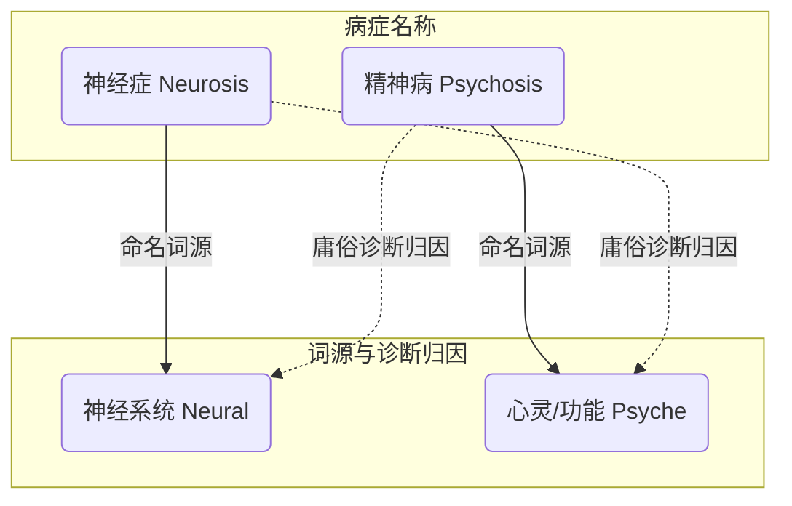
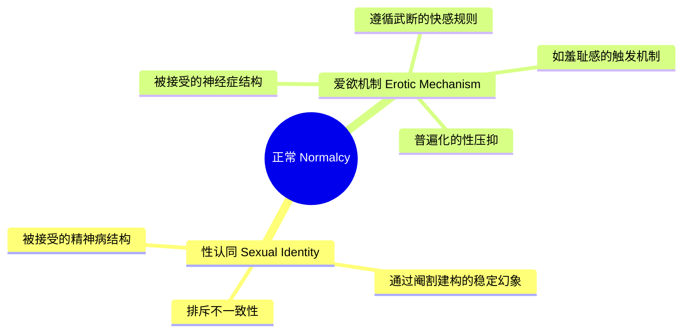
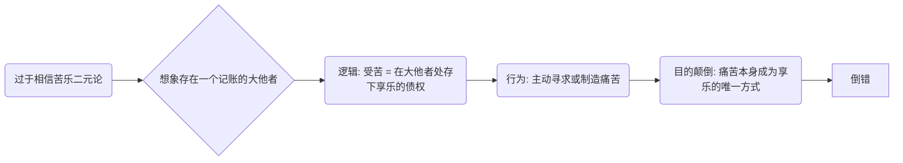

---
{"dg-publish":true,"permalink":"/1-4 平庸主义/1-4-3 心理主义/1-4-3-2 心理正常主义/","created":"2025-09-19T20:52:29.574+08:00","updated":"2025-09-23T01:37:11.240+08:00"}
---

### **一、本章概览**
- **主义主义编码**: 1-4-3-2
- **意识形态命名**: [[心理正常主义\|心理正常主义]]
- **核心论断**: “心理正常主义”是一种大众意识形态，它预设了一个由专家话语定义的“正常”[[世界\|世界]]（1），但其内核是无法言说、需要回避的内在混乱（4）。它通过构建“心理健康”这一中介概念（3）来调和此矛盾，最终将[[世界\|世界]]划分为“正常”与“反常”的二元对立，并致力于永恒地排斥后者（2）。
- **你能获得**: 本笔记将揭示我们日常话语中“正常”与“精神病”二元划分的意识形态根源。你将掌握如何运用“主义主义”框架拆解这种看似无害的常识，理解[[9 未命名/精神分析\|精神分析]]如何颠覆性地看待[[神经症\|神经症]]、[[精神病\|精神病]]与[[9 未命名/倒错\|倒错]]，并洞悉“正常”本身就是一种被社会普遍化的症状。

---
### **二、核心内容解析**

#### **“主义主义”四格分析**

1.  **场域之“1” (Ontology)**：此意识形态的世界观框架是一个由专家话语（Expertise）和知识权威所构建的统一、完整的规范性[[世界\|世界]]。这类似于[[拉康\|拉康]]所说的“[[大学话语\|大学话语]]”，即一个由S2（知识）主导的、看似连贯自洽的符号系统。在这个场域中，“正常”被定义为唯一正确的存在方式，任何偏离这套规范的行为或思想都会被视为对整个[[世界\|世界]]秩序的威胁。这个“1”的场域确保了“正常”的标准是客观的、不容置疑的，它来源于科学、医学或某种公认的权威，从而构建了一个封闭且自足的现实。

2.  **本体之“4” (Body)**：在这个由规范主导的[[世界\|世界]]中，真实存在的“本体”却是一个无法被言说、无法被符号化的内在分裂与虚无。讲稿中将其描述为“莫名其妙”、“古里古怪”、“unable to tell”的状态，这正是“4”的典型特征。它代表了[[主体性\|主体性]]内核中那无法被社会规范完全整合的创伤性部分，即[[拉康\|拉康]]意义上的“实在界”（the Real）。这个“4”是[[心理正常主义\|心理正常主义]]极力想要压抑和否认的，但它又构成了整个体系运作的隐秘驱动力，因为正是为了掩盖这个内在的“不正常”，才需要后续一系列的操作。

3.  **现象之“3” (Phenomenon)**：主体通过一个中介化的概念——“心理状态”或“精神健全”（Mental state）来感知和体验[[世界\|世界]]。这个“3”扮演了调和者的角色，试图弥合统一的规范[[世界\|世界]]（1）与混乱的内在本体（4）之间的鸿沟。它将复杂的[[主体性\|主体性]]体验简化为一个可以被诊断和管理的谱系，一端是理智、人性，另一端是欲望、兽性。通过心理学化的语言，这个中介（3）创造了一个可供观察和干预的“内心[[世界\|世界]]”，使得主体能够在这个框架内进行自我认知和定位，从而维持一种看似稳定的自我感。

4.  **目的之“2” (Purpose)**：该意识形态的最终[[9 未命名/目的论\|目的论]]是导向一个永恒的二元对立斗争。它将[[世界\|世界]]明确划分为两个阵营：[[正常\|正常]] (Normal) 与[[反常\|反常]] (Abnormal)。整个社会机制，包括日常语言（如骂人“精神病”）、医疗体系和教育系统，都服务于这个目的：识别、诊断、区隔并压制“[[反常\|反常]]”的一方，以确保“[[正常\|正常]]”的统治地位。这个“2”的对抗性结构意味着该意识形态并非要最终消灭[[反常\|反常]]（因为[[反常\|反常]]是其定义自身的必要他者），而是要维持这种斗争状态，使其成为社会运作的常态。

#### **其他核心知识点**

##### 神经症与精神病的倒错结构
讲稿揭示了当代庸俗病理学中一个深刻的矛盾结构。在命名上，“[[神经症\|神经症]]”（Neurosis）词源指向神经（neural），而“[[精神病\|精神病]]”（Psychosis）词源指向心灵（psyche）。然而，在临床诊断和大众认知中，它们的属性却发生了倒错：[[神经症\|神经症]]被认为是功能性的、气质上可逆的心理问题，患者仍有自知力并承认规范；而[[精神病\|精神病]]反而被认为是气质上不可逆的、神经系统彻底损坏的器质性问题，患者丧失了自知力。这种倒错暴露了该体系背后隐藏的[[物理决定论\|物理决定论]]倾向，即最终必须为精神的“严重”问题找到一个物质性的、不可挽回的根基，以此来巩固“[[正常\|正常]]”与“[[反常\|反常]]”之间不可逾越的界限。

**举例阐释**：一个有强迫症（[[神经症\|神经症]]）的人，医生会认为他的大脑结构没坏，可以通过药物和心理治疗“修复”；而一个被诊断为精神分裂（[[精神病\|精神病]]）的人，则常被认为其大脑神经递质或结构已发生“永久性损伤”，治疗目标是维持功能而非“治愈”。命名称谓与实际诊断的归因完全是交叉的。

##### “正常”作为被普遍化的症状
精神分析的颠覆性在于，它不认为“[[正常\|正常]]”是健康的自然状态，而是被社会普遍接受、不被标记为“病”的症状结构。我们所谓的“[[正常\|正常]]”[[爱欲机制\|爱欲机制]]和“[[性认同\|性认同]]”，其内在运作逻辑与[[神经症\|神经症]]和[[精神病\|精神病]]并无本质区别。例如，[[正常\|正常]]的[[爱欲机制\|爱欲机制]]依赖于一套武断、压抑的规则（如特定的身体部位、特定的情境才能唤起欲望），这与强迫症患者必须遵循一套复杂仪式才能获得安宁的逻辑是同构的。同样，一个稳固的[[性认同\|性认同]]（如“我是一个男人”）需要压抑所有不符合该认同的可能性，这类似于[[精神病\|精神病]]患者活在一个坚固但封闭的幻想结构中。

**举例阐释**：讲稿中提到，一个人在公共场合被扒光衣服会立刻感到羞耻、行动不能，陷入一种“disorder”。这种“[[正常\|正常]]”反应，其机制（特定情境触发的强烈情绪和行为失能）与广场恐惧症等[[神经症\|神经症]]症状的爆发并无二致，只是前者被社会规范所认可。

##### 倒错、大他者与享乐经济学
讲稿深入剖析了[[9 未命名/倒错\|倒错]]（Perversion）的本质。[[9 未命名/倒错\|倒错]]并非简单的行为变态，而是一种在伦理结构上的颠倒。过于“[[正常\|正常]]”、即过分相信苦乐二元机制（现实原则）的人最容易滑向[[9 未命名/倒错\|倒错]]。他们将[[9 未命名/大他者\|大他者]]（the Big Other）想象成一个精确记账的银行，认为承受的痛苦（suffer）必然可以兑换未来的[[享乐\|享乐]]（jouissance）。这种信念发展到极致，便是主动制造或寻求痛苦，因为痛苦本身成了获取[[享乐\|享乐]]的唯一可靠途径，即“Enjoy by suffering”。这种逻辑将手段（承受必要的痛苦）错误地当成了目的本身（痛苦=快乐），是精神分析视角下的“邪恶”（evil）。

**举例阐释**：一个奉行“棍棒底下出孝子”的家长，他让孩子承受痛苦时，其隐秘逻辑是：“我现在让他受苦，是在为他的未来‘存钱’，这些苦难将来一定会兑换成他的成功和幸福。”这种将伤害他人合理化为未来收益的逻辑，就是一种典型的[[9 未命名/倒错\|倒错]]结构。

---
### **三、关键观点提取**
- “一个人的病理化与其说是一个人病理化，不如说是我们整个的[[话语体系\|话语体系]]，它内在出现的症状，话语体系本身、系统本身出现的问题。”
- “[[人性\|人性]]本质上是一种反常力量，它是以[[符号系统\|符号系统]]内在的不稳定性因素，它是一个不死不休的一种循环力量。”
- “过于[[正常\|正常]]的人就会变得[[9 未命名/倒错\|倒错]]，就变成变态。因为他过于[[正常\|正常]]的人，他相信这个苦乐二元机制。”
- “[[性认同\|性认同]]（sexual identification）这种东西本身就是一种[[精神病\|精神病]]，它本身就是一个精神病理学的一个结构。”

---
### **四、知识点问答**
#### Q: 为什么说“[[心理正常主义\|心理正常主义]]”必然会导向一个“正常”与“反常”的二元对立（2），而不是一个完全统一的“正常”世界（1）？
A: 因为它的[[存在论\|存在论]]（1）和本体（4）之间存在着不可调和的矛盾。它预设了一个完美的、由专家话语构成的规范[[世界\|世界]]（1），但这个[[世界\|世界]]的根基（本体）却是无法被言说、无法被符号化的内在虚无与混乱（4）。为了维持场域（1）的稳定，它必须将内在的混乱（4）外化、对象化，将其投射为外部的敌人——“[[反常\|反常]]”或“精神病人”。因此，它需要不断地进行划分和斗争（2），通过排斥这个外部的“[[反常\|反常]]”，来反向证明自身“[[正常\|正常]]”的合法性。

#### Q: 根据精神分析的观点，“[[正常\|正常]]”的羞耻感和“[[神经症\|神经症]]”的强迫行为，在结构上有何共同之处？
A: 它们的共同之处在于，两者都是主体遵循一套武断的、非理性的[[符号系统\|符号系统]]规则来组织自身行为和体验的模式。[[正常\|正常]]的羞耻感（如裸体示众时的崩溃）和强迫症的仪式化行为，都不是基于纯粹的生理反应或理性计算，而是被一套内化了的社会禁忌和符号秩序所驱动。一旦触犯这套规则，主体的[[世界\|世界]]就会“失序”（disorder），并体验到巨大的痛苦。二者的区别仅在于，前者的规则是社会共享和普遍认可的，而后者的规则是私人性的，因此被标记为“病态”。

#### Q: 为什么讲稿中说，过于相信“苦乐二元机制”的“过于正常的人”反而会变成“[[9 未命名/倒错\|倒错]]”者？
A: 因为“过于[[正常\|正常]]的人”将社会建构的“现实原则”（延迟满足、吃苦耐劳）绝对化了，他们误以为这套奖惩机制背后有一个全知全能的[[9 未命名/大他者\|大他者]]在精确记账。这种信念使他们从“为了快乐可以忍受痛苦”滑向“只要承受痛苦就一定能获得快乐”。当这个逻辑被推到极致，痛苦本身就不再是手段，而变成了获取[[享乐\|享乐]]的凭证和仪式，甚至成为[[享乐\|享乐]]本身。他不再追求快乐，而是追求那个能“保证”快乐的痛苦，从而实现了欲望的[[9 未命名/倒错\|倒错]]。

---
### **五、知识延伸**
- **[[6 哲学家/米歇尔·福柯\|米歇尔·福柯]]《[[疯癫与文明\|疯癫与文明]]》**: 这本书是理解[[心理正常主义\|心理正常主义]]历史谱系的最佳参照。[[福柯\|福柯]]详尽地揭示了“理性”与“疯癫”的二元对立是如何在近代被建构出来的，展示了权力、知识和机构（如精神病院）如何共同塑造了我们关于“[[正常\|正常]]”与“[[反常\|反常]]”的认知，这与本讲稿的批判路径高度一致。
- **[[反精神病学运动\|反精神病学运动]] (Anti-psychiatry movement)**: 以思想家[[R. D. 莱因\|R. D. 莱因]]等人为代表，这一思潮在20世纪中叶直接挑战了主流精神病学的诊断框架。他们认为，所谓的“精神分裂症”等病症，可能是个体对于一个“疯狂”的社会环境（尤其是家庭）所做出的“正常”反应。这为批判“[[心理正常主义\|心理正常主义]]”提供了强有力的社会和临床层面的支持。
- **电影《[[小丑\|小丑]]》 (Joker, 2019)**: 这部电影是对[[心理正常主义\|心理正常主义]]暴力性的艺术化呈现。主角亚瑟·弗兰克生活在一个要求他“强颜欢笑”的规范[[世界\|世界]]里，他自身的内在创伤和[[反常\|反常]]特质（4）与这个[[世界\|世界]]的“[[正常\|正常]]”要求（1）剧烈冲突。最终，社会对其“[[反常\|反常]]”的不断排斥和暴力，促使他彻底拥抱了一种破坏性的[[精神病\|精神病]]式[[主体性\|主体性]]，完美诠释了1-4-3-2意识形态下的个体悲剧。

---
### **六、双链关联总结**
- **一级关联 (核心意识形态与概念)**: [[心理正常主义\|心理正常主义]]、[[正常\|正常]]、[[反常\|反常]]、[[神经症\|神经症]]、[[精神病\|精神病]]、[[9 未命名/倒错\|倒错]]、[[9 未命名/大他者\|大他者]]、[[病理学\|病理学]]、[[爱欲机制\|爱欲机制]]、[[性认同\|性认同]]

- **推测相关人物 (Speculated Figures)**: **多洛雷斯·乌姆里奇** (《哈利·波特》中的角色)。她对“秩序”和“规范”有着绝对的信仰，并将任何偏离其规范的行为都视为需要残酷惩罚的“病态”。她施加痛苦时带着一种满足感，认为这是在维护一个更高级的“美好”秩序，这体现了[[9 未命名/倒错\|倒错]]者将惩罚与维持秩序的[[享乐\|享乐]]相结合的特征。

- **二级关联 (上下文与背景)**: [[9 未命名/精神分析\|精神分析]]、[[拉康\|拉康]]、[[福柯\|福柯]]、[[存在论\|存在论]]、[[本体\|本体]]、[[现象\|现象]]、[[9 未命名/目的论\|目的论]]、[[大学话语\|大学话语]]、[[物理决定论\|物理决定论]]

- **三级关联 (推测与延展)**: [[主体性\|主体性]]、[[实在界\|实在界]]、[[符号系统\|符号系统]]、[[阉割\|阉割]]、[[9 未命名/死亡驱力\|死亡驱力]]、[[享乐\|享乐]]、[[话语体系\|话语体系]]、[[反精神病学运动\|反精神病学运动]]、[[规训权力\|规训权力]]