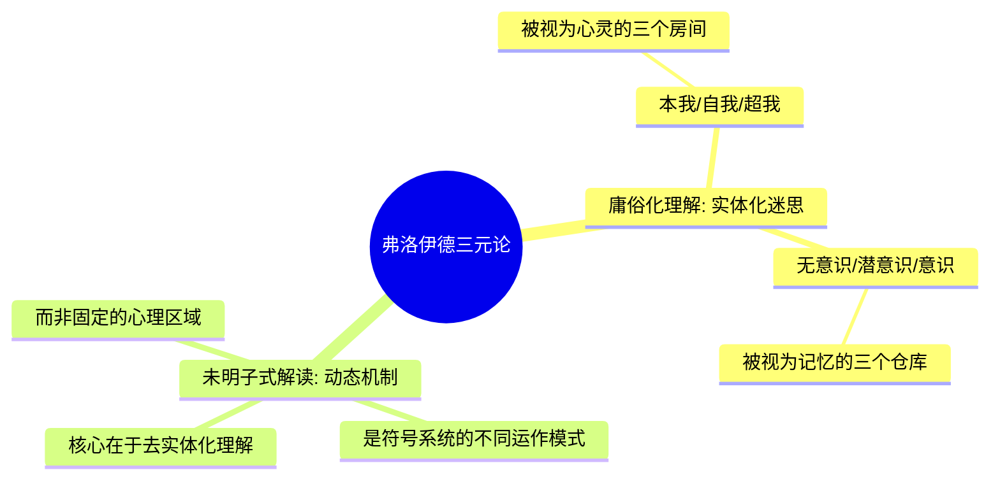
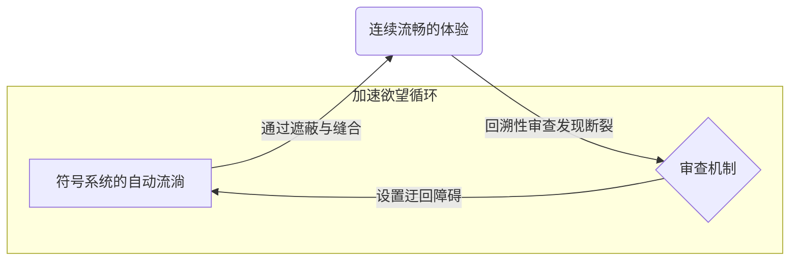
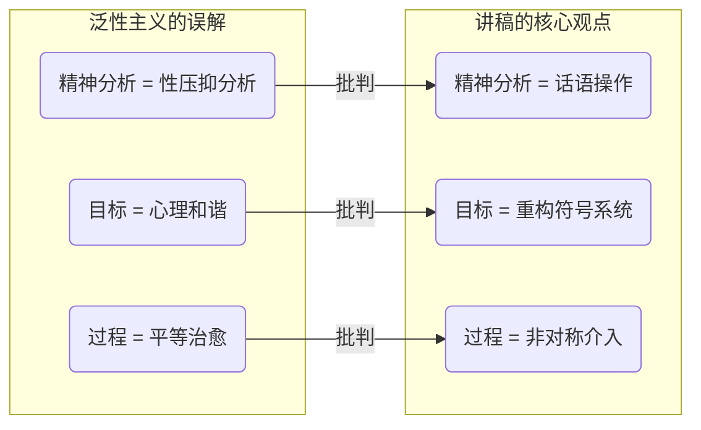

---
{"dg-publish":true,"permalink":"/1-4 平庸主义/1-4-3 心理主义/1-4-3-3 泛性主义/","created":"2025-09-19T20:52:29.575+08:00","updated":"2025-09-23T01:37:12.145+08:00"}
---

### **一、本章概览**
- **主义主义编码**: 1-4-3-3
- **意识形态命名**: [[泛性主义\|泛性主义]] (Pansexualism)
- **核心论断**: [[泛性主义\|泛性主义]]是一种将[[9 未命名/精神分析\|精神分析]]庸俗化、心理学化的意识形态。它在一个由学术权威担保的封闭世界观（1）中，将人内在的驱动力神秘化为一个不可知的深渊（4），并最终诉诸“心理现象”（3）与“[[爱欲\|爱欲]]”（3）作为万能的调和中介，旨在达成一种和谐、平衡的心理状态，而非实现主体真正的解放。
- **你能获得**:
    1.  **诊断框架**: 掌握使用 1-4-3-3 编码剖析庸俗化[[9 未命名/精神分析\|精神分析]]的基本框架。
    2.  **概念祛魅**: 辨析[[弗洛伊德\|弗洛伊德]]的[[无意识\|无意识]]、意识、潜意识三元论的实体化误区，理解[[无意识\|无意识]]作为一种[[符号系统\|符号系统]]运动的本质。
    3.  **核心重塑**: 明白[[9 未命名/精神分析\|精神分析]]的核心并非“性”，而是一种非对称的、主体间的话语操作（Discursive Operation）。
    4.  **现实批判**: 识别现实中将[[9 未命名/精神分析\|精神分析]]神秘化、商业化的“大师”们所处的意识形态位置。

---
### **二、核心内容解析**

#### **“主义主义”四格分析**

1.  **场域之“1” (Ontology)**：该意识形态预设的世界是一个统一且封闭的整体。这个“1”的整全性并非来自物理法则或神圣天意，而是由某个“学术权威”或知识共同体（如“[[9 未命名/精神分析\|精神分析]]学派”、“[[荣格\|荣格]]派”）来担保的。在这个[[世界\|世界]]图景中，所有的社会、文化乃至个人问题，都可以且只可以被纳入这个特定的心理学框架进行解释。这种[[存在论\|存在论]]上的封闭性，使得该体系具有强大的自我验证能力，任何外部的批判或不符的现象，都会被迅速地“心理学化”，从而维持其理论的绝对统一性。

2.  **本体之“4” (Body)**：在统一的世界框架下，该意识形态认为构成世界真实内在驱动力的是一种不可知、不可测的神秘力量。这个“4”并非[[拉康\|拉康]]意义上开启可能性的“大他者之缺”，而是一个被重新神秘化的深渊。它体现为一种[[5 主义/神秘主义\|神秘主义]]倾向，将内在的虚空或矛盾，包装成诸如“集体无意识”、“宇宙能量”或某种需要“修仙”、“炼内丹”才能触及的终极实在。这种处理方式恰恰回避了“4”的真正颠覆性，将其从一个系统的内在矛盾，变成了一个可供膜拜和探寻的、充满魅力的神秘本体。

3.  **现象之“3” (Phenomenon)**：主体通过一个核心中介来感知和体验世界，这个中介就是“人的心理现象”本身。在此，数字“3”扮演了调和者的角色，它用一套心理学术语（如各种情结、心理阶段）来调和两种看似对立的现象：一方面是服从自然法则的、无序的欲望冲动；另一方面是具有反思性的、理性的社会化行为。[[主体性\|主体性]]的体验被理解为这两种力量在一个中心化的心理结构（如“自我”）中不断博弈与调和的过程。因此，现象世界的一切都被赋予了心理学意义，成为了可被分析师解读的症候。

4.  **目的之“3” (Purpose)**：该意识形态的[[9 未命名/目的论\|目的论]]是导向一个由“[[爱欲\|爱欲]]”（Eros）调和的理想状态。这个“3”的目标不是导向革命或超越，而是维持一种“健康”的平衡。它致力于调和“正常”与“反常”：[[爱欲\|爱欲]]被过度压抑是反常的，[[爱欲\|爱欲]]无限制地泛滥也是反常的。最终目的，是通过[[弗洛伊德\|弗洛伊德]]“力比多经济学”中的“现实原则”进行精巧的调配，让主体达到一种不偏不倚、有序安稳的心理和谐状态，这是一种典型的治疗性、维稳性的目的。

#### **其他核心知识点**

##### 弗洛伊德三元论的实体化迷思
[[泛性主义\|泛性主义]]的信奉者常常将[[弗洛伊德\|弗洛伊德]]提出的多组三元论——如“本我-自我-超我”或“[[无意识\|无意识]]-潜意识-意识”——理解为心灵内部真实存在的、如同器官一般的实体区域。讲稿尖锐地指出这是一种“实体化的迷思”。这些概念并非指代心灵的某个“仓库”或“结构部件”，而应被理解为描述主体内部符号学运作的**动态机制**。将它们实体化，就如同把电脑的“CPU占用率”或“内存管理机制”想象成一个个具体的小人或盒子，这不仅是理论上的误读，更会导向将[[9 未命名/精神分析\|精神分析]]变成一种僵化的、机械的心理定位游戏。

**举例阐释**：最常见的误解就是将[[无意识\|无意识]]想象成一个黑暗的地下室，里面锁着各种被压抑的童年创伤和欲望。而[[9 未命名/精神分析\|精神分析]]的过程，就被比喻为分析师拿着钥匙去打开这个地下室，把里面的东西“释放”出来。而讲稿的观点是，根本不存在这样一个“地下室”，[[无意识\|无意识]]只是一种话语运动出错、掉链子、不断循环的模式本身。

##### 作为符号学运动的无意识
讲稿提出了对[[弗洛伊德\|弗洛伊德]]概念的激进重构，认为[[无意识\|无意识]]、意识与潜意识都是回溯性建构的符号运作模式。[[无意识\|无意识]]是“话语中主体自己都不理解的部分”，是[[符号系统\|符号系统]]自身的、无意义的自动循环；“意识”则是对这种不理解进行遮蔽、缝合，创造出一种连续、流畅的体验表象；而“潜意识”与其说是“前意识”，不如说是“后意识”（After-conscious），是一种事后审查机制，它通过设置障碍和迂回，反而加速了[[无意识\|无意识]]欲望的循环。

**举例阐释**：讲者以自己长达十几分钟“不经大脑”的流畅演讲为例。他指出，那个滔滔不绝说话的“它”，并非其有意识的“自我”，而是一套被他内化的[[符号系统\|符号系统]]在自动运转。他的“意识”只是浮在表面的体验，而“潜意识”则是在这个过程中回溯性地调整话语策略（比如突然用一个物理学比喻），以确保这个符号循环能更有效地进行下去。

##### 精神分析的核心：非对称的话语操作
[[泛性主义\|泛性主义]]最大的谬误在于将[[9 未命名/精神分析\|精神分析]]的核心归结为“性”或[[爱欲\|爱欲]]的解放。讲稿对此进行了根本性的驳斥，指出[[9 未命名/精神分析\|精神分析]]的真正内核是**话语操作**（Discursive Operation）。它不是一场平等的对话或治疗，而是一场由分析师和被分析者参与的、高度**不平等、非对称**的符号学活动。分析师通过占据特定的[[话语\|话语]]位置（如[[拉康的四种话语\|拉康的四种话语]]中的分析师话语），介入并重构被分析者的[[符号系统\|符号系统]]，其本质更接近于“为对方重装大脑的操作系统”。

**举例阐释**：[[精神分析伦理\|精神分析伦理]]中“分析师必须收费”的原则。收费的目的并非纯粹为了谋生，而是一种伦理姿态。它在分析师与被分析者之间建立了一道非情感的、符号性的屏障，防止被分析者将分析师当成满足其情感需求的[[客体小a\|客体小a]]（爱的对象），从而确保了话语操作的非对称性与有效性。

---
### **三、关键观点提取**
- “他们就是[[5 主义/神秘主义\|神秘主义]]，本体论上就走向一个有一个算一个，全都要[[5 主义/神秘主义\|神秘主义]]的，就是去修仙了。”
- “[[无意识\|无意识]]本身甚至都可以说成是动力学机制，你不能把它说成是一个真的是有一个仓库一样，像个宝库一样的。No no no no no.”
- “精神分析的内核它不是 sex... 它是 discursive（话语的）。但是这种 discursive 不是平等主义的...精神分析 discursive is asymmetrical（非对称的），是不平等的。”
- “[[精神分析伦理\|精神分析伦理]]是什么？你不能成为别人的[[客体小a\|客体小a]]...为了避免你的这个患者倒错，你进一步要告诉他，你不是大他者。”
- “精神分析的活动就是符号学操作，就是把哲学这个 ROM 装到别人脑子里面。”

---
### **四、知识点问答**
#### Q: 在 1-4-3-3 编码下，为何本体论的“4”导向了[[5 主义/神秘主义\|神秘主义]]，而非其他意识形态中具有革命性的“内在矛盾”？
A: 因为在[[泛性主义\|泛性主义]]的整个框架中，场域“1”的封闭性和目的“3”的调和性已经预设了其总体上的保守倾向。这里的“4”（内在虚空或矛盾）一出现，就会被强大的“1”（权威担保的理论框架）和“3”（心理学调和机制）所捕获和驯化。它不会被承认为系统自身的根本不可能性，而是被重新编码为一个充满魅力的、深不可测的“神秘源头”。主体不去面对这个虚空，反而是去崇拜、探寻这个被神秘化的虚空，从而将潜在的颠覆性能量转化为了维持现有知识-权力结构的动力。

#### Q: 讲稿如何通过重解“潜意识”来颠覆“心理治疗”的传统观念？
A: 传统的心理治疗常将“潜意识”视为一个需要被“意识化”的压抑内容宝库，治疗就是“挖宝”的过程。而讲稿将潜意识解释为一种“事后审查机制”（After-conscious），它并非意识的对立面，而是服务于[[无意识\|无意识]]欲望循环的加速器。这意味着，治疗的目标不是消除压抑或填补空白，而是要介入和改变这个审查机制本身运作的方式，即改变主体的[[符号系统\|符号系统]]的运作逻辑。这使得[[9 未命名/精神分析\|精神分析]]从一种“考古学”式的挖掘，变成了一种“工程师”式的系统重构。

#### Q: 为什么说分析师与被分析者的关系必须是“非对称的”？这种不平等如何体现其伦理性？
A: 这种非对称性是[[精神分析伦理\|精神分析伦理]]的核心。如果分析师与被分析者是平等的朋友或爱人关系，分析师就会轻易地被整合进被分析者原有的想象界和符号界秩序中，成为满足其幻想的[[客体小a\|客体小a]]或担保其意义的“大他者”。这只会加固其原有的症状，而非打破它。通过收费、保持沉默、不提供答案等方式建立的非对称关系，使分析师能够处在一个“局外”位置，从而有效地对被分析者的[[话语\|话语]]进行切割、质疑和重组，迫使其直面自身[[符号系统\|符号系统]]的断裂，这才是真正的伦理所在——不为满足对方的短期需求，而为促成其主体的根本性重塑。

---
### **五、知识延伸**
- **[[拉康的四种话语\|拉康的四种话语]] (Lacan's Four Discourses)**: 这是理解讲稿中“非对称话语操作”的直接理论来源。该理论（主人话语、大学话语、癔症话的功能、分析师话语）精确地描绘了不同社会关系中话语权力的不平等结构，并揭示了分析师话语如何通过占据特定位置来颠覆其他话语，是深入理解[[9 未命名/精神分析\|精神分析]]实践的必备工具。
- **[[德勒兹\|德勒兹]] & [[加塔利\|加塔利]]《[[反俄狄浦斯\|反俄狄浦斯]]》**: 这本书是对[[9 未命名/精神分析\|精神分析]]（特别是其家庭化、庸俗化倾向）最猛烈的批判之一。它指责[[9 未命名/精神分析\|精神分析]]将欲望囚禁在“俄狄浦斯”的家庭剧场中，从而服务于资本主义的压抑性再生产。其“欲望机器”和“精神分裂分析”的构想，为思考如何将欲望从[[泛性主义\|泛性主义]]的调和目的中解放出来，提供了一个极具参照性的批判视角。
- **[[6 哲学家/斯拉沃热·齐泽克\|斯拉沃热·齐泽克]] (Slavoj Žižek)**: 作为当代最著名的[[拉康\|拉康]]派思想家，齐泽克的著作是观看[[9 未命名/精神分析\|精神分析]]理论如何被应用于意识形态批判的最佳范例。他娴熟地运用[[9 未命名/精神分析\|精神分析]]概念剖析电影、政治和社会现象，展现了[[9 未命名/精神分析\|精神分析]]作为一种清醒、锐利的诊断工具的强大力量，与讲稿中批判的[[5 主义/神秘主义\|神秘主义]]、修仙化的倾向形成鲜明对照。

---
### **六、双链关联总结**
- **一级关联 (核心意识形态与概念)**: [[泛性主义\|泛性主义]]、[[9 未命名/精神分析\|精神分析]]、[[无意识\|无意识]]、[[爱欲\|爱欲]]、[[5 主义/神秘主义\|神秘主义]]、[[符号系统\|符号系统]]、[[客体小a\|客体小a]]、[[精神分析伦理\|精神分析伦理]]
- **推测相关人物 (Speculated Figures)**:
    - *卡尔·荣格*: 其“集体无意识”、“原型”等概念，易被挪用为1-4-3-3框架中的神秘化本体（4）。
    - *某些心理学“大师”或“身心灵导师”*: 他们常常宣称掌握了某种触及心灵深处（4）的秘法，并将其包装成一套普适性的理论体系（1），通过咨询或课程（3）来帮助信徒达到内心和谐或成功（3）。
- **二级关联 (上下文与背景)**: [[主页\|主页]]、[[拉康\|拉康]]、[[弗洛伊德\|弗洛伊德]]、[[欧陆哲学\|欧陆哲学]]、[[心理主义\|心理主义]]、[[存在论\|存在论]]、[[现象\|现象]]、[[9 未命名/目的论\|目的论]]、[[主体性\|主体性]]
- **三级关联 (推测与延展)**: [[癔症化\|癔症化]]、[[话语\|话语]]、[[拉康的四种话语\|拉康的四种话语]]、[[德勒兹\|德勒兹]]、[[反俄狄浦斯\|反俄狄浦斯]]、[[齐泽克\|齐泽克]]、[[世界\|世界]]