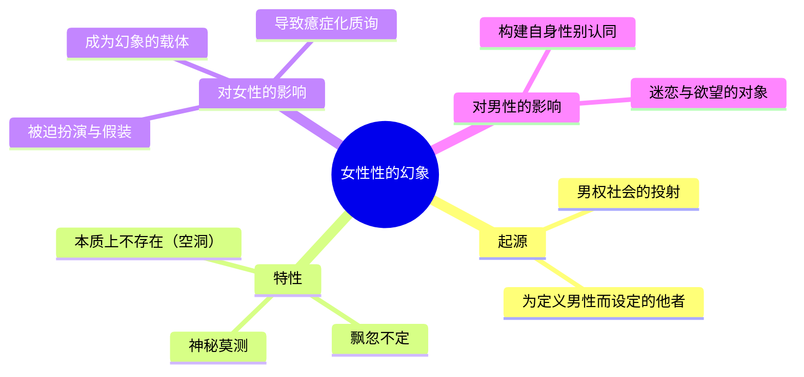
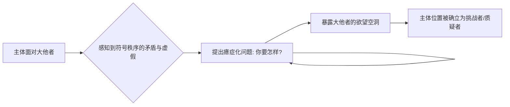
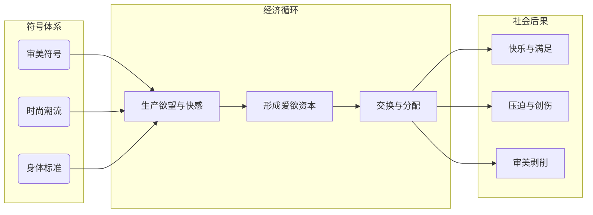

---
{"dg-publish":true,"permalink":"/1-4 平庸主义/1-4-3 心理主义/1-4-3-4 密契女性主义/","created":"2025-09-19T20:52:29.578+08:00","updated":"2025-09-23T18:28:10.015+08:00"}
---

### **一、本章概览**
- **主义主义编码**: 1-4-3-4
- **意识形态命名**: [[密契女性主义\|密契女性主义]] (Mystical Feminism)
- **核心论断**: 这是一种将“[[女性性\|女性性]]”本质化、神秘化的意识形态，它实际上是[[男权\|男权]]社会投射出的幻想，迫使女性扮演一个她们自身并不拥有的神秘本质，最终将主体困在一种[[癔症化\|癔症化]]的质询状态中。
- **你能获得**: 你将理解 1-4-3-4 编码如何精确描述一种普遍存在却又极具误导性的“女性主义”；掌握[[女性性\|女性性]]作为一种幻象建构的运作机制；并学会运用[[爱欲经济学\|爱欲经济学]]等概念，从更深层次批判性别压迫的符号系统。

---
### **二、核心内容解析**
#### **“主义主义”四格分析**

1.  **场域之“1” (Ontology)**：该意识形态预设了一个统一、全知且享乐的[[9 未命名/大他者\|大他者]]（the Big Other）作为世界的基本框架。这个[[9 未命名/大他者\|大他者]]被假定为是存在的、知道一切的，并且是一切意义与规则的最终来源。这里的“1”代表了这个符号秩序的整全性与封闭性，它就像一个无所不包的背景舞台，所有主体都在其注视下行动。[[密契女性主义\|密契女性主义]]正是在这个不容置疑的、统一的父权符号场域中展开的，它默认了这个[[9 未命名/大他者\|大他者]]的存在，并围绕其期望来展开自身的逻辑。

2.  **本体之“4” (Body)**：在这个世界舞台上，不存在一个稳固、自洽的[[实在\|实在]]本体，而是一个被悬置、被掏空的“无反思”状态。这里的“4”意味着一种内在的虚无与不可能性。该意识形态下的主体，无论是男性还是女性，都放弃了对世界本体的根本性质疑，将反思的责任让渡给了现成的知识体系（讲稿中提到的[[拉康\|拉康]]的“[[大学话语\|大学话语]]”）。这种“没必要反思”的态度，使得世界的[[9 未命名/本体论\|本体论]]地位成了一个空洞，一个无法被正面言说、只能被默认和绕过的内在裂隙。

3.  **现象之“3” (Phenomenon)**：主体通过一种中心化的“[[心理体验\|心理体验]]”或“[[第一人称真诚\|第一人称真诚]]”来感知和调和世界。这里的“3”代表了一个中介性的主观感受，它成为了判断一切事物的核心标准。无论是自然的本能冲动，还是理性的文明规则，都被还原为一种内在的、真诚的心理感受。这种现象学立场使得主体将自身的直接体验（如爱、恨、迷恋）视为最真实的[[实在\|实在]]，用以粘合[[9 未命名/本体论\|本体论]]上的空洞，并赋予[[9 未命名/大他者\|大他者]]的场域以感性的内容和意义。

4.  **目的之“4” (Purpose)**：该意识形态最终导向一个开放性的、充满焦虑的质询，即“你要我怎样？” (What do you want?)。这里的“4”代表了[[9 未命名/目的论\|目的论]]上的虚无和不确定性。由于主体在现象上体验到了[[9 未命名/大他者\|大他者]]的存在，但在本体上又找不到坚实的根基，其最终行动目标便成了一个永远无法被满足的谜题。这种[[癔症化\|癔症化]]的姿态，将主体永远锁定在试图猜测并满足一个沉默[[9 未命名/大他者\|大他者]]欲望的循环中，这本身就是一种目的的悬置与落空。

#### **其他核心知识点**

##### 女性性的幻象建构
这套意识形态的核心在于，它将“[[女性性\|女性性]]”（Feminity）构建为一个真实存在、但又神秘莫测的本质。然而，这种所谓的“女人味”并非女性固有的属性，而是[[男权\|男权]]社会为了确立自身身份而投射出的一个镜像或他者。男性通过设定一个与之相对立的、充满神秘魅力的“[[女性性\|女性性]]”来定义自身的“[[男性气概\|男性气概]]”。因此，女性被迫陷入一种双重困境：她们被要求交出一个她们根本不拥有的东西，只能通过妆容、姿态等方式去“假扮”（Pretend）拥有这种本质，以满足[[9 未命名/大他者\|大他者]]的凝视。

**举例阐释**：讲稿中提到“[[女人味\|女人味]]”与“[[男子气概\|男子气概]]”在语言上的差异。“味”是一种弥散的、感性的、仿佛被动散发出来的东西，而“气”则是一种主动的、有骨气的、内在秉持的精神。这种语言上的不对称，恰恰暴露了“[[女性性\|女性性]]”被建构成一个被动、神秘、等待被解读的客体，而“[[男性气概\|男性气概]]”则是主动、自持的主体。

##### [[癔症化\|癔症化]]的主体位置
[[癔症化\|癔症化]]（Hysterization）是在这个意识形态下主体的典型状态。当主体意识到[[9 未命名/大他者\|大他者]]（符号秩序）并非是全能和自洽的，而是存在裂隙和矛盾时，Ta会采取一种独特的姿态：不断地向[[9 未命名/大他者\|大他者]]发问——“你要我怎样？”，以此来暴露[[9 未命名/大他者\|大他者]]的无能和欲望的空洞。在[[密契女性主义\|密契女性主义]]中，女性被置于这个位置上，她们感知到所谓的“[[女性性\|女性性]]”是一个虚假的要求，但又无法摆脱这个符号系统，于是她们的生存状态本身就成了一种对[[男权\|男权]]秩序无声的、歇斯底里的质问。

**举例阐释**：一个女性即使完全按照社会期望打扮自己，内心深处可能依然会感到一种不确定和焦虑：“我这么做了，但这真的是你想要的吗？你到底想要什么？”这个问题本身就挑战了那个看似坚固的[[男权\|男权]]审美标准，揭示了其背后并无终极答案。

##### [[爱欲经济学\|爱欲经济学]]
[[爱欲经济学\|爱欲经济学]]（Erotic Economy）是指一套在男女两性间共同运作的、关于欲望和快感的符号生产与交换体系。在这个体系中，特定的审美符号（如高跟鞋、JK制服、肌肉线条、财富地位）被资本化，成为可以积累和交换的“爱欲资本”。它超越了简单的“男压迫女”框架，揭示出两性都可能成为这套经济学的参与者、受益者和受害者。它通过制造审美等级，对不符合标准的人造成真实的创伤和剥削。

**举例阐释**：讲稿中那个极具冲击力的思想实验——一位各方面“审美符号拉满”的女性去到一个“光棍村”，她的存在本身，无论其主观意图如何，都会对村民造成一种巨大的、创伤性的心理压力。这完美揭示了[[爱欲经济学\|爱欲经济学]]的客观暴力性。

---
### **三、关键观点提取**
- “女性知道这个机制本身是非全的，它是一个露马脚的一个机制。它是一个有一个最后的秘密，就是它没有秘密。”
- “[[男性性\|男性性]]这个东西是一个二阶的一个性别认同。[[女性性\|女性性]]这个东西是…它如果它有的话，它是可以一阶的。但实际上女性本身它是个灵阶的…甚至是个负一阶。”
- “压迫人的并不是[[男权\|男权]]，压迫人的是男女共同默认的这个[[爱欲经济学\|爱欲经济学]]。”
- “我认为你们正统的 feminism，虽然 [[女性性\|女性性]] doesn't exist，但是 feminism 这种姿态，这种运动是必要的。”
- “我们最终要指向的是一个去势的（castrated）这么一个[[9 未命名/大他者\|大他者]]。我们要朝向他，我们的[[9 未命名/癔症\|癔症]]要朝向他。”

---
### **四、知识点问答**
#### Q: 为什么说[[密契女性主义\|密契女性主义]]表面上崇拜女性，实际上却是[[男权\|男权]]的陷阱？
A: 因为它所崇拜的“[[女性性\|女性性]]”并非源于女性自身的本质，而是[[男权\|男权]]社会为了自我定义而投射出的一个神秘他者。它将女性固定在一个被凝视、被解读的客体位置上，迫使她们去表演一种虚幻的本质。这种“崇拜”的代价是剥夺了女性定义自己的话语权，使其成为[[男权\|男权]]符号秩序中一个功能性的镜像。

#### Q: [[爱欲经济学\|爱欲经济学]]的概念如何深化了我们对性别不平等的理解？
A: 它将分析的焦点从单一的“压迫者-被压迫者”二元对立，转移到了一个更为复杂的、由符号和资本共同构建的系统。在这个系统中，男女都可能是参与者和受害者。它揭示了压迫不仅是政治或经济的，也是审美的和符号的，一些女性也可能利用这套体系获得优势，从而伤害其他女性，这使得对[[女性主义\|女性主义]]内部的团结和策略提出了更高的要求。

#### Q: 在这个框架下，女性的“[[癔症化\|癔症化]]”姿态为何具有积极的颠覆性意义？
A: 因为[[癔症化\|癔症化]]的提问（“你要我怎样？”）虽然看似被动和焦虑，但它直接戳破了[[9 未命名/大他者\|大他者]]（[[男权\|男权]]秩序）无所不能的神话。它不断地质询，迫使[[9 未命名/大他者\|大他者]]暴露出自身的矛盾、任意性和欲望的空洞。因此，它不是一种病态，而是一种积极的政治姿态，是瓦解一个看似天经地义的霸权体系的第一步。

---
### **五、知识延伸**
- **[[拉康\|拉康]]的“女人不存在” (Lacan's "The Woman does not exist")**: 这是本讲稿核心论断的直接理论来源。拉康并非指生理女性不存在，而是指在符号学意义上，不存在一个能完全定义所有女性的、统一的本质“女人”（The Woman）。任何对“[[女性性\|女性性]]”的定义都是[[男权\|男权]]话语的幻想建构。
- **[[朱迪斯·巴特勒\|朱迪斯·巴特勒]]的[[性别操演\|性别操演]]理论 (Judith Butler's Gender Performativity)**: 巴特勒认为性别不是内在本质的表达，而是一系列不断重复的、被社会规范所要求的“操演”（performance）。这与讲稿中女性被迫“假扮”拥有[[女性性\|女性性]]的观点高度契合，两者都批判了性别本质主义。
- **电影《[[黑天鹅\|黑天鹅]]》**: 这部电影是 1-4-3-4 意识形态的绝佳寓言。主角尼娜为了成为完美的“黑天鹅”，不断追求一种她本身不具备的、神秘黑暗的“[[女性性\|女性性]]”，最终陷入疯狂。这生动地展示了追逐一个被投射出的虚假本质所带来的毁灭性后果。

---
### **六、双链关联总结**
- **一级关联 (核心意识形态与概念)**: [[密契女性主义\|密契女性主义]]、[[女性性\|女性性]]、[[癔症化\|癔症化]]、[[爱欲经济学\|爱欲经济学]]、[[9 未命名/大他者\|大他者]]、[[第一人称真诚\|第一人称真诚]]
- **推测相关人物 (Speculated Figures)**: **玛丽莲·梦露**。她被塑造成终极的性感符号和神秘的“[[女性性\|女性性]]”化身，满足了整个社会的男性凝视，但其个人生活却充满了痛苦与挣扎，完美体现了扮演一个虚假本质所带来的内在分裂与[[癔症化\|癔症化]]困境。
- **二级关联 (上下文与背景)**: [[9 未命名/精神分析\|精神分析]]、[[拉康\|拉康]]、[[女性主义\|女性主义]]、[[5 主义/后结构主义\|后结构主义]]、[[9 未命名/符号学\|符号学]]
- **三级关联 (推测与延展)**: [[性别操演\|性别操演]]、[[厌女症\|厌女症]]、[[恋物癖\|恋物癖]]、[[大学话语\|大学话语]]、[[主体性\|主体性]]、[[去势\|去势]]、[[泛性论\|泛性论]]