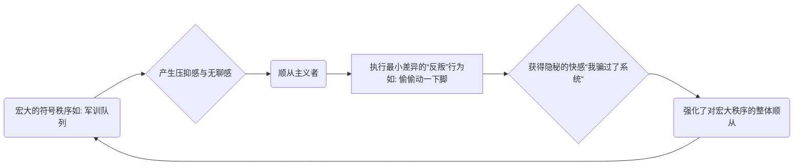
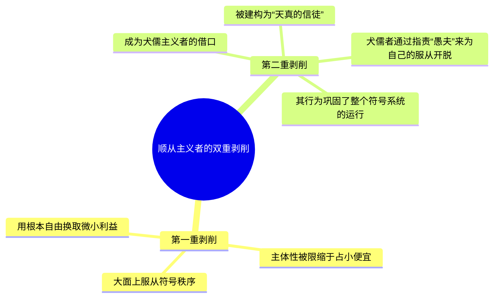
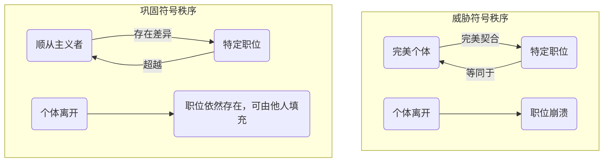

---
{"dg-publish":true,"permalink":"/1-4 平庸主义/1-4-4 庸俗主义/1-4-4-1 顺从主义/","created":"2025-09-19T20:52:29.586+08:00","updated":"2025-09-23T18:41:17.343+08:00"}
---

## **一、本章概览**
- **主义主义编码**: 1-4-4-1
- **意识形态命名**: [[顺从主义\|顺从主义]] (Conformism) / [[随大流主义\|随大流主义]]
- **核心论断**: [[顺从主义\|顺从主义]]的本质并非盲目服从，而是在宏观的顺从中，通过执行一种隐秘的、不成体系的“[[最小差异\|最小差异]]”式反叛（如[[占小便宜\|占小便宜]]）来获得主体性的满足感。这种行为恰恰巩固了它所要偏离的[[符号秩序\|符号秩序]]，并使主体陷入被双重利用的境地。
- **你能获得**: 你将掌握[[顺从主义\|顺从主义]]的内在心理机制，理解[[符号秩序\|符号秩序]]如何利用微小的“违规”来维持其稳定性，并学会辨识和分析现实生活中“随大流”行为背后的深层逻辑，及其与[[犬儒主义\|犬儒主义]]等其他意识形态的共谋关系。

---
### **二、核心内容解析**

#### **“主义主义”四格分析**

1.  **场域之“1” ([[Ontology\|Ontology]])**：该意识形态预设的世界是一个统一、整全且不容置疑的社会场域。这个“1”代表了“大家”、“所有人”、“规矩”所构成的那个宏大且无缝的背景秩序。[[顺从主义\|顺从主义]]者并不去结构性地反思这个场域的合理性，而是先验地接受它作为一个不言自明的、循环运作的舞台。在这个舞台上，所有人都应遵循同一个剧本，任何偏离轨道的行为都会显得格格不入。这个整全的场域是后续一切行为（无论是顺从还是“占便宜”）得以展开的稳定背景板。

2.  **本体之“4” ([[Body\|Body]])**：在本体论层面，[[顺从主义\|顺从主义]]者面对的是一个内在分裂且令人恐惧的“4”。这个“4”代表了他们[[9 未命名/前反思\|前反思]]状态下无法处理的创伤性内核，如对[[死亡\|死亡]]、虚无和存在偶然性的恐惧，即一种“细思极恐”的深渊。由于缺乏一套成熟的世界观来面对这个本体论上的空洞，他们会立刻从这种恐惧中逃离，转而抓住现实世界中最具体、最直接的秩序（如金钱、物质享受）作为唯一的“真实”，以此来填补那个令人不安的内在虚无。

3.  **现象之“4” ([[Phenomenon\|Phenomenon]])**：在现象和认识论层面，[[顺从主义\|顺从主义]]者的主体体验是混乱、零碎且不成体系的“4”。他们不会去追求体验的一致性或为“莫名其妙”的现象寻找根本解释。当遇到无法理解的事物时，他们会将其简单归类为“怪”或“不懂”，然后迅速将其缝合进日常，只要“It works”（它有用）就行。这种主体性的混乱和未被规训的状态，使得他们的行为看似温顺，实则充满了未经整合的、野性的冲动和欲望，处于一种“群魔乱舞”的内在状态。

4.  **目的之“1” ([[Purpose\|Purpose]])**：该意识形态最终导向的目的，是回归并融入到“1”所代表的那个统一的集体秩序中。然而，其独特之处在于，这种回归是通过一种看似偏离的方式完成的。其核心目的可以概括为“[[占便宜\|占便宜]]”或“搭便车”。他们通过在集体行动中为自己谋取一点微小的、隐秘的私利，来确认自己的独特性和聪明。这个[[9 未命名/目的论\|目的论]]上的“1”并非对秩序的无私维护，而是通过循环往复地“占便宜”行为，让自己在融入集体时获得一种微小的、自我满足的胜利感，从而周而复始地再生产着对整个秩序的服从。

#### **其他核心知识点**

##### **最小差异的反叛：顺从的内在驱动力**
[[顺从主义\|顺从主义]]的核心机制并非完全的被动服从，而是一种主动的、通过“[[最小差异\|最小差异]]”来实现的微型反叛。主体在大的方面完全遵循规则（如排队、军训站队），但在无人注意的细节上做出微小、无伤大雅的违规动作（如偷偷挪动一下脚、多拿一点免费赠品）。这种行为被主体体验为一种对[[9 未命名/大他者\|大他者]]（权威、秩序）的智性胜利和隐秘快感，正是这种快感，使得宏大的、无聊的顺从变得可以忍受，并反过来加固了主体对整体秩序的认同。它将主体的反抗能量限缩在了一个无关紧要的维度，从而实现了对主体的有效规训。

**举例阐释**：在军训站队时，教官要求纹丝不动。一个[[顺从主义\|顺从主义]]者大体上会站得很好，但他会偷偷地、在教官不注意时轻微地调整一下重心或挠一下痒。他将这个小动作视为一种“反抗”和“胜利”，这种微小的满足感让他能够继续忍受站几个小时的枯燥，从而更“稳定”地融入了队列这一[[符号秩序\|符号秩序]]。

##### **被利用的“愚夫”：顺从主义的双重剥削机制**
[[顺从主义\|顺从主义]]者在[[符号秩序\|符号秩序]]中遭受了双重剥削。第一重是直接的，他们放弃了主体性的根本反思，将自己大部分的存在交由外部秩序支配，换取一些微不足道的“小便宜”。第二重则更为隐蔽，他们会被[[犬儒主义\|犬儒主义]]者当成一个“天真信徒”的靶子。犬儒者会说：“你看那些笨蛋都信了，都去做了，虽然我不信，但为了合群我也没办法，只能跟着做。”这样一来，[[顺从主义\|顺从主义]]者的存在，就成了那些“聪明人”放弃自身反抗责任、心安理得地服从秩序的绝佳借口。

**举例阐释**：一场内容空洞的公司动员大会后分发纪念品。[[顺从主义\|顺从主义]]者为了领到纪念品而积极参与。一个犬儒的员工心里对此嗤之以鼻，但看到那些积极的同事，他便对自己说：“你看他们多投入，我不去不合群”，于是他也参与了。在这里，[[顺从主义\|顺从主义]]者不仅被会议本身剥削了时间，还被犬儒者当成了其放弃批判、选择同流合污的挡箭牌。

##### **符号秩序的构成性缺陷**
[[符号秩序\|符号秩序]]为了维持自身的稳定， paradoxically 需要其成员“不完美”地填充其中的位置。如果一个人（如海瑞式的完美官员）能够完美地、严丝合缝地与其职位重合，那么这个“职位”的抽象性和独立性就会消失，它会和这个具体的人绑定，导致此人一旦离开，系统就会瘫痪。因此，系统需要成员带有一点“缺陷”或“[[最小差异\|最小差异]]”（如贪点小便宜、有点小癖好），这种不完美恰恰反衬并证明了那个抽象的、超越任何个体的“位置”或“秩序”是真实存在的。[[顺从主义\|顺从主义]]者的小把戏，在无意中扮演了巩固[[符号秩序\|符号秩序]]幻想的关键角色。

**举例阐释**：一个公司的HR职位，如果某位HR（A）做得尽善尽美，所有人都会认为“HR就是A这样的”。当A离职后，公司很难找到替代者，因为标准已经被A本人定义了。相反，如果HR（B）是个有点小毛病、会占点公司文具小便宜的普通人，大家就会认为“B只是在‘HR’这个位置上”，从而相信存在一个独立于B的、客观的“HR岗位要求”，这反而维持了公司结构的稳定性。

---
### **三、关键观点提取**
- “[[顺从主义\|顺从主义]]者就是这会在从随大流当中偷塞一点点东西让他获利的那种人就是[[顺从主义\|顺从主义]]者。”
- “他自以为瞒过了，其实他恰恰就是进了那个那个圈套了。他进了一个圈套了。”
- “这些小手段恰恰是在构建这个东西，恰恰是在让大家意识到，他们这原来这个东西是过分的，原来有个恰恰好的东西。”
- “这种随大流的人会被那些cynical，也就是会被那些冷嘲热讽，嘴巴上冷嘲热讽，在行动上很实诚的那些人，当成是一个一个靶子，当成是个托词，一个借口。”
- “他付出的代价就是其实他整个的都都给出去了，然后甚至他的那种小的那些这些小心思小的勾当也是被外面所征用...”

---
### **四、知识点问答**
#### Q: 为什么说顺从主义者的“最小差异”行为非但不是反抗，反而是对符号秩序的加固？
A: 因为这种“反抗”将主体的能量完全导向了一个微不足道、无伤大雅的维度。当主体在“是否偷偷动一下脚”这种小事上获得满足时，他便失去了对“为何要在这里站几个小时”这一根本问题的追问能力。[[9 未命名/大他者\|大他者]]通过默许甚至暗中设置这些“可违规”的细节，成功地驯化了反抗，使其成为一种排解压力的安全阀，最终确保了主体在宏观结构上的绝对顺从。

#### Q: 顺从主义的1-4-4-1结构中，本体论和现象论上的两个“4”（内在分裂）是如何共同导致其行为模式的？
A: 本体论的“4”代表了对存在之虚无的[[9 未命名/前反思\|前反思]]式恐惧，这迫使主体逃向任何确定的外部秩序。现象论的“4G”代表了其主体经验的碎片化和不连贯，使他无法形成一个统一的自我来系统性地审视世界。这两个“4”共同作用，使得主体既没有面对存在真相的勇气（本体之“4”），也没有组织起有效反思工具的能力（现象之“4”），最终只能依附于最表层的社会规范（场域之“1”），并通过零碎的“[[占小便宜\|占小便宜]]”行为来拼凑一个虚假的、感觉良好的自我（目的之“1”）。

#### Q: 顺从主义者与犬儒主义者的核心区别是什么？他们之间又存在怎样的共谋关系？
A: 核心区别在于反思的距离。[[顺从主义\|顺从主义]]者真心认为自己的小聪明是一种胜利，他与秩序之间没有自觉的反思距离。而[[犬儒主义\|犬儒主义]]者则清楚地知道秩序是虚伪的，他保持着思想上的距离，但在行动上却完全服从。他们的共谋在于，[[犬儒主义\|犬儒主义]]者将[[顺从主义\|顺从主义]]者的“天真”当作自己放弃反抗的借口（“是他们太蠢，我没办法”），从而心安理得地顺从，而[[顺从主义\|顺从主义]]者的行为则为这种犬儒式的合理化提供了现实依据，二者共同维护了[[符号秩序\|符号秩序]]的运转。

---
### **五、知识延伸**
- **米歇尔·德·塞托《[[日常生活的实践\|日常生活的实践]]》**: 塞托在书中区分了强权的“策略”（strategy）和弱者的“战术”（tactic）。[[顺从主义\|顺从主义]]者的“[[占小便宜\|占小便宜]]”行为，就是一种典型的“战术”——在既定规则的缝隙中，为自己创造临时的、微小的获利空间。这本书为理解这种微观反抗提供了深刻的理论框架。
- **斯拉沃热·齐泽克“[[内在的违犯\|内在的违犯]]”(Inherent Transgression)**: 齐泽克的理论指出，意识形态的律法常常内含一个被默许的“违犯空间”，正是这种小的违犯让大的律法变得可以忍受。这与[[顺从主义\|顺从主义]]中“[[最小差异\|最小差异]]”的功能如出一辙，可作为精神分析层面的参照。
- **鲁迅《[[阿Q正传\|阿Q正传]]》**: 阿Q的“精神胜利法”是[[顺从主义\|顺从主义]]心理机制的文学极致。当在现实中彻底失败时，阿Q总能在内心通过歪曲解释来宣布自己的胜利（一种心理上的“[[占便宜\|占便宜]]”），从而忍受并合理化自己的悲惨处境，这与1-4-4-1的内在逻辑高度同构。

---
### **六、双链关联总结**
- **一级关联 (核心意识形态与概念)**: [[顺从主义\|顺从主义]]、[[随大流主义\|随大流主义]]、[[最小差异\|最小差异]]、[[占小便宜\|占小便宜]]
- **推测相关人物 (Speculated Figures)**: **[[阿Q\|阿Q]]**。他的“精神胜利法”完美体现了在宏大层面的彻底顺从（被欺辱、被剥削）与微观心理层面的“[[占便宜\|占便宜]]”（“儿子打老子”）之间的转换机制，是1-4-4-1意识形态的绝佳文学形象。
- **二级关联 (上下文与背景)**: [[主页\|主页]]、[[9 未命名/精神分析\|精神分析]]、[[符号秩序\|符号秩序]]、[[9 未命名/大他者\|大他者]]、[[主体性\|主体性]]、[[9 未命名/前反思\|前反思]]、[[拉康\|拉康]]
- **三级关联 (推测与延展)**: [[犬儒主义\|犬儒主义]]、[[日常生活的实践\|日常生活的实践]]、[[内在的违犯\|内在的违犯]]、[[纪晓芙\|纪晓芙]]、[[阿Q精神\|阿Q精神]]、[[死亡\|死亡]]