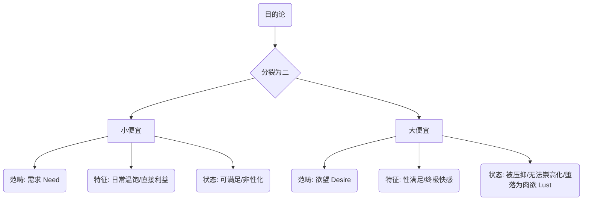
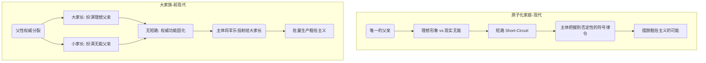
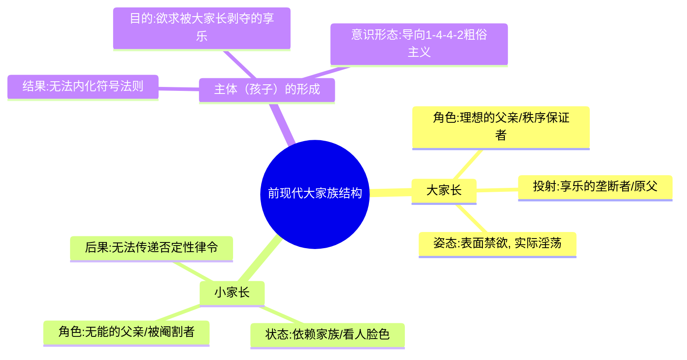

---
{"dg-publish":true,"permalink":"/1-4 平庸主义/1-4-4 庸俗主义/1-4-4-2 粗俗主义/","created":"2025-09-19T20:52:29.588+08:00","updated":"2025-09-23T18:40:33.986+08:00"}
---

### **一、本章概览**
- **主义主义编码**: 1-4-4-2
- **意识形态命名**: [[粗俗主义\|粗俗主义]] (Vulgarianism)
- **核心论断**: [[粗俗主义\|粗俗主义]]是一种前反思的、以男性为主的底层意识形态，其核心驱力源于[[9 未命名/目的论\|目的论]]上“小便宜”（日常需求）与“大便宜”（被压抑的性化欲望）的根本对立。这种分裂使其主体成为一个在愤世嫉俗和沉溺欲望之间摇摆的“色鬼”与“赌狗”，其根源在于[[前现代\|前现代]]社会中[[父性权威\|父性权威]]的功能性缺失。
- **你能获得**:
    - **诊断工具**: 掌握分析“1-4-4-2”意识形态的[[四格框架\|四格框架]]，理解其内在的虚无主义底色和二元对立的驱力结构。
    - **精神分析视角**: 了解[[原子化家庭\|原子化家庭]]与[[大家族\|大家族]]在塑造主体精神结构上的根本差异，特别是“[[父性权威\|父性权威]]的短路”如何成为摆脱[[粗俗主义\|粗俗主义]]的关键。
    - **现实洞察**: 辨识现实生活中“色鬼”、“赌狗”和网络“喷子”背后的意识形态逻辑，理解其行为模式（如说脏话、愤世嫉俗）为何是一种无望的享乐补偿。

---
### **二、核心内容解析**

#### **“主义主义”四格分析**

1.  **场域之“1” (Ontology)**：该意识形态的[[世界\|世界]]图景是一个统一且未经反思的“大流”。它预设了一个不言自明的、无差别的社会背景秩序。主体完全沉浸其中，不质疑其合理性，行为模式是“随大流”。这个“1”代表着一种智识上的懒惰和存在论上的顺从，世界被视为一个理所当然、无需深究的舞台。所有的人和事都在这个同质化的背景中运作，没有真正的例外或断裂，一切复杂的社会矛盾都被简化为一种浑然一体的“世道如此”。

2.  **本体之“4” (Body)**：世界的[[实在\|实在]]本质被体验为一个内在虚无、充满创伤性暴力的空洞。但与[[虚无主义\|虚无主义]]者不同，[[粗俗主义\|粗俗主义]]者并不直面这种“细思恐极”的真相。相反，他们用一种极具攻击性的犬儒姿态来掩盖和拒斥这个空洞，表现为“关我屁事”、“你装什么装”。这个“4”因此体现为一种否认性的虚无：世界的真相是空的、假的、令人作呕的，但主体选择用粗鄙的言行主动攻击任何试图揭示或严肃对待这一真相的人事物，以此来防御自身的焦虑。

3.  **现象之“4” (Phenomenon)**：[[主体性\|主体性]]体验是完全破碎、偶然且无根据的。主体的感知和行为模式是“一时兴起”（a whim），缺乏任何内在的连贯性和逻辑。这个现象学上的“4”意味着主体的内在世界没有稳定的原则，充满了随机的冲动。一切体验都被拉平为消费和“玩”，任何不爽或阻碍都会被立即通过骂脏话等方式转化为一种虚假的“爽”，从而消解了任何可能引发反思的负面体验（如怅然若失、悲伤）。世界在此成为一个没有深度、仅供即时享乐和发泄的游乐场。

4.  **目的之“2” (Purpose)**：该意识形态的[[9 未命名/目的论\|目的论]]呈现为一种不可调和的二元对立：[[小便宜\|小便宜]]与[[大便宜\|大便宜]]之间的斗争。前者代表着日常的、非性化的[[需求\|需求]]（Need），如温饱、金钱等直接的生理满足。后者则指向被高度性化、压抑且难以获得的[[欲望\|欲望]]（Desire），尤其是粗俗的肉欲（Lust）。这种分裂使得主体的生活变成了一场“以小博大”的赌博，他不断积累[[小便宜\|小便宜]]，幻想有朝一日能兑换成终极的[[大便宜\|大便宜]]。这种永恒的张力构成了其核心驱力，使其沦为“色鬼”和“赌狗”。

#### **其他核心知识点**

##### 小便宜 vs. 大便宜：需求与欲望的堕落形态
[[粗俗主义\|粗俗主义]]的整个动力系统建立在[[小便宜\|小便宜]]与[[大便宜\|大便宜]]的对立之上。这并非简单的利益大小之分，而是一个深刻的[[9 未命名/精神分析\|精神分析]]结构。[[小便宜\|小便宜]]对应着前欲望层面的生物性[[需求\|需求]]（Need），是直接的、可满足的、不会带来精神升华的，例如吃饭、保暖。而[[大便宜\|大便宜]]则进入了[[欲望\|欲望]]（Desire）的辩证法，但它是一种未能[[崇高化\|崇高化]]（Sublimation）也未能精神化的堕落形态——纯粹的肉欲（Lust）。它指向被社会律法压抑的、被想象为终极满足的性快感。由于主体缺乏真正的[[主体性\|主体性]]和反思能力，这种欲望无法转化为爱或创造力，只能永远以一种粗鄙、物化的形式成为其追逐的幻影，并导致其陷入更深的压抑循环。

**举例阐释**：讲稿中提到的那位高学历人渣同事，尽管在社会层面不断积累学历、地位等[[小便宜\|小便宜]]，但他所有行为的最终幻想都指向对女性的性征服，即[[大便宜\|大便宜]]。然而，一旦他“搞到手”，这种满足感便立刻消失，因为这种[[欲望\|欲望]]本身是空洞的，缺乏爱情的维度，只是对一个想象中被剥夺的[[享乐\|享乐]]的病态补偿。

##### 原子化家庭与父性权威的“短路”
19世纪西欧[[原子化家庭\|原子化家庭]]的出现，是人类精神结构的一次重大变革，它创造了摆脱[[粗俗主义\|粗俗主义]]的条件。关键在于[[父性权威\|父性权威]]发生了“短路”。在小家庭中，同一个父亲身上同时体现了两种矛盾的形象：一个试图维持秩序、代表理性的[[理想的父亲\|理想的父亲]]，和另一个在现实中屡屡受挫、无能甚至暴怒的[[无能的父亲\|无能的父亲]]。孩子通过观察这种同体矛盾，得以瞥见一个超越了具体父亲形象的、纯粹的否定性律令——即对原始[[爱欲\|爱欲]]说“不”的力量。这种“短路”使得符号律令得以建立，为主体发展出反思和[[崇高化\|崇高化]]能力奠定了基础。

**举例阐释**：一个孩子看到他失业的父亲（[[无能的父亲\|无能的父亲]]）在训斥自己时，虽然言辞严厉，却能从父亲颤抖的声音和为难的表情中，感受到父亲正在拼命克制自己的挫败感和怒火，以维持一个“为你好”的父亲形象（[[理想的父亲\|理想的父亲]]）。正是在这种矛盾中，孩子理解了纪律和规则并非源于父亲个人的强大，而是一种超越性的、必须遵守的否定性原则。

##### 前现代大家族与享乐的垄断
[[前现代\|前现代]]的[[大家族\|大家族]]结构是批量生产[[粗俗主义\|粗俗主义]]的温床。在这种结构中，[[父性权威\|父性权威]]被人为地割裂为两部分：[[大家长\|大家长]]（如祖父、族长）扮演着不容置疑的、象征绝对秩序的[[理想的父亲\|理想的父亲]]角色；而孩子自己的父亲（“小家长”）则是一个必须看[[大家长\|大家长]]脸色行事的、被阉割的[[无能的父亲\|无能的父亲]]。这种结构导致孩子无法体验到[[父性权威\|父性权威]]的内在矛盾。相反，他会将所有被禁止的[[享乐\|享乐]]（Jouissance）都投射到那个神秘、威严的[[大家长\|大家长]]身上，把他想象成一个垄断了一切快感的[[原父\|原父]]。因此，他自身的[[欲望\|欲望]]从一开始就被设定为一种对[[原父\|原父]]所窃取之物的欲求，这使得他的[[享乐\|享乐]]模式永远是病态和补偿性的。

**举例阐释**：在《红楼梦》或《白鹿原》这样的宗族故事中，贾政必须在贾母面前唯唯诺诺，白嘉轩作为族长则掌握着绝对的道德和惩戒权力。年轻一代会感到，所有真正的权力与自由（包括性的自由）都被这些大家长所掌控。他们长大后获得的性快感，并非体验为爱情，而是体验为“那些老不死的终于死了，我终于可以拿回本属于我的东西了”，这是一种充满怨恨的补偿。

---
### **三、关键观点提取**
- “他就会发现这个世界上有两种便宜，两种享乐......一种是[[小便宜\|小便宜]]，还有一种是[[大便宜\|大便宜]]。他就这两种[[9 未命名/目的论\|目的论]]就对立起来了。”
- “当他这些粗鄙之人......在面对比如说一些暴力威胁的时候......他就‘你老什么老装什么装你他妈谁啊’......他会把人称化。”
- “在[[原子化家庭\|原子化家庭]]里面，它是短路了......理想的父亲......和一个现实的一个[[无能的父亲\|无能的父亲]]。这两种形象在[[原子化家庭\|原子化家庭]]里面，它是短路了。”
- “前现代的律法这个律法实际上和[[享乐\|享乐]]是同一种东西......你只要遵守我这个律法，大面上遵守，我就允许你可以[[享乐\|享乐]]。”
- “终于他开心的就是那个你应当[[享乐\|享乐]]的那个大他者，把偷走的那些快感还回来了。终于这些老不死的死了，我终于可以拿走被他们剥夺的那些快感了。”

---
### **四、知识点问答**
#### Q: 为何说[[粗俗主义\|粗俗主义]]者是没有爱情的？
A: 因为在1-4-4-2的结构中，[[大便宜\|大便宜]]作为其[[欲望\|欲望]]的终极目标，从一开始就被设定为对想象中被[[原父\|原父]]（[[大家长\|大家长]]）剥夺的[[享乐\|享乐]]的补偿和夺回。因此，当他与女性发生性关系时，他体验到的快感并非源于与另一个主体的相遇和结合，而是感觉“压抑许久后，那个至高的父性秩序终于对我的补偿”。这种体验模式中，对方只是一个实现其病态补偿的工具，而不是一个具有独立[[主体性\|主体性]]的爱的对象。真正的爱情需要一个能够否定纯粹肉欲、建立起符号交换关系的主体，而这正是[[粗俗主义\|粗俗主义]]者所缺乏的。

#### Q: 粗俗主义者“一时兴起”和“关我屁事”的态度，如何共同构筑了其现象学上的“4”和本体论上的“4”？
A: “一时兴起”描述了其现象学体验的破碎性（现象之4）：主体的内在世界没有统一的原则，行为和感知都是随机、断裂的冲动，缺乏深度和连续性。而“关我屁事”则是对本体论真相（本体之4）的防御姿态：世界的本质是一个创伤性的虚空，但主体拒绝承认这一点，而是用粗鄙的攻击性言辞将这个“虚空”推开，否认其存在。两者共同作用，塑造了一个既没有内在统一性，也拒绝外部深刻性的主体——他漂浮在无意义的瞬间刺激中，同时用犬儒式的暴力抵御任何可能让他坠入存在之虚无的事物。

#### Q: 讲稿中提到的父性权威“短路”为何至关重要？它与拉康的“父之名”有何关联？
A: 这个“短路”之所以关键，是因为它打破了[[父性权威\|父性权威]]的神话。当孩子在同一个父亲身上看到理想与无能的矛盾时，他才意识到，那个禁止他原始[[爱欲\|爱欲]]的“法”并非来自父亲这个具体的人，而是一个超越性的、抽象的符号律令。这个律令本身也是不完美的，但正因如此才需要被遵守。这就是[[拉康\|拉康]]所说的“[[父之名\|父之名]]”（Name-of-the-Father）的建立过程——它不是指具体的父亲，而是指那个将主体从与母亲的想象性融合中切断、引入符号秩序的结构性功能。没有这个“短路”，孩子要么将“法”等同于[[大家长\|大家长]]的专断意志，要么将其视为无能父亲的虚张声势，都无法真正完成主体化。

---
### **五、知识延伸**
- **[[弗洛伊德\|弗洛伊德]]的《[[图腾与禁忌\|图腾与禁忌]]》**: 此书是理解“[[原父\|原父]]”和“[[享乐\|享乐]]垄断”概念的源头。[[弗洛伊德\|弗洛伊德]]在书中构想了一个原始部落，其中强大的父亲垄断了所有女性，儿子们为了获得[[享乐\|享乐]]而弑父。这为讲稿中关于[[大家族\|大家族]]批量生产[[粗俗主义\|粗俗主义]]的[[9 未命名/精神分析\|精神分析]]论断提供了最经典的理论支持。
- **陀思妥耶夫斯基的小说，尤其是《[[卡拉马佐夫兄弟\|卡拉马佐夫兄弟]]》中的老卡拉马佐夫**: 费奥多尔·巴甫洛维奇·卡拉马佐夫是[[粗俗主义\|粗俗主义]]（1-4-4-2）最完美的文学形象。他一生都在追逐金钱（[[小便宜\|小便宜]]）和女色（[[大便宜\|大便宜]]），言语粗鄙，行为放荡，完全无视道德律法。他正是那个失败的、无法提供符号律令、自身沉溺于原始[[享乐\|享乐]]的父亲形象，并直接导致了他儿子们的精神悲剧。
- **电影《[[华尔街之狼\|华尔街之狼]]》**: 影片主角乔丹·贝尔福特的生活可以看作是现代资本主义背景下的1-4-4-2变体。他将金融投机获得的巨额财富（[[小便宜\|小便宜]]的极致放大）全部用于满足无尽的性欲和毒品消费（[[大便宜\|大便宜]]的无限循环），其内在精神极度空虚。这展现了当“随大流”的场域从[[前现代\|前现代]]宗族变为现代消费社会时，[[粗俗主义\|粗俗主义]]会呈现出何种光鲜亮丽却同样堕落的形式。

---
### **六、双链关联总结**
- **一级关联 (核心意识形态与概念)**: [[粗俗主义\|粗俗主义]]、[[小便宜\|小便宜]]、[[大便宜\|大便宜]]、[[父性权威\|父性权威]]、[[短路\|短路]]、[[理想的父亲\|理想的父亲]]、[[无能的父亲\|无能的父亲]]

- **推测相关人物 (Speculated Figures)**: 一个玩世不恭、沉迷于短期刺激与感官满足，同时又对未来抱有不切实际的“捞一把大的”幻想的都市男性。他频繁使用网络流行脏话，对严肃话题报以嘲讽，私下里却可能是一个“赌狗”或“色鬼”，其行为模式根植于对一个强大而缺席的权威形象的复杂情感（既模仿又怨恨）。

- **二级关联 (上下文与背景)**: [[9 未命名/精神分析\|精神分析]]、[[弗洛伊德\|弗洛伊德]]、[[拉康\|拉康]]、[[前现代\|前现代]]、[[原子化家庭\|原子化家庭]]、[[大家族\|大家族]]、[[9 未命名/目的论\|目的论]]、[[存在论\|存在论]]、[[9 未命名/现象学\|现象学]]

- **三级关联 (推测与延展)**: [[欲望\|欲望]]、[[需求\|需求]]、[[享乐\|享乐]]、[[原父\|原父]]、[[父之名\|父之名]]、[[崇高化\|崇高化]]、[[犬儒主义\|犬儒主义]]、[[歇斯底里\|歇斯底里]]、[[图腾与禁忌\|图腾与禁忌]]、[[卡拉马佐夫兄弟\|卡拉马佐夫兄弟]]