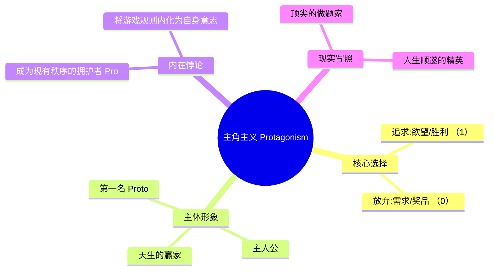
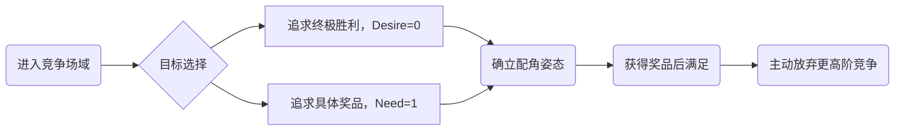
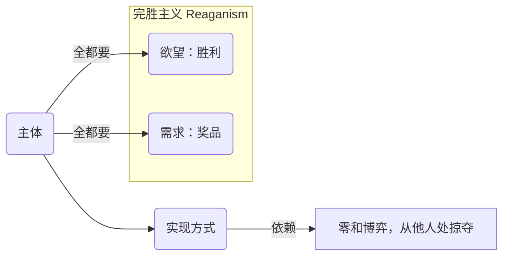
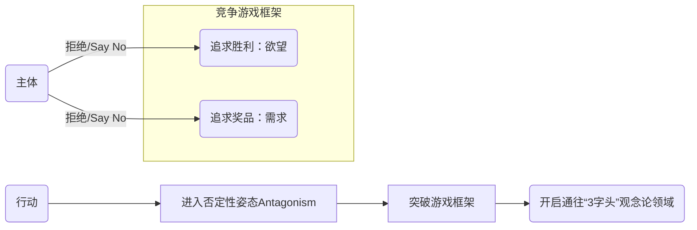

---
{"dg-publish":true,"permalink":"/1-4 平庸主义/1-4-4 庸俗主义/1-4-4-3 四重竞争主义/","created":"2025-09-19T20:52:29.591+08:00","updated":"2025-09-23T18:39:57.321+08:00"}
---

### **一、本章概览**
- **主义主义编码**: 1-4-4-3
- **意识形态命名**: [[四重竞争主义\|四重竞争主义]] / [[Fourfold Agonism\|Fourfold Agonism]]
- **核心论断**: 这是一种在[[庸俗主义\|庸俗主义]]层面，为调和“[[小便宜\|小便宜]]”（需求）与“[[大满足\|大满足]]”（欲望）之间的矛盾而产生的意识形态。它将整个世界视为一个[[竞技场\|竞技场]]，通过一套四重化的竞争姿态来结构主体的行为，其本质是逃避反思，但在其最激进的否定性姿态中，也蕴含着通向真正[[主体性\|主体性]]的传送门。
- **你能获得**:
    - 理解 1-4-4-3 意识形态如何将世界框架为一个封闭的“游戏”。
    - 掌握其核心的四种竞争姿态：[[主角主义\|主角主义]]、[[配角主义\|配角主义]]、[[完胜主义\|完胜主义]]与[[反抗主义\|反抗主义]]。
    - 洞悉为何“[[做题家\|做题家]]”思维是这种意识形态的典型体现。
    - 认识到[[反抗主义\|反抗主义]]姿态（以[[安提戈涅\|安提戈涅]]为例）如何成为突破该体系，进入更高阶哲学思考（“三字头”）的关键。

---
### **二、核心内容解析**

#### **“主义主义”四格分析**

1.  **场域之“1” (Ontology)**：此处的“1”代表世界被预设为一个统一、封闭且规则明确的[[竞技场\|竞技场]]或游戏（Game）。在这个[[存在论\|存在论]]框架下，世界不是一个充满无限可能性的开放领域，而是一个被唯一逻辑——“竞争-获胜”——所支配的整全系统。所有存在物和事件的意义都被还原为游戏内的元素、得分项或障碍物。这个场域是循环和同质的，因为它只允许一种行为模式（竞争）和一种价值判断（输赢），排除了对游戏本身进行反思的可能性。

2.  **本体之“4” (Body)**：在此竞技场中，具体的“内容”被视为空洞、无价值和偶然的，这正是“4”的体现。该意识形态对世界由什么构成的[[9 未命名/本体论\|本体论]]问题持一种虚无主义的回避态度。万物（包括知识、道德、人际关系）的内在价值被悬置，它们只被看作是游戏中可以利用的、无差别的工具或筹码。这种“去价值化”的态度体现了“4”的内在分裂与虚无特性：世界本身是荒芜的，唯一真实的就是竞争关系本身，而非竞争的对象。

3.  **现象之“4” (Phenomenon)**：主体在此场域中的感知和体验同样由“4”来定义，即一种“不思考”的盲目游戏状态。[[主体性\|主体性]]被悬空，个体放弃了对行为背后意义的追问，其[[现象\|现象]]学体验被简化为对游戏规则的被动遵循和条件反射式的操作。所有事件都被理解为偶然的（contingent）巧合，所有策略都只是权宜之计。这种状态体现了“4”作为内在矛盾的特质：主体在行动，但其行动缺乏内在的、自洽的哲学根基，处于一种前反思的、被游戏逻辑支配的分裂状态。

4.  **目的之“3” (Purpose)**：该意识形态的[[9 未命名/目的论\|目的论]]由“3”来结构，即追求[[奖品\|奖品]] (Prize)。这个[[奖品\|奖品]]是一个核心的中介者，它成功地调和了前反思主体内部“占[[小便宜\|小便宜]]”（具体的需求满足）和“获[[大满足\|大满足]]”（抽象的胜利欲望）之间的矛盾。这个“3”不是一个单一的目标，而是分化为一个复杂的、结构化的四重矩阵，为主体提供了不同的“获胜”策略。它通过设立一个可见的、可争夺的中心目标，使得空洞的竞争行为获得了方向和动力，将主体的能量汇集到这个求胜的游戏中。

#### **其他核心知识点**

##### 主角主义 (Protagonism)：为胜利而生的拥护者
[[主角主义\|主角主义]]是[[四重竞争主义\|四重竞争主义]]中的第一种姿态，它在[[欲望\|欲望]]（胜利）和[[需求\|需求]]（奖品）的矩阵中选择“1-0”模式：即追求[[胜利\|胜利]]本身的[[大满足\|大满足]]，而对具体的[[奖品\|奖品]]（小便宜）不屑一顾。这种姿态常见于天资聪颖、顺风顺水的“天选之子”，他们将竞争的终极目标设定为证明自己是第一名（Proto-）。然而，讲稿揭示了一个深刻的悖论：这种对胜利的执着，使他们无意中成为了维护这个竞争游戏秩序最坚定的拥护者（Pro-），因为他们的“主角”身份完全依赖于这个游戏规则的稳定。他们看似是游戏的主人，实则是秩序最忠实的提线木偶。

**举例阐释**：讲稿中提到的“小镇做题家里面考上北大清华那些人”，他们中的佼佼者往往体现出[[主角主义\|主角主义]]。他们追求的不仅仅是大学录取通知书这个“[[奖品\|奖品]]”，更是“状元”、“第一名”所带来的、超越所有对手的[[胜利\|胜利]]快感。

##### 配角主义 (Deuteragonism)：满足于奖品的第二名
[[配角主义\|配角主义]]是矩阵中的“0-1”模式，与[[主角主义\|主角主义]]截然相反。它选择放弃对终极[[胜利\|胜利]]（欲望）的争夺，而满足于获得具体的[[奖品\|奖品]]（需求）。这种姿态体现为一种“第二名万岁”的心态，甘愿做主角身边的配角或跟风者（Deutero-）。他们将竞争的痛苦最小化，把目标锁定在可获得的实际利益上。讲稿指出，这种姿态可以被理解为一种“求胜心的缺失”，他们要的是战利品，而不是战争本身的胜利。这种策略在充满不确定性的竞争环境中，是一种务实的、减少心理损耗的生存之道。

**举例阐释**：电影《投名状》中，相对于大哥对权力和地位（[[胜利\|胜利]]）的无尽追求，他的两个结拜兄弟在很多时候更满足于抢来的金银财宝和粮食（[[奖品\|奖品]]），这就是一种典型的[[配角主义\|配角主义]]。

##### 完胜主义 (Reaganism / Re-agonism)：零和博弈的全都要
[[完胜主义\|完胜主义]]是矩阵中的“1-1”模式，即“我全都要”。它既要[[胜利\|胜利]]的[[大满足\|大满足]]，也要[[奖品\|奖品]]的[[小便宜\|小便宜]]，追求一种无可挑剔的、完美的胜利。这种姿态的内在逻辑是[[零和博弈\|零和博弈]]，因为它假定资源是有限的，要实现双重满足，就必须通过更激进、无底线的竞争手段从别人手中抢夺份额。讲稿巧妙地将其命名为“里根主义”（Reaganism），暗指其在冷战时期既要全球霸权的[[胜利\|胜利]]，又要国内经济利益（减税、市场化）的[[奖品\|奖品]]。前缀“Re-”也暗示了其不懈、重复、加倍的斗争姿态。

**举例阐释**：以[[里根主义\|里根主义]]为代表的政治策略，在国际上不惜一切代价（包括突破意识形态底线）追求对苏联的冷战[[胜利\|胜利]]，在国内则通过激进的经济政策来确保特定阶层的利益（[[奖品\|奖品]]），这正是一种典型的[[完胜主义\|完胜主义]]姿态。

##### 反抗主义 (Antagonism)：撕破游戏规则的否定性姿态
[[反抗主义\|反抗主义]]是矩阵中“0-0”的模式，也是最稀有、最具哲学颠覆性的一种姿态。它双重否定，既拒绝[[胜利\|胜利]]的诱惑，也拒绝[[奖品\|奖品]]的慰藉。这种姿态不是竞争，而是对竞争游戏本身的反抗。它并非为了达成某个积极的目标，而是纯粹的否定性行动，其动力超越了[[欲望\|欲望]]的辩证法，进入了[[9 未命名/精神分析\|精神分析]]中的[[9 未命名/死亡驱力\|死亡驱力]]（Death Drive）领域。这种姿态不计代价、不死不休，通过一种看似非理性的坚持，撕破整个由“大小逻辑”构成的游戏规则体系，从而为真正自由的[[主体性\|主体性]]开辟了空间。

**举例阐释**：古希腊悲剧中的[[安提戈涅\|安提戈涅]]是[[反抗主义\|反抗主义]]的终极典范。她执意埋葬兄长，既违背了国王的王命（拒绝承认世俗的[[胜利\|胜利]]规则），也超越了普通的人情逻辑（若兄长在世，不会愿她赴死，即拒绝以自我保全为[[奖品\|奖品]]）。她的行动遵循一种不可妥协的内在法则（神谕/自由意志），最终摧毁了整个城邦的秩序。

---
### **三、关键观点提取**
- “这个东西就是很多[[做题家\|做题家]]，为什么？他实际上他是1-4-4的，但是还能够接受教育...因为[[做题家\|做题家]]在[[9 未命名/目的论\|目的论]]上，他是结构出这个3，这个三是个是个四重化的。”
- “我们可以我们甚至可以把这个[[欲望\|欲望]]和[[需求\|需求]]就改写成一个[[欲望\|欲望]]代表[[胜利\|胜利]]，而[[需求\|需求]]代表是[[奖品\|奖品]]。”
- “实际上他作为主人公，其实他只是个拥护支持者。他拥护什么呢？拥护那个大的秩序，告诉他那个[[大满足\|大满足]]是什么。”
- “一个无论这个规则是小还是大，只要你在字面上把它坚持到底，它就是最大的...掀掉整个[[竞争主义\|竞争主义]]这个游戏里面的两个对抗性规则。”
- “这个玩意儿是前反思的1-4-4-3...他最后一个是没法成为一个主意的...主流意识形态是不会...把它当成一个选项的...这个太危险了。”

---
### **四、知识点问答**

#### Q: 为何讲稿将 1-4-4-3 这种竞争主义称为“庸俗的”或“前反思的”？
A: 因为其[[存在论\|存在论]]（1-世界是游戏）和[[现象\|现象]]学（4-不思考）根基决定了它是一种回避深刻反思的意识形态。处于该意识形态下的主体，将世界简化为一个规则既定的[[竞技场\|竞技场]]，并放弃了对规则本身合法性、世界本质及自我存在意义的追问（本体之“4”，现象之“4”）。所有精力都投入到如何“玩好游戏”上，这是一种典型的[[庸俗主义\|庸俗主义]]姿态，即用战术上的勤奋掩盖战略上的懒惰。

#### Q: 安提戈涅的行动如何体现了对“欲望”和“需求”的双重拒绝 (0-0)？
A: 她拒绝了“[[欲望\|欲望]]”的维度，即没有将战胜国王、捍卫家族荣誉或证明神谕正确性作为一种[[胜利\|胜利]]来追求。同时，她也拒绝了“[[需求\|需求]]”的维度，即没有将埋葬兄长以求得内心安宁或家庭和睦作为一种具体“[[奖品\|奖品]]”。她的行动超越了任何可计算的得失，其不惜牺牲自己和他人幸福的决绝姿态，表明她拒绝了世俗框架下的一切奖惩，进入了一种纯粹的、不可妥协的[[9 未命名/死亡驱力\|死亡驱力]]领域。

#### Q: 讲稿为何暗示 反抗主义 (Antagonism) 是通往“3字头”意识形态的传送门？
A: 因为[[反抗主义\|反抗主义]]引入了最关键的要素：绝对的、能动的[[主体性\|主体性]]。在 1-4-4-3 的前三种姿态中，主体都是游戏规则的奴隶。而[[反抗主义\|反抗主义]]通过对整个游戏框架的否定，彰显了一种不被任何外部规则所定义的、纯粹的内在决断。这种能够“掀桌子”的激进[[主体性\|主体性]]，正是“三字头”意识形态的核心特征——即由一个中心化的观念（如自我意识、绝对精神）来调和与重塑整个世界图景。[[反抗主义\|反抗主义]]的姿态，就是这种强大[[主体性\|主体性]]的惊鸿一现。

---
### **五、知识延伸**
- **索福克勒斯《[[安提戈涅\|安提戈涅]]》**: 阅读这本古希腊悲剧的原著，是理解[[反抗主义\|反抗主义]]姿态最直接的方式。它深刻揭示了神法与人法、个体伦理与城邦政治之间的绝对冲突，是探讨[[主体性\|主体性]]与法则关系的永恒经典。
- **[[零和博弈\|零和博弈]] (Zero-Sum Game)**: 这一博弈论概念是理解[[完胜主义\|完胜主义]]（Reaganism）内在逻辑的钥匙。它有助于分析为何这种“全都要”的姿态必然导向对他者的加倍掠夺和无底线的竞争。
- **雅克·拉康的[[9 未命名/死亡驱力\|死亡驱力]] (Death Drive)**: 为理解[[反抗主义\|反抗主义]]超越“趋乐避苦”原则的动力，[[拉康\|拉康]]对弗洛伊德[[9 未命名/死亡驱力\|死亡驱力]]的解读提供了关键理论支持。它解释了那种不计后果、不死不休、享受“毁灭”本身的否定性力量，这正是[[安提戈涅\|安提戈涅]]式行动的内核。

---
### **六、双链关联总结**
- **一级关联 (核心意识形态与概念)**: [[四重竞争主义\|四重竞争主义]]、[[Fourfold Agonism\|Fourfold Agonism]]、[[竞争主义\|竞争主义]]、[[主角主义\|主角主义]]、[[配角主义\|配角主义]]、[[完胜主义\|完胜主义]]、[[反抗主义\|反抗主义]]、[[欲望\|欲望]]、[[需求\|需求]]、[[胜利\|胜利]]、[[奖品\|奖品]]
- **推测相关人物 (Speculated Figures)**: [[安提戈涅\|安提戈涅]] (作为[[反抗主义\|反抗主义]]的化身)、[[罗纳德·里根\|罗纳德·里根]] (作为[[完胜主义\|完胜主义]]的政治象征)、典型的“[[做题家\|做题家]]” (作为该意识形态的普遍社会形象)
- **二级关联 (上下文与背景)**: [[庸俗主义\|庸俗主义]]、[[存在论\|存在论]]、[[9 未命名/本体论\|本体论]]、[[现象\|现象]]、[[9 未命名/目的论\|目的论]]、[[主体性\|主体性]]、[[9 未命名/精神分析\|精神分析]]、[[古希腊神话\|古希腊神话]]、[[索福克勒斯\|索福克勒斯]]
- **三级关联 (推测与延展)**: [[偶然性\|偶然性]]、[[零和博弈\|零和博弈]]、[[9 未命名/死亡驱力\|死亡驱力]]、[[6 哲学家/雅克·拉康\|雅克·拉康]]、[[竞技场\|竞技场]]、[[9 未命名/前反思\|前反思]]