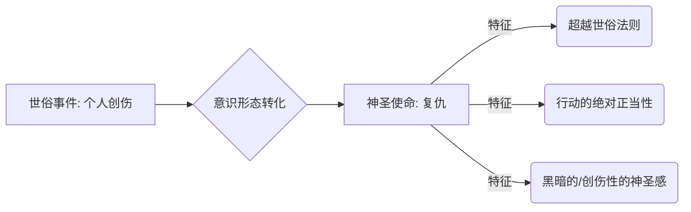
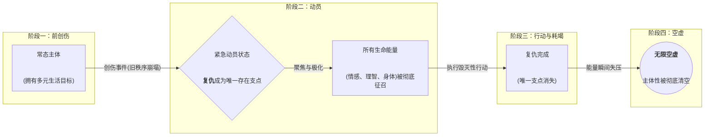
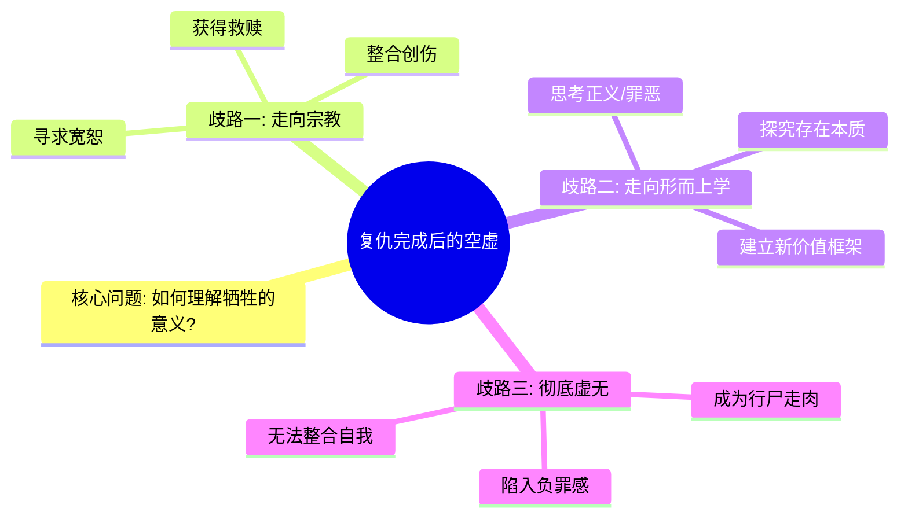

---
{"dg-publish":true,"permalink":"/1-4 平庸主义/1-4-4 庸俗主义/1-4-4-4 复仇主义/","created":"2025-09-19T20:52:29.594+08:00","updated":"2025-09-23T01:37:17.329+08:00"}
---

### **一、本章概览**
- **主义主义编码**: 1-4-4-4
- **意识形态命名**: [[复仇主义\|复仇主义]] / [[最神圣的庸俗\|最神圣的庸俗]]
- **核心论断**: [[复仇主义\|复仇主义]]是[[庸俗主义\|庸俗主义]]的终极形态，它将主体彻底工具化，使其被一个受创的、绝对化的[[秩序\|秩序]]完全接管。在这种意识形态下，个体的一切生命活动都被悬置，只为执行一场旨在抹除历史创伤的、具有[[世俗的神圣\|世俗的神圣]]性的复仇行动，并最终在行动完成后坠入[[无限的空虚\|无限的空虚]]。
- **你能获得**: 你将理解1-4-4-4这一特殊编码的内在逻辑，掌握[[世俗的神圣\|世俗的神圣]]、[[主体性的全面征召与清空\|主体性的全面征召与清空]]等核心概念，并能从“主义主义”框架下剖析复仇心理如何演变为一种毁灭性的、总体性的意识形态，同时洞察其背后通往[[形而上学\|形而上学]]或[[宗教\|宗教]]的微弱可能性。

---
### **二、核心内容解析**
#### **“主义主义”四格分析**

1.  **场域之“1” (Ontology)**：在此意识形态中，[[世界\|世界]]被预设为一个本应统一、和谐、天经地义的绝对[[秩序\|秩序]]。这个“1”不是一个中立的背景，而是一个具有道德完满性的整全系统。然而，某个创伤性事件（罪恶）已经野蛮地撕裂了这个[[秩序\|秩序]]，使其不再完整。因此，整个世界的[[存在论\|存在论]]框架变成了一个“被玷污的‘1’”。复仇行动的全部意义，就在于以一种同样绝对的暴力，去修复或“净化”这个被破坏的统一[[秩序\|秩序]]，使其恢复到想象中的原初状态。

2.  **本体之“4” (Body)**：在复仇者的眼中，构成[[世界\|世界]]的[[实在\|实在]]本身是虚假的、不应存在的。数字“4”在此处揭示了一种内在的否定性：现实中一切安然无恙的存在（人、事、物）都是对那个原初[[秩序\|秩序]]的背叛，是一种[[罪\|罪]]（Sin）。它们的存在本身就构成了一种错误。因此，本体论层面充满了内在矛盾——“存在着的东西，恰恰是不该存在的”。复仇者否定这一切现实的合法性，认为整个历史、整个[[世界\|世界]]都因容纳了那桩罪恶而失去了存在的资格，理应被抹除。

3.  **现象之“4” (Phenomenon)**：[[主体性\|主体性]]的体验被彻底撕裂，并被一种无所不包的[[羞耻\|羞耻]]（Shame）所贯穿。数字“4”代表了[[主体性\|主体性]]的内在分裂与虚无。复仇者的自我感知是羞耻的（因无力立即复仇），对仇敌的感知是羞耻的（其存在本身就是一种耻辱），对中立旁观者的感知也是羞耻的（他们的漠视或无能同样是可耻的）。因此，主体没有任何统一、稳定的现象学体验，其感知[[世界\|世界]]的方式被单一的、创伤性的负面情感（羞耻）所殖民，一切体验都指向内在的空洞与不可能性。

4.  **目的之“4” (Purpose)**：该意识形态的[[9 未命名/目的论\|目的论]]是虚无的，其终点是[[牺牲\|牺牲]]（Sacrifice）与自我取消。数字“4”在此意味着所有常规的人生目的（幸福、成就、发展）都已失效。唯一的目标是通过复仇行动，将仇敌、自我、乃至整个冷漠的[[世界\|世界]]一并[[牺牲\|牺牲]]掉。这个目的不是为了构建任何新的东西，而是为了“取消”——取消创伤、取消历史、取消自我。因此，其[[9 未命名/目的论\|目的论]]是一种反目的论，它导向的不是一个积极的未来，而是一个绝对的终结，一个大仇得报之后的[[无限的空虚\|无限的空虚]]。

#### **其他核心知识点**

##### 世俗的神圣 (The Secular Sacred)
[[复仇主义\|复仇主义]]将一种原本世俗的情感（仇恨）提升到了一个绝对的、不容置疑的“神圣”领域。这种神圣性并非传统[[宗教\|宗教]]中金光闪闪、创造性的神圣，而是一种源于创伤、浸透着血与痛苦的“黑暗神圣性”。它为复仇行动提供了超越一切世俗法律、道德和个人福祉的最高合法性。主体在此状态下，不再是为自己复仇，而是作为一个被神圣[[秩序\|秩序]]选中的祭司或工具，执行一场宇宙级的审判。这种转化使得任何代价都变得合理，任何手段都可被允许，因为它服务于一个至高无上的“天命”。

**举例阐释**：在电影《杀死比尔》中，主角“新娘”的复仇之旅早已超越了个人恩怨。她的行动被赋予了一种仪式感和天命感，仿佛是在执行一项不得不完成的神圣任务，这使得她的极端暴力行为在影片的叙事逻辑中获得了某种“美学”和“正义”上的豁免。

##### 主体性的全面征召与清空 (Total Mobilization and Evacuation of Subjectivity)
1-4-4-4意识形态是一种[[紧急动员机制\|紧急动员机制]]，它能在一瞬间将个体的全部生命能量（符号系统、神经系统）彻底征用，服务于复仇这唯一目标。在这种状态下，主体体验到一种极度的紧张与“充实”，因为其所有潜能都被激活并聚焦于一点。然而，这是一种透支性的征用。一旦复仇完成，这个唯一的支点消失，被全面动员的[[主体性\|主体性]]会瞬间“失压”，导致彻底的崩塌和[[无限的空虚\|无限的空虚]]。主体就像一台被强制超频后烧毁的CPU，行动之后只剩下行尸走肉般的存在。

**举例阐释**：讲稿中提到的“发袋子和纸笔”的意象，即士兵在执行必死任务前写下遗书，完美地诠释了这一点。这是一种将个体彻底奉献给一个宏大目标的总动员，个体的未来与可能性被预先清空。

##### 复仇之后的双重歧路 (The Post-Revenge Crossroads)
当复仇完成，主体坠入[[无限的空虚\|无限的空虚]]时，一个微弱的“契机”也随之出现。这个契机在于如何反思和处理复仇过程中的巨大[[牺牲\|牺牲]]——包括牺牲的他人、世界以及自我。对[[牺牲\|牺牲]]意义的追问，可能将主体引向两条截然不同的道路，从而摆脱1-4-4-4的毁灭循环。一条是通向[[宗教\|宗教]]的道路，通过寻求更高层面的宽恕与救赎来整合创伤。另一条是通向[[形而上学\|形而上学]]的道路，通过将个人痛苦抽象化、普遍化，去思考正义、罪恶、存在等根本问题。若无法完成这种反思，主体则会彻底沦为虚无。

**举例阐释**：在《蝙蝠侠：黑暗骑士》中，布鲁斯·韦恩在父母被杀后选择了第二条路。他没有停留在对罪犯的个人复仇上，而是将自己的创伤升华为一个关于“正义”的[[形而上学\|形而上学]]符号（蝙蝠侠），试图从根本上解决哥谭市的罪恶问题。

---
### **三、关键观点提取**
- “符号学[[秩序\|秩序]]对什么进行复仇？对[[主体性\|主体性]]进行复仇，实际上是这个符号学[[秩序\|秩序]]它hostile to（敌视）[[主体性\|主体性]]本身。”
- “在这个复仇状态里面，就是说整个[[世界\|世界]]都不该发生，整个[[世界\|世界]]整个历史都不该发生，就应该消失。”
- “它是一种[[世俗的神圣\|世俗的神圣]]（secular secret），是一种世俗的神圣。只不过这种神圣性是一种邪魅的那种…不是一个积极的金光闪闪的神圣性，而是一个血色一般的。”
- “它是一种[[紧急动员机制\|紧急动员机制]]…它会彻底的彻底的变成1-4-4-4了…他要保证你所有的个体的整个符号学能量都被征召出来。”
- “大仇已报之后的那瞬间就是[[无限的空虚\|无限的空虚]]，就会有[[无限的空虚\|无限的空虚]]。我要讲的就是说这个时候是有机会的，这个时候是契机。”

---
### **四、知识点问答**
#### Q: 为什么1-4-4-4被称作“最神圣的庸俗”？
A: 称其为“[[庸俗主义\|庸俗主义]]”是因为它的起点“1”——场域论上的统一[[秩序\|秩序]]——是未经反思、被当作天经地义来接受的，缺乏真正的[[形而上学\|形而上学]]深度。然而，它又是“最神圣的”，因为它将这种庸俗的、前反思的[[秩序\|秩序]]绝对化，一旦此[[秩序\|秩序]]被侵犯，所激发的复仇行为被赋予了超越一切的、不容置疑的[[世俗的神圣\|世俗的神圣]]性。这种神圣感能最彻底地动员和牺牲主体，其强度和绝对性远超其他形态的[[庸俗主义\|庸俗主义]]。

#### Q: 在1-4-4-4结构中，场域的“1”如何催生并主宰了后面三个“4”？
A: 场域的“1”是一个绝对完满、不容任何杂质的[[秩序\|秩序]]预设。正因为这个“1”的绝对性，任何对它的破坏（创伤事件）才不会被看作是相对的、可修复的错误，而被视为一种绝对的[[罪\|罪]]，从而污染了整个[[存在论\|存在论]]（本体之“4”，即现实不应存在）。这种宇宙级的崩坏感，继而让主体的体验充满了无法弥合的[[羞耻\|羞耻]]与分裂（现象之“4”）。最终，唯一可能的行动就是以同样绝对的方式，通过[[牺牲\|牺牲]]一切来“抹除”这个错误，导向一个虚无的目的（目的之“4”）。所以，正是“1”的绝对主义，才孕育了“4”的绝对虚无。

#### Q: 讲稿中提到的“契机”具体指什么？为何反思“牺牲”是走出[[复仇主义\|复仇主义]]的关键？
A: “契机”指的是在复仇完成后的[[无限的空虚\|无限的空虚]]中，主体被迫直面其行动代价的时刻。[[复仇主义\|复仇主义]]在行动阶段是无需思考的，完全被[[秩序\|秩序]]驱动。但当目标消失，主体必须为自己的行为寻找意义。反思“[[牺牲\|牺牲]]”是关键，因为它迫使主体从一个被动的“工具”角色，转变为一个主动的“诠释者”。追问“我牺牲的一切究竟为了什么？”这个问题，能打破1-4-4-4的封闭循环，可能开启通往[[宗教\|宗教]]（寻求超越性的[[救赎\|救赎]]）或[[形而上学\|形而上学]]（建构新的意义框架）的道路，从而重塑[[主体性\|主体性]]。

---
### **五、知识延伸**
- **[[尼采\|尼采]]的《[[论道德的谱系\|论道德的谱系]]》**: 尼采对“[[怨恨\|怨恨]]”（Ressentiment）的分析是理解[[复仇主义\|复仇主义]]心理根源的绝佳参照。他揭示了弱者如何通过道德重估，将自己的无能和痛苦转化为一种具有攻击性的、否定生命价值的“奴隶道德”，这与复仇者将个人创伤上升为审判整个[[世界\|世界]]的[[世俗的神圣\|世俗的神圣]]性有深刻的内在关联。
- **电影《[[老男孩\|老男孩]]》（朴赞郁版）**: 这部电影是1-4-4-4意识形态的极致影像化。主角被囚禁多年后，其唯一的生存目的就是复仇。整个过程充满了仪式化的暴力和自我毁灭倾向，影片结尾揭示的真相更是将复仇的荒诞性与创伤的不可消除性推向顶峰，完美诠释了大仇得报后的[[无限的空虚\|无限的空虚]]与伦理崩溃。
- **文学形象：[[哈姆雷特\|哈姆雷特]]**: 莎士比亚笔下的哈姆雷特可以看作是一个在[[复仇主义\|复仇主义]]边缘挣扎的复杂主体。他感受到了复仇的“神圣”召唤（来自父亲鬼魂的命令），但其过度的反思和犹豫（一种[[主体性\|主体性]]的残留）使其无法彻底成为1-4-4-4的执行工具，最终导致了所有人的悲剧。他展现了从“庸俗”的复仇命令到[[形而上学\|形而上学]]式痛苦的过渡。

---
### **六、双链关联总结**
- **一级关联 (核心意识形态与概念)**: [[复仇主义\|复仇主义]]、[[庸俗主义\|庸俗主义]]、[[世俗的神圣\|世俗的神圣]]、[[牺牲\|牺牲]]、[[主体性\|主体性]]、[[秩序\|秩序]]、[[罪\|罪]]、[[羞耻\|羞耻]]、[[无限的空虚\|无限的空虚]]、[[紧急动员机制\|紧急动员机制]]
- **推测相关人物 (Speculated Figures)**:
    - **埃德蒙·唐泰斯 (基督山伯爵)**：其精心策划的复仇超越了个人利益，成为一场对社会秩序的审判，体现了[[世俗的神圣\|世俗的神圣]]性，复仇结束后也陷入了对自身行为意义的追问。
    - **亚哈船长 (《白鲸》)**：他将对莫比·迪克的仇恨，从一次工伤事故上升为对抗宇宙邪恶化身的[[形而上学\|形而上学]]战争，为此[[牺牲\|牺牲]]了船员、船只和自己的一切，是1-4-4-4的完美文学原型。
- **二级关联 (上下文与背景)**: [[主页\|主页]]、[[形而上学\|形而上学]]、[[存在论\|存在论]]、[[9 未命名/目的论\|目的论]]、[[9 未命名/现象学\|现象学]]、[[9 未命名/符号学\|符号学]]、[[尼采\|尼采]]、[[怨恨\|怨恨]]
- **三级关联 (推测与延展)**: [[创伤理论\|创伤理论]]、[[虚无主义\|虚无主义]]、[[宗教\|宗教]]、[[救赎\|救赎]]、[[天魔解体大法\|天魔解体大法]]