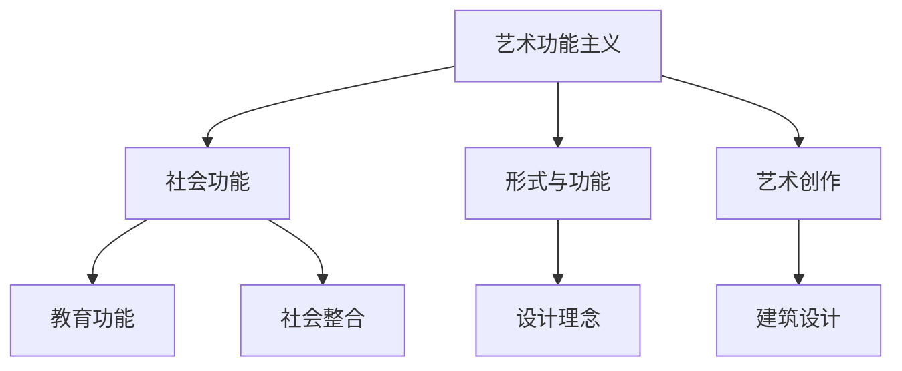
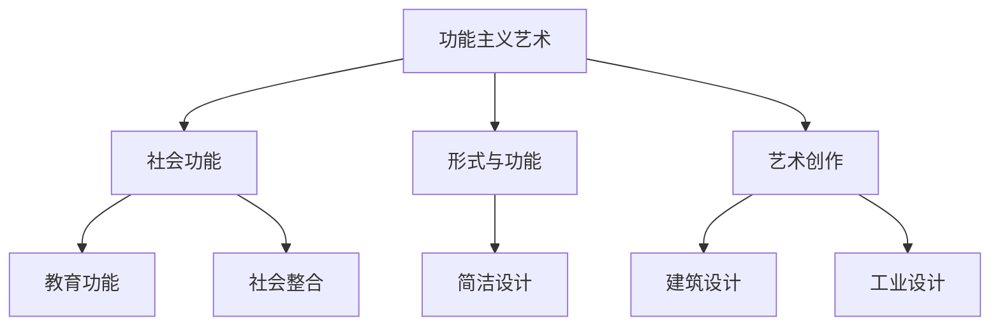

---
{"dg-publish":true,"permalink":"/5 主义/功能主义/","tags":["哲学"],"created":"2025-09-19T21:41:23.553+08:00","updated":"2025-09-22T21:20:37.283+08:00"}
---

### 1. 功能主义**

艺术领域的功能主义（Functionalism in Art）是一种认为艺术的形式和内容应该服务于社会或实用目的的艺术理论。与强调艺术的纯粹美学价值的理论不同，功能主义强调艺术应当具有实际的、社会性的功能，如教育、传播社会信息、促进社会整合等。该理论认为艺术不仅是自我表达和审美享受的工具，而且可以成为社会、政治、文化交流的手段。

在建筑、设计、工艺、艺术创作等多个领域，功能主义强调“形式追随功能”（Form Follows Function），即艺术创作的形式应该由其实际用途和功能决定，而不是出于装饰或纯粹美学的考虑。[[功能主义艺术\|功能主义艺术]]、[[形式与功能\|形式与功能]]、[[5 主义/现代主义\|现代主义]]。

### 2. **起源与发展**

- **早期影响：** 功能主义在艺术领域的萌芽可以追溯到18世纪末至19世纪初的工业革命。当时，随着工业化进程的推进，设计和建筑开始关注实用性而非单纯的装饰性，早期的功能主义艺术思想逐步浮现。[[9 未命名/工业革命\|工业革命]]、[[实用主义\|实用主义]]。
    
- **现代主义的兴起：** 在20世纪初，[[5 主义/现代主义\|现代主义]]艺术运动成为功能主义艺术的关键推动力。现代主义者提倡去除多余的装饰，强调艺术和设计的实用性和社会价值。[[5 主义/现代主义\|现代主义]]。
    
- **包豪斯学派：** [[包豪斯\|包豪斯]]（Bauhaus）是功能主义艺术的代表之一，其设计理念“形式追随功能”强调艺术和设计应服务于工业化和现代化进程，艺术不仅要美观，更要具备实用性。包豪斯学派通过建筑、设计、工艺等多种形式，展现了功能主义的艺术哲学。[[包豪斯\|包豪斯]]。
    
- **建筑与工业设计：** 在建筑领域，[[路德维希·密斯·范·德·罗\|路德维希·密斯·范·德·罗]]（Ludwig Mies van der Rohe）和[[勒·柯布西耶\|勒·柯布西耶]]（Le Corbusier）等建筑师提倡功能主义，强调建筑不仅是视觉艺术作品，还应满足人的实际需求，强调建筑的结构与功能相一致。[[路德维希·密斯·范·德·罗\|路德维希·密斯·范·德·罗]]、[[勒·柯布西耶\|勒·柯布西耶]]。
    

### 3. **功能主义的核心观点**

- **形式追随功能**：功能主义的核心原则之一是“形式追随功能”（Form Follows Function），即艺术作品的外形和结构应根据其功能需求来决定，而非仅仅追求装饰性或美学效果。这一观点在建筑、设计和现代艺术中都有广泛应用。[[形式追随功能\|形式追随功能]]。
    
- **艺术的社会功能**：功能主义艺术不仅仅是审美的表达，它还承担着社会责任，如教育功能、传播文化、提升社会生活质量等。艺术的功能被视为推动社会进步和人类发展的工具。[[社会功能\|社会功能]]。
    
- **反对装饰主义**：功能主义反对过度装饰和复杂的艺术风格，主张简洁、实用的设计理念。在建筑和工业设计中，功能主义者认为装饰元素应当被简化，甚至去除，以便突出建筑和设计的本质功能。[[简洁设计\|简洁设计]]。
    
- **跨学科整合**：功能主义不仅限于单一的艺术形式，而是强调不同领域之间的整合，如建筑、设计、绘画、工艺等多个学科的融合，以更好地服务于社会需求。[[跨学科整合\|跨学科整合]]。
    

### 4. **功能主义的主要代表**

- **路德维希·密斯·范·德·罗（Ludwig Mies van der Rohe）**：密斯是功能主义建筑设计的代表人物之一，他主张建筑的形式应当由结构和功能决定，并且强调建筑的简洁性与现代性。他的经典作品，如[[巴塞罗那馆\|巴塞罗那馆]]（Barcelona Pavilion）和[[钢铁与玻璃房\|钢铁与玻璃房]]（Glass House），体现了功能主义在建筑设计中的理念。[[巴塞罗那馆\|巴塞罗那馆]]、[[钢铁与玻璃房\|钢铁与玻璃房]]。
    
- **勒·柯布西耶（Le Corbusier）**：柯布西耶提倡“住宅是居住的机器”，强调建筑的功能性和结构性。他的设计理念不仅影响了20世纪的建筑风格，也对现代艺术产生了深远影响。[[住宅是居住的机器\|住宅是居住的机器]]。
    
- **包豪斯学派（Bauhaus）**：包豪斯学派提出设计与艺术应服务于工业化和社会需求，强调功能与美学的结合，倡导简洁、实用的设计风格。包豪斯的代表人物包括[[瓦尔特·格罗皮乌斯\|瓦尔特·格罗皮乌斯]]（Walter Gropius）和[[亨利·范·德·费尔德\|亨利·范·德·费尔德]]（Henry van de Velde）。[[瓦尔特·格罗皮乌斯\|瓦尔特·格罗皮乌斯]]、[[亨利·范·德·费尔德\|亨利·范·德·费尔德]]。
    

### 5. **功能主义艺术的影响**

- **现代主义艺术**：功能主义对现代艺术产生了深刻影响，尤其是在[[建筑\|建筑]]、[[工业设计\|工业设计]]、[[家具设计\|家具设计]]和[[平面设计\|平面设计]]等领域。现代主义艺术家摒弃了传统的装饰风格，倡导简单、纯粹的形态，体现了艺术与社会功能的紧密联系。[[5 主义/现代艺术\|现代艺术]]、[[工业设计\|工业设计]]、[[平面设计\|平面设计]]。
    
- **建筑与城市规划**：功能主义的理念深入影响了20世纪的建筑风格，尤其是[[国际风格\|国际风格]]（International Style）和[[极简主义建筑\|极简主义建筑]]（Minimalist Architecture）。这一时期的建筑强调结构的显现，去除所有不必要的装饰。[[国际风格\|国际风格]]、[[极简主义建筑\|极简主义建筑]]。
    
- **日常用品设计**：功能主义还影响了日常用品和家居设计，推动了家电、家具等商品的实用化和标准化，使得产品不仅具备美学价值，还能更好地服务于人类日常生活的需要。[[家居设计\|家居设计]]、[[家电设计\|家电设计]]。
    

### 6. **批评与争议**

- **形式过于简化**：功能主义的“形式追随功能”理论有时被批评为过于简化，忽视了艺术的主观表达和情感价值。批评者认为，功能主义可能导致艺术创作的单一化，压抑了创造力和个性。[[艺术简化\|艺术简化]]。
    
- **忽视个体需求**：有学者指出，功能主义有时过于强调普遍性和效率，忽略了艺术作品在表达个体情感和独特性的方面的作用。[[个体需求\|个体需求]]。
    
- **技术化的批判**：功能主义的理论有时也被认为过于强调技术和工业化，忽略了艺术作品的文化和历史价值，甚至有可能使艺术创作陷入机械化和标准化的困境。[[技术化批判\|技术化批判]]。
    

### 7. **双链总结**

- **相关主题**：[[功能主义艺术\|功能主义艺术]]、[[5 主义/现代主义\|现代主义]]、[[形式与功能\|形式与功能]]、[[社会功能\|社会功能]]。
    
- **关键人物**：[[路德维希·密斯·范·德·罗\|路德维希·密斯·范·德·罗]]、[[勒·柯布西耶\|勒·柯布西耶]]、[[包豪斯学派\|包豪斯学派]]、[[瓦尔特·格罗皮乌斯\|瓦尔特·格罗皮乌斯]]。
    
- **相关领域**：[[建筑设计\|建筑设计]]、[[工业设计\|工业设计]]、[[家具设计\|家具设计]]、[[平面设计\|平面设计]]。
    

### 图示：功能主义艺术的核心概念

