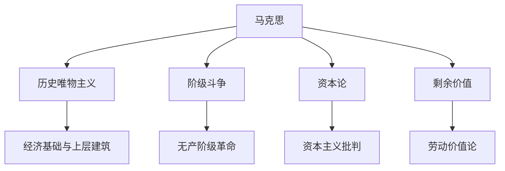

---
{"dg-publish":true,"permalink":"/6 哲学家/卡尔·马克思/","tags":["哲学"],"created":"2025-09-19T21:41:24.836+08:00","updated":"2025-09-22T21:21:45.619+08:00"}
---

### 卡尔·马克思（Karl Marx）

#### 1. **简介**

卡尔·马克思（Karl Marx，1818年5月5日－1883年3月14日）是19世纪德国的哲学家、经济学家、历史学家和政治理论家，是现代社会科学的奠基人之一，也是社会主义和共产主义理论的创始人之一。马克思的思想对政治学、经济学、历史学和哲学等领域产生了深远的影响，尤其是关于资本主义、阶级斗争、历史唯物主义等核心理论。

- **英语定义**：Karl Marx
- **主要思想**：马克思主张，社会历史的发展是由经济基础决定的，资本主义社会必然会被社会主义所替代，最终走向共产主义。他强调阶级斗争是推动社会变革的动力。

#### 2. **马克思主义核心思想**

马克思主义的核心在于其历史唯物主义、阶级斗争和对资本主义的批判。马克思的哲学基于一种“唯物主义”的世界观，认为社会的发展是由物质生产力和生产关系之间的矛盾推动的。

##### 2.1 **历史唯物主义**

历史唯物主义是马克思主义的哲学基础，它认为历史的进程是由物质生产力的变化所决定的，而这种变化最终会影响到生产关系和社会结构。

- **经济基础与上层建筑**：马克思区分了社会的“经济基础”和“上层建筑”。经济基础指的是社会的生产力和生产关系，而上层建筑则指法律、政治、宗教、哲学等意识形态。马克思认为，上层建筑是由经济基础决定的，并且反过来影响经济基础的发展。
- **历史进程的推动力**：马克思认为，社会的历史是由生产力与生产关系之间的矛盾推动的。随着生产力的不断发展，旧的生产关系必然会发生革命性变化，推动社会向前发展。

##### 2.2 **阶级斗争**

马克思认为，阶级斗争是历史发展的主要动力，社会的历史就是一部阶级斗争的历史。在资本主义社会中，主要的阶级对立是资产阶级（资本家）和无产阶级（工人阶级）之间的对立。

- **资产阶级与无产阶级**：资本主义社会中，资产阶级拥有生产资料，而无产阶级则通过出卖劳动力来生存。马克思认为，这种经济不平等会导致阶级矛盾的加剧。
- **无产阶级革命**：马克思预见到，随着资本主义矛盾的深化，无产阶级最终会通过革命推翻资产阶级，建立社会主义社会，最终实现共产主义。

##### 2.3 **资本论**

马克思的《资本论》是其最重要的经济学著作之一，在该书中，他深入分析了资本主义经济体系的运作机制，特别是资本的积累过程以及它如何导致阶级剥削。

- **剩余价值**：马克思的劳动价值论认为，商品的价值是由生产商品所需的社会必要劳动时间决定的。在资本主义生产中，工人通过劳动创造的价值高于他们所得到的工资，这部分未支付给工人的价值被称为“剩余价值”。资本家通过榨取剩余价值来实现利润。
- **资本积累与集中**：马克思认为，资本主义的内在矛盾导致资本的集中和积累，即越来越少的资本家拥有越来越多的财富，而大多数工人则继续贫困。这种不平等最终会导致资本主义的崩溃。

##### 2.4 **共产主义**

马克思主张，社会主义是资本主义发展的必然结果，而最终的社会形态是共产主义。共产主义社会是没有阶级、没有国家、没有私有制的社会，所有生产资料归全体人民共同所有。

- **阶级消亡**：在共产主义社会中，阶级不再存在，人人平等。资本主义社会的阶级对立和剥削被彻底消除。
- **无国家社会**：马克思认为，随着共产主义的实现，国家作为阶级压迫的工具也会逐渐消亡，社会将进入一个无政府状态的理想阶段。

#### 3. **马克思主义的影响与批评**

马克思主义不仅对政治学、哲学、经济学、历史学等学科产生了巨大影响，而且直接影响了20世纪的多次革命运动和世界历史的发展。

##### 3.1 **影响**

- **社会主义与共产主义**：马克思的理论为20世纪的社会主义国家提供了理论基础，苏联、中国等国的社会主义建设深受其影响。马克思的阶级斗争理论和剩余价值理论对这些国家的经济政策产生了深远影响。
- **马克思主义哲学**：马克思的历史唯物主义和辩证法对后来的哲学家产生了深远影响，特别是在德意志古典哲学、法国启蒙思想和结构主义哲学中得到了广泛的应用。
- **批判理论与后期发展**：马克思的思想也为后来的批判理论和文化研究提供了理论基础，法兰克福学派、阿尔都塞等学者都在马克思主义的框架下发展出了新的思想。

##### 3.2 **批评**

- **经济决定论**：一些学者批评马克思主义过于注重经济因素，忽视了文化、意识形态、精神生活等非经济因素的作用。
- **对人性的不完全理解**：马克思主义强调集体主义和社会变革，但有评论认为，它低估了个人自由和人类创造性的多样性。
- **资本主义的适应性**：一些学者认为，资本主义社会有着极强的适应能力和自我调节机制，因此马克思预言的资本主义崩溃并未实现，反而资本主义在全球化进程中表现出强大的生命力。

#### 4. **总结双链**

- **相关主题**：[[5 主义/历史唯物主义\|历史唯物主义]]、[[阶级斗争\|阶级斗争]]、[[剩余价值\|剩余价值]]、[[5 主义/资本主义\|资本主义]]、[[9 未命名/共产主义\|共产主义]]、[[无产阶级革命\|无产阶级革命]]、[[社会变革\|社会变革]]、[[5 主义/社会主义\|社会主义]]
- **关键人物**：[[6 哲学家/卡尔·马克思\|卡尔·马克思]]、[[6 哲学家/弗里德里希·恩格斯\|弗里德里希·恩格斯]]、[[列宁\|列宁]]、[[毛泽东\|毛泽东]]、[[西蒙·波利瓦尔\|西蒙·波利瓦尔]]
- **相关概念**：[[劳动价值论\|劳动价值论]]、[[生产资料\|生产资料]]、[[资本积累\|资本积累]]、[[9 未命名/无产阶级\|无产阶级]]、[[9 未命名/资产阶级\|资产阶级]]、[[5 主义/社会主义\|社会主义]]、[[共产主义社会\|共产主义社会]]