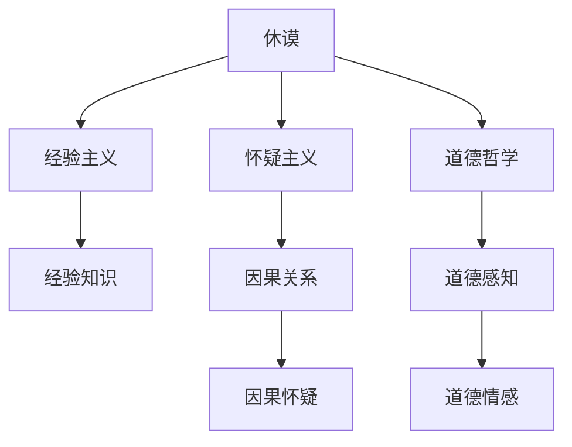

---
{"dg-publish":true,"permalink":"/6 哲学家/大卫·休谟/","tags":["哲学"],"created":"2025-09-19T21:41:24.843+08:00","updated":"2025-09-22T21:21:37.241+08:00"}
---

### **休谟（David Hume）**

#### 1. **简介**

大卫·休谟（David Hume，1711年4月26日－1776年8月25日）是苏格兰著名的哲学家、历史学家和经济学家，被认为是经验主义和怀疑主义的代表人物之一。他的哲学思想对后来的哲学、伦理学、心理学、政治学等多个领域产生了深远影响。

- **英语定义**：David Hume
- **学科影响**：休谟的经验主义哲学和对因果关系、宗教信仰、道德感知等问题的探讨，尤其是他对理性和经验的批判，对现代哲学产生了重大影响。

#### 2. **休谟的哲学思想**

休谟是经验主义的代表人物之一，他认为知识的来源来自感官经验，而不是先验的理性或神秘的直觉。他的怀疑主义影响了后来的哲学，特别是他对因果关系和宗教信仰的探讨。

##### 2.1 **经验主义与知识的来源**

休谟主张所有知识都来自经验，他的哲学观念强调感官印象与理性推理之间的关系。他认为，所有的知识要么是感官印象（直接的感知），要么是这些印象的回忆（观念）。因此，他反对理性主义认为知识有先天存在的观点。

- **感官印象与观念**：休谟区分了“印象”和“观念”，其中印象是直接的感官经验，观念则是从印象中派生出来的记忆和思维。这一观点强调了经验在知识形成中的基础作用。

##### 2.2 **怀疑主义与因果关系**

休谟是怀疑主义的代表，他对传统的因果关系提出了挑战。休谟认为，因果关系并非通过理性或感官经验可以直接证实的，而是通过习惯和经验的联结形成的。他对因果关系的怀疑意味着我们无法绝对证明一事物必然导致另一事物，而是依赖于经验的推测。

- **因果怀疑**：休谟认为，因果关系并不是可以通过理性推导得出的必然性，而是通过反复的经验观察中形成的习惯性预期。人们基于过去的经验假设未来事件的发生，但我们无法直接证实因果关系。

##### 2.3 **道德哲学与道德感知**

休谟在道德哲学方面提出了许多重要观点，特别是他对道德判断的来源进行了讨论。休谟认为，道德感知源自情感而非理性，认为“理性只是情感的奴隶”。他主张道德判断并非通过理性推理得出，而是基于人类的情感和同情心。

- **道德情感**：休谟认为，人的道德判断是基于对他人遭遇的同情，或是对行为后果的情感反应，而非理性的分析。他认为人类的道德生活和行为更多地源自情感、情绪和社会习惯。

##### 2.4 **宗教哲学与神的存在**

休谟在宗教哲学方面表现出明显的怀疑主义，他对神的存在以及宗教的理性基础提出了质疑。他反对将理性用于证明上帝存在，认为宗教信仰应更多地依赖于信仰而非理性证据。

- **宗教怀疑**：休谟认为，关于神存在的证据并不充分，宗教信仰更多是基于信仰与传统，而非科学的理性推理。他的《自然宗教对话录》批评了基督教的神学论证。

#### 3. **休谟的影响**

休谟的哲学对现代哲学、伦理学、心理学等领域产生了深远的影响。他的经验主义哲学为康德的批判哲学提供了契机，同时他的怀疑主义、道德哲学和宗教批判影响了后来的哲学家，如康德、斯图亚特·密尔、约翰·斯图尔特·密尔等。

- **对康德的影响**：休谟的怀疑主义和因果关系问题促使康德提出“转折”的哲学，即从“经验出发，推演先验”的理论。
- **对伦理学的影响**：休谟的道德情感理论对情感伦理学和后来的道德心理学产生了深远影响。

#### 4. **总结双链**

- **相关主题**：[[5 主义/经验主义\|经验主义]]、[[5 主义/怀疑主义\|怀疑主义]]、[[因果关系\|因果关系]]、[[道德哲学\|道德哲学]]、[[情感伦理学\|情感伦理学]]、[[宗教哲学\|宗教哲学]]、[[现代哲学\|现代哲学]]
- **关键人物**：[[6 哲学家/大卫·休谟\|大卫·休谟]]、[[6 哲学家/伊曼努尔·康德\|伊曼努尔·康德]]、[[斯图亚特·密尔\|斯图亚特·密尔]]、[[约翰·斯图尔特·密尔\|约翰·斯图尔特·密尔]]
- **相关概念**：[[感官印象\|感官印象]]、[[观念\|观念]]、[[道德情感\|道德情感]]、[[因果怀疑\|因果怀疑]]、[[自然宗教对话录\|自然宗教对话录]]