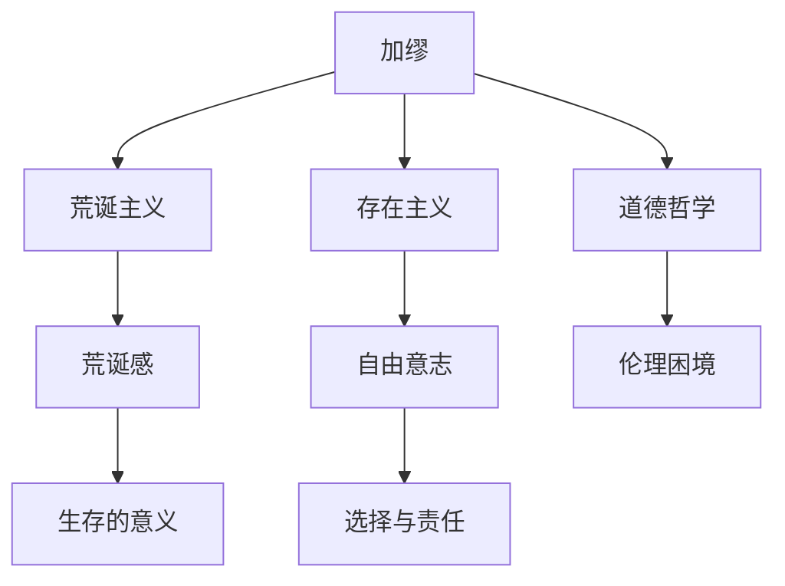

---
{"dg-publish":true,"permalink":"/6 哲学家/阿尔贝·加缪/","tags":["哲学"],"created":"2025-09-19T21:41:24.887+08:00","updated":"2025-09-22T21:21:32.034+08:00"}
---

### **加缪（Albert Camus）**

#### 1. **简介**

阿尔贝·加缪（Albert Camus，1913年11月7日－1960年1月4日）是法国著名的哲学家、作家、记者和剧作家，因其对荒诞哲学和存在主义的深刻探讨而成为20世纪最重要的思想家之一。他的作品中包含了对人类生存意义、自由、道德和存在的深刻反思。

- **英语定义**：Albert Camus
- **学科影响**：加缪被认为是荒诞主义哲学的代表人物，他的作品影响了哲学、文学和社会理论领域。

#### 2. **加缪的哲学思想**

加缪的哲学思考围绕着“荒诞”这一主题展开。他提出人类在面对无意义的宇宙时，会感到一种深刻的“荒诞感”，然而人类依然需要通过自我意识、行动和责任来创造意义。

##### 2.1 **荒诞主义与人类的生存意义**

加缪的荒诞主义认为，宇宙本身没有任何固有意义，人类试图从宇宙中寻找意义时，会感到一种无望的荒诞。他在《西西弗神话》一书中探讨了这个主题，提出虽然人生是荒诞的，但我们依然可以通过对抗荒诞、接受生活本身来创造个人的意义。

- **荒诞感**：加缪认为，荒诞的体验来源于人类对宇宙的期望和宇宙的无意义之间的冲突。这个冲突产生了人类存在的荒诞感。

##### 2.2 **存在主义与自由意志**

虽然加缪与存在主义哲学家（如萨特）有许多相似之处，但他并不认同存在主义的观点。加缪认为，自由意志并不是从无意义中创造绝对自由的依据，而是人类应当承担责任，尽管宇宙没有赋予我们任何绝对意义。

- **自由与责任**：加缪强调，即使生活是荒诞的，人类依然有自由选择自己的行动，并且要对自己的选择承担责任。他拒绝逃避到宗教或虚无主义中，而是认为人类应当在荒诞中寻找个人的自由和责任。

##### 2.3 **道德哲学与伦理困境**

加缪的道德哲学主要集中在伦理困境中，尤其是在面对荒诞时如何行动的问题。他认为，人类的道德不应基于任何超自然的道德规范，而应源于人类之间的共同经验和理解。

- **伦理困境**：在《鼠疫》一书中，加缪探讨了人在面对灾难和不公时应如何行动。即使宇宙没有任何内在意义，人类仍然可以通过团结与反抗为他人创造意义，体现出责任感和人道主义精神。

##### 2.4 **加缪与文学创作**

加缪不仅是哲学家，还是一位重要的文学家。他的小说《异乡人》和戏剧《卡里古拉》深刻表现了荒诞哲学中的主要思想，探索了人类在面对宇宙无意义时的孤独与反抗。

- **《异乡人》**：通过主人公梅尔索的冷漠与无动于衷，展现了人在面对生命和死亡的荒诞时的无力与抗拒。
- **《卡里古拉》**：通过描写罗马皇帝卡里古拉的暴虐统治，探讨了个体如何在面对绝对权力和存在的荒诞时作出反应。

#### 3. **加缪的影响**

加缪的哲学对20世纪的文学、哲学和政治思想产生了深远的影响。他的荒诞主义哲学与存在主义在现代文化中占据重要位置，尤其是对人类的自由、选择与责任的问题进行了深刻反思。

- **存在主义的补充**：虽然与萨特等存在主义哲学家共享对自由和责任的关注，加缪的荒诞主义哲学更为悲观，他强调在宇宙的无意义面前，人类仍应选择行动并承担责任。
- **伦理学与政治**：加缪的道德哲学对人道主义、政治自由以及反抗不公的行动产生了影响，尤其是在政治压迫和暴力行为的背景下。

#### 4. **总结双链**

- **相关主题**：[[荒诞主义\|荒诞主义]]、[[5 主义/存在主义\|存在主义]]、[[自由意志\|自由意志]]、[[9 未命名/伦理学\|伦理学]]、[[政治哲学\|政治哲学]]、[[道德困境\|道德困境]]
- **关键人物**：[[6 哲学家/阿尔贝·加缪\|阿尔贝·加缪]]、[[6 哲学家/让-保罗·萨特\|让-保罗·萨特]]
- **相关作品**：[[异乡人\|异乡人]]、[[西西弗神话\|西西弗神话]]、[[卡里古拉\|卡里古拉]]、[[鼠疫\|鼠疫]]
- **相关概念**：[[荒诞感\|荒诞感]]、[[自由与责任\|自由与责任]]、[[伦理困境\|伦理困境]]、[[生存的意义\|生存的意义]]