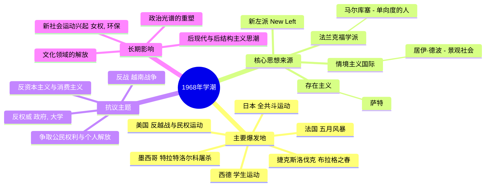

---
{"dg-publish":true,"permalink":"/9 未命名/1968年学潮/","tags":["历史/世界史","社会运动","冷战","反文化运动","事件"],"created":"2025-09-19T21:41:23.063+08:00","updated":"2025-09-22T21:22:15.391+08:00"}
---

# 1968年学潮

**1968年学潮**，或称**1968年全球抗议**，是一场席卷全球的、以青年学生为主体的左翼社会政治运动的总称。它并非一个统一协调的全球行动，而是在[[9 未命名/冷战\|冷战]]的东西方对峙、战后经济繁荣与社会矛盾并存的背景下，于世界各地几乎同时爆发的一系列抗议、示威和革命风潮。这场运动的核心特征是其强烈的反权威、反资本主义、反官僚主义色彩，其矛头直指现存的政治、社会和文化秩序。从巴黎的街垒到美国的校园，从西柏林的示威到布拉格的改革，1968年成为了一个象征着叛逆、理想主义和激进变革的标志性年份，深刻地改变了战后世界的文化和政治图景。

### 1. 起源与背景

1968年学潮的爆发并非偶然，而是多种社会、政治和文化因素长期积累的结果。首先，在政治层面，[[越南战争\|越南战争]]的不断升级成为引爆全球反战情绪的最主要导火索，尤其在美国和西欧，反战示威将矛头直接对准了政府的帝国主义政策和军事工业复合体。其次，在社会层面，战后二十年的经济高速增长（如法国的“辉煌三十年”）催生了庞大的中产阶级和第一代大规模接受高等教育的“婴儿潮”一代。这一代人成长于物质相对富裕的环境，却对父辈所构建的消费社会、保守价值观和僵化的社会结构感到疏离和不满。大学教育的扩张并未带来相应的社会地位和就业前景，反而使大学成为酝酿不满和激进思想的温床。思想上，[[新左派\|新左派]]理论的兴起为运动提供了智力武器，[[9 未命名/法兰克福学派\|法兰克福学派]]的代表人物如[[赫伯特·马尔ку塞\|马尔库塞]]在其著作《单向度的人》中对发达工业社会的批判，深刻影响了学生领袖；此外，[[5 主义/存在主义\|存在主义]]哲学，特别是[[6 哲学家/让-保罗·萨特\|萨特]]对个人自由和政治介入的强调，以及[[情境主义国际\|情境主义国际]]对“景观社会”的颠覆性批判，都为运动注入了强大的理论燃料。同时，第三世界的民族解放运动，如古巴革命和中国的[[文化大革命\|文化大革命]]，也为西方激进青年提供了革命的想象和榜样。

### 2. 发展与扩张

1968年的抗议浪潮在地理上极为广泛，但各地表现形式和侧重点各不相同。其中，影响力最大的是[[法国1968年“五月风暴”\|法国1968年“五月风暴”]]。它始于巴黎南泰尔文学院的学生抗议，迅速蔓延至索邦大学，并最终演变为一场波及全国的、学生与工人联合的总罢工，参与人数一度超过一千万人，几乎令[[戴高乐\|戴高乐]]政府陷入瘫痪。在美国，学生运动与[[民权运动\|民权运动]]和反[[越南战争\|越南战争]]运动紧密结合，哥伦比亚大学、伯克利大学等高校成为抗议中心，学生占领校园，反对大学与国防研究的合作。同年，[[马丁·路德·金\|马丁·路德·金]]和罗伯特·肯尼迪的遇刺更是激化了社会矛盾。在西德，学生运动领袖鲁迪·杜奇克的遇刺引发了大规模示威，抗议者将矛头指向保守的施普林格报业集团。在“铁幕”的另一边，捷克斯洛伐克的[[布拉格之春\|布拉格之春]]则是一场由上至下的改革运动，旨在建立“带有人性面孔的社会主义”，但最终在8月被苏联的坦克无情碾碎。此外，日本的“全共斗”运动、墨西哥的[[特拉特洛尔科屠杀\|特拉特洛尔科屠杀]]，都展示了这场全球运动的激烈程度及其悲剧性结局。这些看似孤立的事件通过新兴的电视媒体相互连接，形成了一种全球共振的效应。

### 3. 核心诉求与结构

尽管各地运动的具体目标有别，但其核心诉求展现出高度的一致性，即对现有权力结构的全面挑战。在政治上，运动普遍反对[[9 未命名/冷战\|冷战]]格局下的两大霸权（美国和苏联），并对传统的议会民主和官僚化的共产主义政党均表示失望，寻求一种更直接、更具参与性的民主形式。在文化上，这是一场深刻的[[反文化运动\|反文化运动]]，挑战一切形式的权威——家庭中的父权、学校中的教师权威、社会中的传统道德和宗教束缚。性解放、摇滚乐、嬉皮士文化成为这场文化叛逆的载体。经济上，运动批判[[5 主义/资本主义\|资本主义]]所导致的异化劳动和消费主义对人性的压抑，法国学生喊出的“宁要一个悲惨的结局，不要没有结局的悲惨”口号，以及“在鹅卵石下面，是海滩！”等诗意标语，集中体现了对现有生活方式的彻底否定和对新生活方式的浪漫想象。`来源：Mark Kurlansky,《1968: The Year That Rocked the World》`。然而，运动的组织结构大多是松散的、去中心化的，这既是其能够快速蔓延的原因，也成为其难以形成持久政治力量的弱点。学生和工人的联盟往往是短暂和脆弱的，最终导致运动被各个击破。

### 4. 衰落与结局

1968年学潮的高潮是短暂的。进入1968年夏秋之后，浪潮开始逐渐退去。其衰落的原因是多方面的。首先是国家机器的强力镇压。无论是戴高乐在法国通过解散议会、承诺改革并动用军队威胁，还是墨西哥政府在奥运会前夕的血腥屠杀，都显示了建制派维护秩序的决心和能力。其次，运动内部的矛盾与分裂日益显现。学生领袖们在斗争的未来路线上产生严重分歧，从改良主义到毛主义、托派等各种激进路线争论不休，无法形成统一的行动纲领。学生与传统工人阶级（尤其是有工会和左翼政党组织的工人）之间的联盟被证明是策略性的而非结构性的，两者的最终目标和文化归属感存在巨大差异，最终导致分道扬镳。到了年底，大多数抗议活动已经平息，许多参与者感到了理想破灭后的疲惫和幻灭。轰轰烈烈的革命最终未能颠覆任何一个西方主要国家的政权，其直接的政治目标大多以失败告终。

### 5. 历史遗产与影响

尽管1968年学潮在政治上“失败”了，但它在文化和社会层面留下了极其深远和持久的遗产。它被视为战后[[新社会运动\|新社会运动]]的催化剂，女权主义、环境保护运动、同性恋权益运动等在70年代后的兴起，都深受1968年挑战权威、追求个人解放精神的启发。在思想学术领域，1968年的“失败”促使左翼知识分子进行深刻反思，对传统马克思主义的阶级斗争理论和革命模式提出质疑，这直接催生了[[5 主义/后结构主义\|后结构主义]]和[[5 主义/后现代主义\|后现代主义]]的兴起，[[6 哲学家/米歇尔·福柯\|福柯]]、[[6 哲学家/吉尔·德勒兹\|德勒兹]]等人的思想正是在这一背景下走向成熟。它彻底改变了西方社会的文化风貌，使得个人主义、价值观多元化和对权威的质疑成为社会常态。大学获得了更多的自治权，代际关系、两性关系和生活方式都发生了不可逆转的变化。因此，1968年与其说是一场失败的革命，不如说是一场深刻的“文化革命”，它的影响如水银泻地，渗透到此后几十年的社会肌理之中，塑造了我们今天所生活的世界。

## 双链关联总结

- **一级关联 (核心实体)**: [[法国1968年“五月风暴”\|法国1968年“五月风暴”]]、[[新左派\|新左派]]、[[反文化运动\|反文化运动]]、[[赫伯特·马尔库塞\|赫伯特·马尔库塞]]、[[情境主义国际\|情境主义国际]]、[[越南战争\|越南战争]]、[[布拉格之春\|布拉格之春]]
- **二级关联 (上下文与背景)**: [[9 未命名/冷战\|冷战]]、[[5 主义/存在主义\|存在主义]]、[[9 未命名/法兰克福学派\|法兰克福学派]]、[[婴儿潮\|婴儿潮]]、[[民权运动\|民权运动]]、[[戴高乐\|戴高乐]]、[[消费主义\|消费主义]]
- **三级关联 (推测与延展)**: [[5 主义/后结构主义\|后结构主义]]、[[5 主义/后现代主义\|后现代主义]]、[[新社会运动\|新社会运动]]、[[6 哲学家/米歇尔·福柯\|米歇尔·福柯]]、[[文化大革命\|文化大革命]]、[[全球化\|全球化]]、[[9 未命名/身份政治\|身份政治]]
