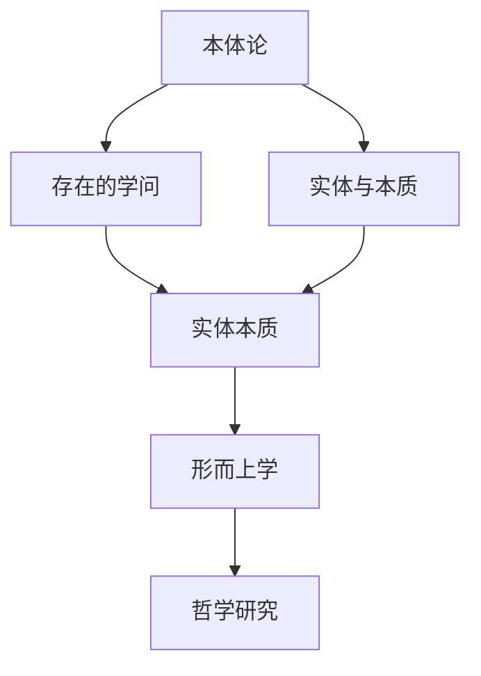

---
{"dg-publish":true,"permalink":"/9 未命名/本体论/","tags":["哲学"],"created":"2025-09-19T21:41:23.191+08:00","updated":"2025-09-22T21:22:28.156+08:00"}
---

### 本体论（Ontology）

#### 1. **定义与起源**

本体论是哲学的一个分支，专注于研究“存在”这一基本概念，探索事物存在的本质、属性及其相互关系。作为[[形而上学\|形而上学]]的核心内容之一，本体论试图解答关于什么存在、存在的类型、存在的方式及其基本结构等根本性问题。这个领域探讨的问题包括：什么是实体？什么是本质？事物的本质和存在是否相同？

- 本体论的术语“ontos”（希腊语：“存在”）和“logos”（“学说”）结合而成，意味着“存在的学问”。
- 本体论与[[形而上学\|形而上学]]密切相关，但形而上学的范畴更广泛，涵盖了对“存在”的本质和其背后的原因的探讨。

#### 2. **本体论的基本问题**

本体论研究的核心问题包括：

- **存在的本质**：什么是存在？我们如何理解存在？存在是普遍的，还是存在于特定的事物之中？
- **实体与属性**：事物作为实体存在的本质是什么？它们的属性是什么？这些属性如何定义事物的存在？
- **存在的分类**：事物的存在是否有不同的层次或类型？例如，物理实体、心灵或抽象概念等。

#### 3. **主要流派与理论**

不同哲学家对本体论的理解各有不同。以下是几种主要的本体论流派与理论：

- **古希腊本体论**：[[6 哲学家/柏拉图\|柏拉图]]和[[6 哲学家/亚里士多德\|亚里士多德]]对本体论的发展具有深远影响。柏拉图提出了理想的“形式”理论，认为现实世界的事物是“形式”的影像。亚里士多德则提出了实体（ousia）的概念，认为实体是事物存在的基础。
    
- **近代本体论**：[[6 哲学家/勒内·笛卡尔\|勒内·笛卡尔]]提出了“我思故我在”的命题，强调思维作为存在的基础。[[6 哲学家/巴鲁赫·斯宾诺莎\|巴鲁赫·斯宾诺莎]]则认为，所有存在的事物都由单一的“实质”或“上帝”构成。
    
- **存在主义**：[[6 哲学家/马丁·海德格尔\|马丁·海德格尔]]是20世纪本体论的主要人物之一，他提出“存在”是人类体验的基础，认为人类的存在（Being）不同于物体的存在，它是动态的，具有自我理解和自我创造的特性。
    
- **物理本体论**：现代物理学中的本体论研究则更侧重于物理实体和宇宙的结构，例如物质的存在、时间的流逝以及量子力学中的概率性存在。
    

#### 4. **本体论与其他学科的联系**

本体论不仅是哲学的一个分支，也与多个学科密切相关：

- **神学**：许多神学家探讨了“神”作为一种存在的本质，讨论了神的本体论性质，如[[9 未命名/托马斯·阿奎那\|托马斯·阿奎那]]的“神的存在论证”。
- **逻辑学**：本体论与逻辑学紧密相连，特别是在描述如何通过概念和命题构建存在的理论时。[[术语逻辑\|术语逻辑]]和[[谓词逻辑\|谓词逻辑]]是本体论中常用的工具。
- **计算机科学**：在人工智能和知识表示领域，本体论也被用来指代一种数据建模方法，尤其是在语义网（Semantic Web）和知识图谱中，创建能够表达不同实体及其关系的结构。

#### 5. **本体论的现代意义**

在当代，尤其是信息科学和人工智能领域，本体论被用来建立描述现实世界的模型。例如，构建数字化的本体论，可以帮助计算机理解和分类事物，从而提升知识的组织、检索和应用效率。

#### 6. **双链总结**

- **相关主题**：[[哲学\|哲学]]、[[形而上学\|形而上学]]、[[5 主义/存在主义\|存在主义]]、[[物理本体论\|物理本体论]]、[[逻辑学\|逻辑学]]、[[神学\|神学]]、[[计算机科学\|计算机科学]]、[[人工智能\|人工智能]]、[[知识表示\|知识表示]]
- **关键人物**：[[6 哲学家/柏拉图\|柏拉图]]、[[6 哲学家/亚里士多德\|亚里士多德]]、[[6 哲学家/勒内·笛卡尔\|勒内·笛卡尔]]、[[6 哲学家/巴鲁赫·斯宾诺莎\|巴鲁赫·斯宾诺莎]]、[[6 哲学家/马丁·海德格尔\|马丁·海德格尔]]、[[9 未命名/托马斯·阿奎那\|托马斯·阿奎那]]
- **关键概念**：[[存在\|存在]]、[[实体\|实体]]、[[本质\|本质]]、[[理想形式\|理想形式]]、[[自我存在\|自我存在]]、[[上帝\|上帝]]、[[知识图谱\|知识图谱]]、[[量子存在\|量子存在]]