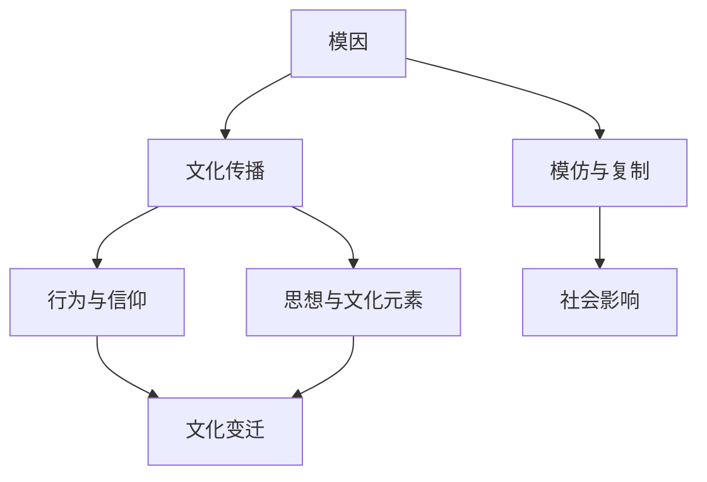

---
{"dg-publish":true,"permalink":"/9 未命名/模因/","tags":["社会学"],"created":"2025-09-19T21:41:24.023+08:00","updated":"2025-09-22T21:23:35.970+08:00"}
---

### 模因（Meme）

#### 1. **定义与核心思想**

模因（Meme）最早由英国生物学家[[理查德·道金斯\|理查德·道金斯]]（Richard Dawkins）在其1976年出版的著作《自私的基因》中提出。模因指的是在文化中传播的思想、行为、信仰或风格，类似于基因在生物体中的遗传方式。道金斯用“模因”一词来描述文化传递的单位，它通过模仿和复制在个体之间传播并在社会中不断演变。

- **英语定义**：Meme

#### 2. **模因的基本特征**

- **文化复制与变异**：模因通过模仿在社会中传播，它不仅仅是简单的复制，往往在传播过程中会发生一些变异。例如，某个思想或行为在一群人中传播时，可能会因为理解和个体创意的不同而有所变化。
    
- **传递媒介**：模因的传播依赖于社会互动、语言、书写、艺术、宗教、风俗等文化传递的途径。随着互联网和社交媒体的发展，模因的传播速度和范围得到了极大的扩展。
    
- **选择与适应**：类似基因在自然选择中的作用，模因也在文化传播中经历着“选择”。某些模因由于其吸引力、相关性或实用性而得以更广泛地传播，而其他模因则可能逐渐消失。模因的传播是一个竞争性过程。
    

#### 3. **模因的传播方式与社会影响**

- **语言与交流**：语言是模因传播的一个重要载体。通过语言、故事、笑话、成语等，个体能够将思想和行为传递给他人，并影响他们的认知和行为。
    
- **互联网文化中的模因**：随着互联网的普及，模因的传播得到了前所未有的加速。网络上的幽默、图片、视频等元素迅速成为全球文化的组成部分。[[社交媒体\|社交媒体]]平台，如Twitter、Facebook、Instagram等，成为模因传播的主要渠道。
    
- **集体行为与文化认同**：模因不仅传播思想，还可能对集体行为、群体认同和社会价值观产生影响。模因有时能够凝聚群体意识，创造共鸣，甚至推动社会变革。许多社会运动和公共讨论中的主题，往往是以模因的形式进行传播和扩展。
    

#### 4. **模因的演变与多样性**

- **从基因到模因**：道金斯通过对比基因的传播方式，提出了“文化基因”的概念，模因作为文化传播的单位，类似于基因在生物进化中的作用，随着时间的推移，某些模因会不断演变并适应新的文化环境。
    
- **模因的多样性**：模因不仅限于思想或语言，还包括行为、风格、时尚、宗教信仰、艺术作品、音乐等多种形式。每个时代、每个社群的模因都有独特的表现形式。例如，[[Hip-hop文化\|Hip-hop文化]]的模因就包括了特定的语言、舞蹈、服饰等，而互联网文化中的“表情包”也是当代模因的一种表现形式。
    

#### 5. **模因与社会文化现象**

- **模因与创新**：一些学者认为，模因是文化创新的源泉。模因的传播和变异是文化和社会不断变化的驱动力。创新思想和行为可能通过模因的方式进入社会意识，并影响社会变革。
    
- **模因与媒体**：现代媒体，特别是社交媒体平台，是模因传播的温床。通过不断的分享、点赞和评论，用户们不断地加速和扩展模因的传播。在社交网络上，模因的快速传播通常意味着它能够迅速吸引大量人的关注，并形成广泛的文化现象。
    

#### 6. **批评与局限性**

- **简化与误解**：有批评认为，将文化现象仅仅归结为模因的传播可能过于简化了复杂的社会动态。模因概念有时难以涵盖文化演变中的所有因素，忽视了社会、历史和政治的影响。
    
- **文化的同质化**：一些评论认为，随着全球化和互联网文化的普及，模因的广泛传播可能导致文化的同质化。不同文化和传统可能会失去其独特性，受到全球化趋势下某些主流模因的影响。
    

#### 7. **双链总结**

- **相关主题**：[[9 未命名/模因\|模因]]、[[理查德·道金斯\|理查德·道金斯]]、[[文化传播\|文化传播]]、[[社交媒体\|社交媒体]]、[[互联网文化\|互联网文化]]、[[表情包\|表情包]]、[[文化创新\|文化创新]]、[[Hip-hop文化\|Hip-hop文化]]、[[社会行为\|社会行为]]、[[集体认同\|集体认同]]
- **关键人物**：[[理查德·道金斯\|理查德·道金斯]]
- **关键概念**：[[文化复制\|文化复制]]、[[模仿与变异\|模仿与变异]]、[[社交媒体\|社交媒体]]、[[集体行为\|集体行为]]、[[文化认同\|文化认同]]、[[创新与变异\|创新与变异]]、[[互联网文化\|互联网文化]]