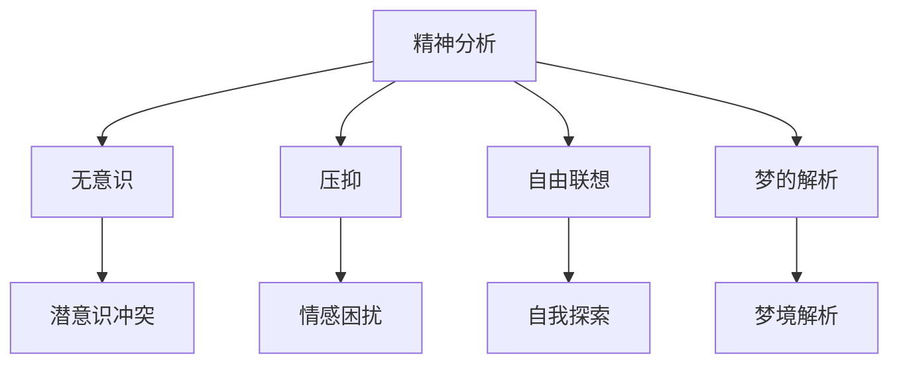

---
{"dg-publish":true,"permalink":"/9 未命名/精神分析/","tags":["心理学"],"created":"2025-09-19T21:41:23.748+08:00","updated":"2025-09-22T21:23:49.895+08:00"}
---

### 1. **精神分析定义**

精神分析（Psychoanalysis）是一种由奥地利精神病学家[[6 哲学家/西格蒙德·弗洛伊德\|西格蒙德·弗洛伊德]]（Sigmund Freud）创立的心理学理论和治疗方法。它主要关注无意识心理过程在个体行为、情感和思维中的作用。精神分析理论认为，许多心理冲突、病症和心理障碍源自无意识中的压抑、欲望和冲突，这些无意识的内容通常通过梦境、口误、自由联想等方式显现出来。

精神分析不仅关注个体的心理病理学，还强调人类行为、社会文化和历史背景中的无意识影响。弗洛伊德的理论成为20世纪最具影响力的心理学理论之一，对心理学、文学、艺术、社会学等多个领域产生了深远影响。[[6 哲学家/西格蒙德·弗洛伊德\|西格蒙德·弗洛伊德]]、[[无意识\|无意识]]、[[压抑\|压抑]]、[[自由联想\|自由联想]]。

### 2. **精神分析的起源与发展**

- **弗洛伊德的贡献**：精神分析起源于[[6 哲学家/西格蒙德·弗洛伊德\|西格蒙德·弗洛伊德]]的研究，他通过对神经症患者的深入分析，提出了无意识的概念。他认为，个体的行为和情感大部分由无意识动机驱动。弗洛伊德提出的“本我”、“自我”和“超我”三重结构模型，是理解心理冲突和心理疾病的重要框架。[[本我\|本我]]、[[自我\|自我]]、[[超我\|超我]]。
    
- **弗洛伊德的经典理论**：
    
    - **本我**（Id）：代表原始冲动和欲望，主要受 pleasure principle（快乐原则）支配，寻求即时满足。
    - **自我**（Ego）：调节本我和现实之间的冲突，遵循 reality principle（现实原则），负责做出理性决策。
    - **超我**（Superego）：代表道德和社会规范，追求理想行为，内化社会价值观。[[本我\|本我]]、[[自我\|自我]]、[[超我\|超我]]。
- **梦的解析**：弗洛伊德通过对梦境的分析，提出了梦境的象征意义。他认为梦是无意识冲突和被压抑欲望的表现，并通过梦的内容揭示个体的内心世界。[[梦的解析\|梦的解析]]。
    
- **自由联想**：自由联想是精神分析治疗中重要的技术之一，患者被鼓励自由地说出任何想到的内容，以帮助揭示潜意识中的冲突和压抑的情感。[[自由联想\|自由联想]]。
    
- **压抑与防御机制**：弗洛伊德认为，许多内心的痛苦源于压抑的无意识内容，个体使用防御机制（如否认、投射、回避等）来应对这些潜意识冲突。[[压抑\|压抑]]、[[防御机制\|防御机制]]。
    

### 3. **精神分析的基本理论**

- **无意识的作用**：弗洛伊德认为，无意识是个体心理生活的重要组成部分，它包含了压抑的欲望、未解决的冲突和被遗忘的记忆。无意识的内容影响着个人的行为和情感，常常在梦境、口误等中有所显现。[[无意识\|无意识]]、[[潜意识\|潜意识]]。
    
- **心理发展阶段**：弗洛伊德提出，个体的心理发展可以分为多个阶段，包括口腔期、肛门期、性别期等。每个阶段都与特定的冲突和心理需求相关，个体在这些阶段的经历会影响成年后的性格和行为。[[心理发展\|心理发展]]、[[口腔期\|口腔期]]、[[肛门期\|肛门期]]、[[性别期\|性别期]]。
    
- **本能与文化的冲突**：弗洛伊德认为，本我代表了无意识的冲动，而超我代表了社会的道德规范。个体在成长过程中，必须调和这两者的冲突，这种冲突会影响个体的心理状态。[[本我\|本我]]、[[超我\|超我]]、[[社会道德\|社会道德]]。
    

### 4. **精神分析治疗方法**

- **自由联想法**：治疗的核心是让患者放松并自由地说出他们的所有想法，无论这些想法看似无关或混乱。通过这种方式，治疗师可以识别潜藏在无意识中的冲突和未被察觉的情感。[[自由联想\|自由联想]]。
    
- **梦的解析**：通过分析梦境内容，揭示梦中潜藏的象征意义。弗洛伊德认为，梦是无意识愿望和压抑欲望的表现，分析梦境可以帮助患者理解自己内心的冲突。[[梦的解析\|梦的解析]]。
    
- **转移与反转移**：在治疗过程中，患者可能将对重要人物（如父母、配偶等）的情感投射到治疗师身上，这被称为“转移”。治疗师对这种转移的反应被称为“反转移”。分析这些现象可以帮助理解患者的情感模式。[[转移\|转移]]、[[反转移\|反转移]]。
    
- **压抑与防御机制**：通过识别患者的防御机制，治疗师帮助患者意识到自己如何通过压抑、回避等方式来应对无意识的痛苦情感。[[压抑\|压抑]]、[[防御机制\|防御机制]]。
    

### 5. **精神分析的批评与发展**

- **科学性批评**：精神分析因其无法通过实验验证而受到批评。许多心理学家认为，弗洛伊德的理论缺乏科学证据，过于侧重于个体的潜意识和主观解释。[[科学性批评\|科学性批评]]。
    
- **性别与文化批评**：弗洛伊德的部分理论（如“恋母情结”和“恋父情结”）受到性别和文化批评，认为这些理论过于西方化和性别化，忽视了社会文化背景对个体行为的影响。[[性别批评\|性别批评]]、[[文化批评\|文化批评]]。
    
- **后弗洛伊德派**：尽管弗洛伊德的部分理论受到质疑，但许多后来的心理学家在其基础上进行发展，例如[[卡尔·荣格\|卡尔·荣格]]（Carl Jung）、[[阿尔弗雷德·阿德勒\|阿尔弗雷德·阿德勒]]（Alfred Adler）等，他们在探索个体潜意识和人类心理时，提出了不同的观点和治疗方法。[[卡尔·荣格\|卡尔·荣格]]、[[阿尔弗雷德·阿德勒\|阿尔弗雷德·阿德勒]]。
    

### 6. **精神分析的影响**

- **文学与艺术**：精神分析深刻影响了文学、艺术和电影的创作。许多文学作品和电影通过无意识、梦境、压抑等主题进行表达，揭示了人类内心世界的复杂性。[[文学\|文学]]、[[艺术\|艺术]]、[[电影\|电影]]。
    
- **社会科学与文化研究**：精神分析为社会学、文化研究和性别研究提供了理论工具，帮助分析文化符号、社会结构和人类行为中的潜意识因素。[[社会学\|社会学]]、[[文化研究\|文化研究]]、[[性别研究\|性别研究]]。
    

### 7. **双链总结**

- **相关主题**：[[9 未命名/精神分析\|精神分析]]、[[无意识\|无意识]]、[[压抑\|压抑]]、[[自由联想\|自由联想]]、[[梦的解析\|梦的解析]]、[[防御机制\|防御机制]]。
    
- **关键人物**：[[6 哲学家/西格蒙德·弗洛伊德\|西格蒙德·弗洛伊德]]、[[卡尔·荣格\|卡尔·荣格]]、[[阿尔弗雷德·阿德勒\|阿尔弗雷德·阿德勒]]。
    
- **相关理论**：[[本我\|本我]]、[[自我\|自我]]、[[超我\|超我]]、[[恋母情结\|恋母情结]]、[[恋父情结\|恋父情结]]。
    
- **治疗方法**：[[自由联想\|自由联想]]、[[梦的解析\|梦的解析]]、[[转移\|转移]]、[[反转移\|反转移]]。
    

### 图示：精神分析的核心概念

