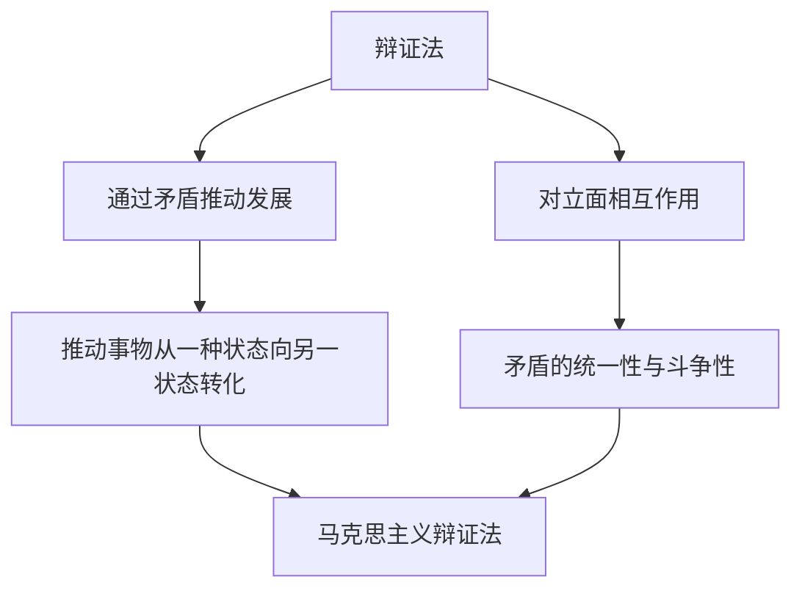

---
{"dg-publish":true,"permalink":"/9 未命名/辩证法/","tags":["哲学"],"created":"2025-09-19T21:41:23.213+08:00","updated":"2025-09-22T21:22:32.242+08:00"}
---

### 辩证法（Dialectics）

#### 1. **定义与核心思想**

辩证法是一种哲学方法，强调通过对立的矛盾和冲突来推动事物的发展与变化。其核心思想是，事物本身包含对立面，这些对立面通过相互作用和斗争，最终推动事物从一种状态向另一种状态转化。辩证法不仅限于哲学领域，也被广泛应用于政治、历史、社会等方面。

- **英语定义**：Dialectics

#### 2. **辩证法的历史背景与发展**

辩证法的概念最早起源于古希腊哲学，尤其是[[6 哲学家/赫拉克利特\|赫拉克利特]]（Heraclitus）和[[9 未命名/苏格拉底\|苏格拉底]]（Socrates）。赫拉克利特提出了“万物流变”的观点，认为一切事物都是通过对立和矛盾的斗争来实现发展的。而苏格拉底则通过“对话”的形式探索不同观点之间的冲突，推动思想的深化。

- **古希腊辩证法**：赫拉克利特强调事物的对立和变化，认为宇宙中一切事物都处于不断变化中，通过对立的力量相互作用推动事物发展。他的名言“战斗是万物之父”体现了这一思想。
    
- **柏拉图与亚里士多德**：柏拉图的“理念论”试图解决事物本质与现象之间的关系，而[[6 哲学家/亚里士多德\|亚里士多德]]则通过对事物内在矛盾的分析来提出他的“实体论”，这些都为辩证法的进一步发展奠定了基础。
    
- **黑格尔辩证法**：辩证法的重要发展是[[6 哲学家/乔治·威廉·弗里德里希·黑格尔\|乔治·威廉·弗里德里希·黑格尔]]（Georg Wilhelm Friedrich Hegel）提出的“绝对精神”与“历史辩证法”。黑格尔认为，历史是通过自我展开的过程，包含对立的力量和矛盾，历史的推动力就是矛盾的解决。他提出了著名的“正、反、合”三段论模式，认为每一阶段都包含着对立的两极，并最终通过冲突达成合成，推动历史的前进。
    

#### 3. **辩证法的核心原则**

辩证法有几个关键的核心原则，这些原则帮助理解和分析事物的内在关系和发展过程。

- **矛盾统一性与斗争性**：辩证法认为事物的内在矛盾是推动其发展的根本动力。矛盾在一定条件下会保持统一，但它们也在不断斗争和冲突中推动事物的变化。
    
- **否定之否定**：这是辩证法中的重要概念，意味着事物的发展是通过“否定”的过程完成的。在这个过程中，旧的事物被新的事物所替代，而这个新事物在发展过程中会再次受到否定，形成新的、更高阶段的事物。
    
- **量变与质变**：量变是指事物的量的累积，质变是指事物的本质发生了根本性改变。辩证法认为，事物的质变通常是量变积累到一定程度的结果。这一概念由[[5 主义/马克思主义\|马克思主义]]的辩证法继承并发展。
    
- **普遍联系与发展**：辩证法强调所有事物之间的普遍联系，它认为事物的发展是一个从低级到高级的过程。事物是处于不断变化和发展的状态中。
    

#### 4. **马克思主义辩证法**

[[6 哲学家/卡尔·马克思\|卡尔·马克思]]（Karl Marx）和[[6 哲学家/弗里德里希·恩格斯\|弗里德里希·恩格斯]]（Friedrich Engels）将辩证法应用于历史和社会分析，提出了马克思主义辩证法，认为社会的变化和历史的发展是由阶级斗争、生产力与生产关系之间的矛盾推动的。

- **历史唯物主义**：马克思主义辩证法通过历史唯物主义的观点看待社会历史，认为生产力和生产关系的矛盾是社会发展的根本动力。社会历史的发展是一个由经济基础推动的、包含对立和斗争的过程。
    
- **阶级斗争与社会变革**：马克思主义认为社会的发展是通过阶级斗争推进的，统治阶级与被统治阶级之间的矛盾和斗争是推动历史变革的力量。通过矛盾的激化，社会最终会朝着共产主义的方向发展。
    
- **革命与社会转型**：马克思主义辩证法也提出，社会的质变通常伴随着革命的爆发，革命是旧的社会形态与新的社会形态之间的矛盾冲突的产物。通过革命，社会得以从资本主义转变为社会主义，再到共产主义。
    

#### 5. **辩证法在其他领域的应用**

辩证法不仅仅局限于哲学领域，也在政治、社会学、自然科学等方面有广泛应用。

- **政治学与社会学**：辩证法在政治和社会学中被用来分析社会矛盾和社会变革。马克思主义的阶级分析、社会革命理论和历史进程中的对立关系都受到了辩证法的深刻影响。
    
- **自然科学**：在自然科学中，辩证法帮助科学家理解自然界中的对立和相互作用。例如，生态学中的物种竞争与合作、物理学中的相对论与量子力学的统一等，都可以从辩证法的角度得到阐释。
    
- **历史学**：辩证法通过分析历史中的矛盾冲突，揭示历史发展背后的规律。历史学家通过辩证法，分析历史的推动力和历史的阶段性，理解历史的进程。
    

#### 6. **辩证法的批评与挑战**

辩证法虽然在哲学、政治学和社会学中产生了深远影响，但也遭到一些哲学家和学派的批评：

- **形式逻辑的批评**：形式逻辑强调清晰的定义和推理过程，批评辩证法的矛盾统一性和否定之否定的观点。形式逻辑认为，辩证法过于抽象，无法提供明确的解决方案。
    
- **经验主义的批评**：经验主义者强调知识应来源于经验，而辩证法所强调的“抽象的矛盾”概念缺乏实证依据。经验主义者认为辩证法过于理想化，无法解决实际问题。
    
- **极端的辩证法应用**：一些学者认为辩证法的极端应用可能导致理论上的过度推导，缺乏可操作性，甚至会带来思想上的过度对立。
    

#### 7. **双链总结**

- **相关主题**：[[9 未命名/辩证法\|辩证法]]、[[黑格尔辩证法\|黑格尔辩证法]]、[[5 主义/马克思主义\|马克思主义]]、[[5 主义/历史唯物主义\|历史唯物主义]]、[[对立统一\|对立统一]]、[[矛盾理论\|矛盾理论]]、[[社会变革\|社会变革]]、[[阶级斗争\|阶级斗争]]
- **关键人物**：[[6 哲学家/赫拉克利特\|赫拉克利特]]、[[6 哲学家/乔治·威廉·弗里德里希·黑格尔\|乔治·威廉·弗里德里希·黑格尔]]、[[6 哲学家/卡尔·马克思\|卡尔·马克思]]、[[6 哲学家/弗里德里希·恩格斯\|弗里德里希·恩格斯]]、[[9 未命名/苏格拉底\|苏格拉底]]
- **关键概念**：[[矛盾统一性\|矛盾统一性]]、[[量变与质变\|量变与质变]]、[[否定之否定\|否定之否定]]、[[5 主义/历史唯物主义\|历史唯物主义]]、[[阶级斗争\|阶级斗争]]、[[革命理论\|革命理论]]